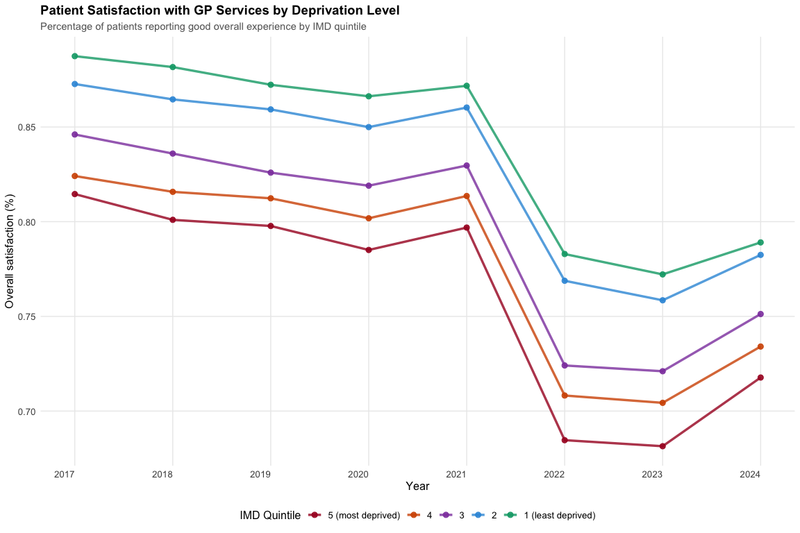
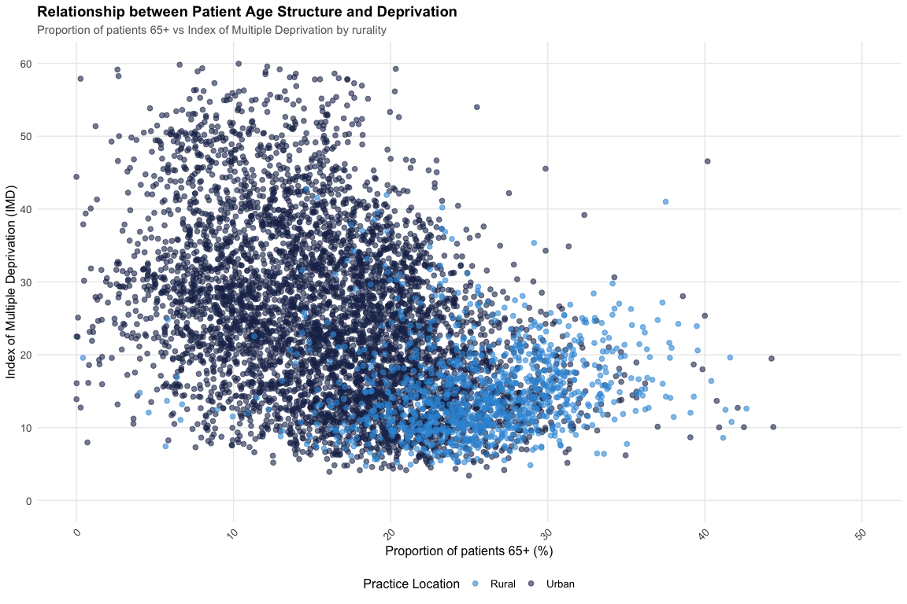

# Health Equity Evidence Centre


- [Project Overview](#project-overview)
- [Key Findings](#key-findings)
  - [💰 **Payment Disparities**](#moneybag-payment-disparities)
  - [👨‍⚕️ **Workforce
    Challenges**](#man_health_worker-workforce-challenges)
  - [😟 **Patient Experience Gaps**](#worried-patient-experience-gaps)
  - [🏥 **System-Wide Pressures**](#hospital-system-wide-pressures)
- [Data Sources](#data-sources)
- [Datasets](#datasets)
  - [Index of Multiple Deprivation
    (IMD)](#index-of-multiple-deprivation-imd)
    - [API](#api)
    - [FingertipsR Package](#fingertipsr-package)
    - [Direct download](#direct-download)
  - [Payments](#payments)
  - [Age Group Data](#age-group-data)
  - [Satisfaction](#satisfaction)
  - [GP Workforce](#gp-workforce)
  - [GP Earnings](#gp-earnings)
- [Analysis](#analysis)
  - [1. Structural inequalities in primary care – the facts and
    figures](#1-structural-inequalities-in-primary-care--the-facts-and-figures)
  - [2. NHS payments to practices in the East of
    England](#2-nhs-payments-to-practices-in-the-east-of-england)
  - [3. What does the latest GP Patient Survey tell us about
    socio-economic inequalities in general
    practice?](#3-what-does-the-latest-gp-patient-survey-tell-us-about-socio-economic-inequalities-in-general-practice)
  - [4. Exploring the impact of dispensing practices on equity in NHS
    payments to general
    practices](#4-exploring-the-impact-of-dispensing-practices-on-equity-in-nhs-payments-to-general-practices)
  - [5. General Practice Inequalities
    Datapacks](#5-general-practice-inequalities-datapacks)
  - [6. How does the age structure of patients affect NHS payments to
    General
    Practice?](#6-how-does-the-age-structure-of-patients-affect-nhs-payments-to-general-practice)
  - [7. Sorry we’re closed: Exploring general practice
    closures](#7-sorry-were-closed-exploring-general-practice-closures)
- [Shiny Applications](#shiny-applications)
- [Project Structure](#project-structure)
  - [Getting Started](#getting-started)

``` r
library(magrittr)
library(dplyr)
library(ggplot2)
library(tidyr)
library(scales)

# Define consistent theme
heec_theme <- theme_minimal() +
  theme(
    plot.title = element_text(size = 14, face = "bold"),
    plot.subtitle = element_text(size = 11, color = "gray40"),
    axis.title = element_text(size = 12),
    axis.text = element_text(size = 10),
    legend.title = element_text(size = 12),
    legend.text = element_text(size = 10),
    panel.grid.minor = element_blank(),
    axis.text.x = element_text(angle = 45, hjust = 1)
  )

# Define consistent colors
heec_colors <- c("#1B2C57", "#00A865", "#A80026", "#D35400", "#8E44AD", "#3498DB", "#00A676")
imd_colors <- c("5" = "#A80026", "4" = "#D35400", "3" = "#8E44AD", "2" = "#3498DB", "1" = "#00A676")
my_colors <- colorRampPalette(c("#1B2C57", "#00A865"))(42)
```

This repository contains a comprehensive analysis of health inequalities
in primary care across England, examining how healthcare resources,
access, and outcomes vary by socioeconomic deprivation level.

## Project Overview

The Health Equity Evidence Centre has compiled and analyzed
practice-level data from multiple NHS sources to understand patterns of
inequality in general practice. Our analysis covers **6,669 GP
practices** serving over **60 million patients**, examining disparities
across:

- **NHS funding and payments** to general practices
- **Workforce density** and staffing patterns  
- **Patient satisfaction** and access to care
- **Health outcomes** and disease prevalence
- **Practice characteristics** including rurality and size

## Key Findings

Our analysis reveals significant health inequalities in primary care
across England:

### 💰 **Payment Disparities**

- Practices serving the **most deprived 20% of the population received
  £14 less in NHS payments per weighted patient** in 2022-23 than those
  serving the least deprived quintile
- **Dispensing practices** earn substantially more per patient due to
  additional prescribing revenues, creating geographic inequities
- Despite higher healthcare needs in deprived areas, **funding
  mechanisms don’t fully compensate** for increased complexity and
  demand

### 👨‍⚕️ **Workforce Challenges**

- **GP workforce density varies significantly** across deprivation
  levels, with fewer fully qualified GPs per patient in more deprived
  areas
- **Rural practices face acute staffing shortages** while serving
  populations with greater healthcare needs
- The shift from **GP partners to salaried GPs** threatens traditional
  practice models, particularly affecting smaller practices in
  disadvantaged areas

### 😟 **Patient Experience Gaps**

- **Patient satisfaction consistently lower** in practices serving more
  deprived populations across all measured domains
- **Access to appointments and continuity of care** shows persistent
  inequalities, with worse outcomes in deprived communities
- **Trust and confidence in healthcare providers** varies by practice
  characteristics and local socioeconomic factors

### 🏥 **System-Wide Pressures**

- **Practice closures disproportionately impact** smaller communities,
  with 718,000 patients displaced since 2019
- **Age structure of populations** significantly influences payment
  levels, with practices serving older patients receiving higher
  capitation

## Data Sources

This repository includes complete practice-level time-series data from
authoritative NHS sources:

- **NHS Digital**: Payments, workforce, appointments, and QOF data
  (2015-2025)
- **OHID Fingertips**: Disease prevalence, health behaviors, and life
  expectancy
- **GP Patient Survey**: Patient satisfaction and experience metrics
  (2017-2024)
- **NHS England**: Practice characteristics, PCN data, and geographic
  mappings

# Datasets

| Dataset | Description | Source | Time Period | Files | Processing |
|----|----|----|----|----|----|
| **NHS Payments** | Practice-level NHS payments to general practice | [NHS Digital](https://digital.nhs.uk/data-and-information/publications/statistical/nhs-payments-to-general-practice) | 2015-2023 | `payments/payments.csv` | Annual files merged with standardized columns |
| **IMD** | Index of Multiple Deprivation at practice level | [DoHSC](https://www.gov.uk/government/collections/english-indices-of-deprivation) | 2010, 2015, 2019 | `IMD/IMD_interpolated.csv` | Interpolated for continuous time series |
| **GP Patient Survey** | Patient satisfaction and experience metrics | [NHS England](https://www.gp-patient.co.uk/) | 2017-2024 | `satisfaction/satisfaction.csv` | Annual files merged with consistent variables |
| **GP Workforce** | Practice workforce data (GPs, nurses, admin staff) | [NHS Digital](https://digital.nhs.uk/data-and-information/publications/statistical/general-practice-workforce) | 2015-2025 | `workforce/workforce_year.csv` | Monthly data aggregated to annual |
| **Age Groups** | Proportion of registered patients by age group | [OHID Fingertips](https://fingertips.phe.org.uk/) | 2016-2023 | `age_group/age.csv` | API data focused on 65+ population |
| **Appointments** | Appointment data by mode and status | [NHS Digital](https://digital.nhs.uk/data-and-information/publications/statistical/appointments-in-general-practice) | 2024-2025 | `appointments/appointments.csv` | Monthly practice-level data |
| **Disease Prevalence** | QOF disease prevalence rates | [OHID Fingertips](https://fingertips.phe.org.uk/) | 2023 | `prevalence/ltc_prevalence.csv` | Long-term condition prevalence |
| **QOF Achievement** | Quality and Outcomes Framework performance | [NHS Digital](https://digital.nhs.uk/data-and-information/publications/statistical/quality-and-outcomes-framework-achievement-prevalence-and-exceptions-data) | 2023-2024 | `QOF/qof.csv` | Achievement and prevalence metrics |
| **Health Behaviours** | Smoking, obesity, hypertension prevalence | [OHID Fingertips](https://fingertips.phe.org.uk/) | 2023 | `behaviours/behaviours.csv` | Risk factor prevalence |
| **Secondary Care** | Emergency admissions and A&E attendances | [OHID Fingertips](https://fingertips.phe.org.uk/) | 2023 | `secondary_care/secondary_care.csv` | Practice-attributed hospital activity |
| **Life Expectancy** | Life expectancy by practice population | [OHID Fingertips](https://fingertips.phe.org.uk/) | 2018-2020 | `life_expectancy/life_expectancy.csv` | Practice-level life expectancy estimates |
| **PCN Workforce** | Primary Care Network workforce data | [NHS Digital](https://digital.nhs.uk/data-and-information/publications/statistical/general-practice-workforce) | 2020-2024 | `pcn_workforce/pcn_workforce.csv` | Additional roles and PCN staff |
| **GP Earnings** | GP partner and salaried income data | [NHS Digital](https://digital.nhs.uk/data-and-information/publications/statistical/gp-earnings-and-expenses-estimates) | 2018-2023 | `GP_earnings/` | Partner income and practice expenses |
| **CQC Ratings** | Care Quality Commission inspection ratings | [CQC](https://www.cqc.org.uk/about-us/transparency/using-cqc-data) | 2024 | `CQC/cqc.csv` | Practice quality ratings |
| **CCG/ICB Codes** | Mapping between CCG and ICB codes | NHS England | 2023 | `CCG_ICB_code.csv` | Geographic area mappings |

## Index of Multiple Deprivation (IMD)

The Ministry of Housing, Communities and Local Government calculates the
English Indices of Deprivation, which includes the Index of Multiple
Deprivation (IMD) - the official measure of relative deprivation in
England - at the practice-level. This data is used to assess the
socio-economic status of the population served by each practice.

The latest release is IoD2019; no new release has been announced as of
Nov 2024.

### API

This data can be accessed through the
[API](https://fingertips.phe.org.uk/api) provided by the Fingertips
platform.

``` r
# Load necessary libraries
library(httr)
library(readr)
library(magrittr)
library(dplyr)

# Define the URL and query parameters
base_url <- "https://fingertipsws.phe.org.uk/api/all_data/csv/by_indicator_id"
query_params <- list(
  v = "/0-c459298b/",
  parent_area_code = "E92000001",
  parent_area_type_id = 167,
  child_area_type_id = 7,
  indicator_ids = 93553
)

# Make the API request
response <- GET(base_url, query = query_params)

# Check if the response is successful
if (http_status(response)$category == "Success") {
  # Write the content to a temporary file
  temp_file <- tempfile(fileext = ".csv")
  writeBin(content(response, "raw"), temp_file)

  # Read the CSV data
  IMD <- read_csv(temp_file)

  # Display the first few rows of the data
  print(head(IMD))
} else {
  cat("Failed to retrieve data. Status code:", status_code(response), "\n")
  cat("Response content:", content(response, "text"), "\n")
}
```

    # A tibble: 6 × 27
      `Indicator ID` `Indicator Name`        `Parent Code` `Parent Name` `Area Code`
               <dbl> <chr>                   <chr>         <chr>         <chr>      
    1          93553 Deprivation score (IMD… <NA>          <NA>          E92000001  
    2          93553 Deprivation score (IMD… E92000001     England       E38000217  
    3          93553 Deprivation score (IMD… E38000247     NHS Tees Val… A81001     
    4          93553 Deprivation score (IMD… E38000247     NHS Tees Val… A81002     
    5          93553 Deprivation score (IMD… E38000247     NHS Tees Val… A81004     
    6          93553 Deprivation score (IMD… E38000247     NHS Tees Val… A81005     
    # ℹ 22 more variables: `Area Name` <chr>, `Area Type` <chr>, Sex <chr>,
    #   Age <chr>, `Category Type` <chr>, Category <chr>, `Time period` <dbl>,
    #   Value <dbl>, `Lower CI 95.0 limit` <lgl>, `Upper CI 95.0 limit` <lgl>,
    #   `Lower CI 99.8 limit` <lgl>, `Upper CI 99.8 limit` <lgl>, Count <lgl>,
    #   Denominator <lgl>, `Value note` <chr>, `Recent Trend` <chr>,
    #   `Compared to England value or percentiles` <chr>,
    #   `Compared to CCGs (from Apr 2021) value or percentiles` <chr>, …

``` r
head(IMD)
```

    # A tibble: 6 × 27
      `Indicator ID` `Indicator Name`        `Parent Code` `Parent Name` `Area Code`
               <dbl> <chr>                   <chr>         <chr>         <chr>      
    1          93553 Deprivation score (IMD… <NA>          <NA>          E92000001  
    2          93553 Deprivation score (IMD… E92000001     England       E38000217  
    3          93553 Deprivation score (IMD… E38000247     NHS Tees Val… A81001     
    4          93553 Deprivation score (IMD… E38000247     NHS Tees Val… A81002     
    5          93553 Deprivation score (IMD… E38000247     NHS Tees Val… A81004     
    6          93553 Deprivation score (IMD… E38000247     NHS Tees Val… A81005     
    # ℹ 22 more variables: `Area Name` <chr>, `Area Type` <chr>, Sex <chr>,
    #   Age <chr>, `Category Type` <chr>, Category <chr>, `Time period` <dbl>,
    #   Value <dbl>, `Lower CI 95.0 limit` <lgl>, `Upper CI 95.0 limit` <lgl>,
    #   `Lower CI 99.8 limit` <lgl>, `Upper CI 99.8 limit` <lgl>, Count <lgl>,
    #   Denominator <lgl>, `Value note` <chr>, `Recent Trend` <chr>,
    #   `Compared to England value or percentiles` <chr>,
    #   `Compared to CCGs (from Apr 2021) value or percentiles` <chr>, …

### FingertipsR Package

The IMD data can also be accessed using the `fingertipsR`
[package](https://github.com/ropensci/fingertipsR).

``` r
# Load necessary library
library(fingertipsR)

# Get the profile ID for the Public Health Outcomes Framework
profiles_data <- profiles()
phof_profile <- profiles_data[profiles_data$ProfileName == "Public Health Outcomes Framework", ]
profile_id <- phof_profile$ProfileID[1]

# Print the profile details (optional)
print(phof_profile)
```

    # A tibble: 6 × 4
      ProfileID ProfileName                        DomainID DomainName              
          <int> <chr>                                 <int> <chr>                   
    1        19 Public Health Outcomes Framework    1000049 A. Overarching indicato…
    2        19 Public Health Outcomes Framework    1000041 B. Wider determinants o…
    3        19 Public Health Outcomes Framework    1000042 C. Health improvement   
    4        19 Public Health Outcomes Framework    1000043 D. Health protection    
    5        19 Public Health Outcomes Framework    1000044 E. Healthcare and prema…
    6        19 Public Health Outcomes Framework 1938132983 Supporting information  

``` r
# Get indicators for the Public Health Outcomes Framework profile
indicators_data <- indicators(ProfileID = profile_id)

# Find the IndicatorID for "Deprivation score (IMD 2019)"
indicator_id <- indicators_data$IndicatorID[indicators_data$IndicatorName == "Deprivation score (IMD 2019)"]

# Print the indicator details (optional)
print(indicators_data[indicators_data$IndicatorName == "Deprivation score (IMD 2019)", ])
```

    # A tibble: 1 × 6
      IndicatorID IndicatorName            DomainID DomainName ProfileID ProfileName
            <int> <fct>                       <int> <chr>          <int> <chr>      
    1       93553 Deprivation score (IMD …   1.94e9 Supportin…        19 Public Hea…

``` r
# Get the data for the "Deprivation score (IMD 2019)" indicator
IMD <- fingertips_data(IndicatorID = indicator_id, AreaTypeID = 7) # AreaTypeID 7 is for CCGs

# Display the first few rows of the data
head(IMD)
```

      IndicatorID                IndicatorName ParentCode                ParentName
    1       93553 Deprivation score (IMD 2019)       <NA>                      <NA>
    2       93553 Deprivation score (IMD 2019)     U89141              Stockton PCN
    3       93553 Deprivation score (IMD 2019)     U07032        North Stockton PCN
    4       93553 Deprivation score (IMD 2019)     U02671 Greater Middlesbrough PCN
    5       93553 Deprivation score (IMD 2019)     U07842        East Cleveland PCN
    6       93553 Deprivation score (IMD 2019)     U07032        North Stockton PCN
       AreaCode                        AreaName AreaType     Sex      Age
    1 E92000001                         England  England Persons All ages
    2    A81001             The Densham Surgery      GPs Persons All ages
    3    A81002      Queens Park Medical Centre      GPs Persons All ages
    4    A81004           Acklam Medical Centre      GPs Persons All ages
    5    A81005              Springwood Surgery      GPs Persons All ages
    6    A81006 Tennant Street Medical Practice      GPs Persons All ages
      CategoryType Category Timeperiod    Value LowerCI95.0limit UpperCI95.0limit
    1         <NA>     <NA>       2010 21.69383               NA               NA
    2         <NA>     <NA>       2010 25.07512               NA               NA
    3         <NA>     <NA>       2010 27.70068               NA               NA
    4         <NA>     <NA>       2010 33.05193               NA               NA
    5         <NA>     <NA>       2010 14.55969               NA               NA
    6         <NA>     <NA>       2010 29.14449               NA               NA
      LowerCI99.8limit UpperCI99.8limit Count Denominator Valuenote RecentTrend
    1               NA               NA    NA          NA      <NA>        <NA>
    2               NA               NA    NA          NA      <NA>        <NA>
    3               NA               NA    NA          NA      <NA>        <NA>
    4               NA               NA    NA          NA      <NA>        <NA>
    5               NA               NA    NA          NA      <NA>        <NA>
    6               NA               NA    NA          NA      <NA>        <NA>
      ComparedtoEnglandvalueorpercentiles
    1                        Not compared
    2                        Not compared
    3                        Not compared
    4                        Not compared
    5                        Not compared
    6                        Not compared
      ComparedtoPCNs(v.25/10/24)valueorpercentiles TimeperiodSortable Newdata
    1                                 Not compared           20100000    <NA>
    2                                 Not compared           20100000    <NA>
    3                                 Not compared           20100000    <NA>
    4                                 Not compared           20100000    <NA>
    5                                 Not compared           20100000    <NA>
    6                                 Not compared           20100000    <NA>
      Comparedtogoal Timeperiodrange
    1           <NA>              1y
    2           <NA>              1y
    3           <NA>              1y
    4           <NA>              1y
    5           <NA>              1y
    6           <NA>              1y

### Direct download

However, this data only provides values for practices that are still
active in 2019. To get the data for all practices, we obtained the CSV
directly from OHID via email, which is available
[here](https://github.com/camappel/HEEC/blob/main/data/IMD/IMD_raw.csv)
as `IMD_raw.csv`.

IMD values are only provided for 2010, 2015, and 2019. In order to have
a continuous time series, we interpolate the values between these years,
and extrapolate the values for 2020-2025. The resultant data is saved
[here](https://github.com/camappel/HEEC/blob/main/data/IMD/IMD_interpolated.csv)
as `IMD_interpolated.csv`.

``` r
IMD <- read.csv("data/IMD/IMD_raw.csv")

IMD <- IMD[, c("AreaCode", "Value", "Year")]
IMD %<>% rename(., Practice.Code = AreaCode)
IMD %<>% rename(., IMD = Value)

### interpolate IMD
result_df <- data.frame()

for (i in unique(IMD$Practice.Code)) {
  has_2010 <- any(IMD$Practice.Code == i & IMD$Year == 2010)
  has_2015 <- any(IMD$Practice.Code == i & IMD$Year == 2015)
  has_2019 <- any(IMD$Practice.Code == i & IMD$Year == 2019)

  # if data is only available for 2010, extrapolate to 2011-2025
  if (has_2010 & !has_2015) {
    for (year in 2011:2025) {
      new_row <- data.frame(
        Year = year,
        Practice.Code = i,
        IMD = IMD[IMD$Practice.Code == i & IMD$Year == 2010, ]$IMD
      )

      # Append the new row to the result data frame
      result_df <- rbind(result_df, new_row)
    }
  }

  # if data is available for 2010 and 2015, interpolate to 2011-2014
  if (has_2010 & has_2015) {
    for (year in 2011:2014) {
      y_new <- approx(
        IMD[IMD$Practice.Code == i, ]$Year,
        IMD[IMD$Practice.Code == i, ]$IMD,
        xout = year
      )
      # Create a new row for the current year and AreaCode
      new_row <- data.frame(
        Year = year,
        Practice.Code = i,
        IMD = y_new$y
      )

      # Append the new row to the result data frame
      result_df <- rbind(result_df, new_row)
    }
  }

  # if data is available for 2015 but not 2019, extrapolate to 2016-2025
  if (has_2015 & !has_2019) {
    for (year in 2016:2025) {
      new_row <- data.frame(
        Year = year,
        Practice.Code = i,
        IMD = IMD[IMD$Practice.Code == i & IMD$Year == 2015, ]$IMD
      )

      # Append the new row to the result data frame
      result_df <- rbind(result_df, new_row)
    }
  }

  # if data is available for 2015 and 2019, interpolate to 2016-2018
  if (has_2015 & has_2019) {
    for (year in 2016:2018) {
      y_new <- approx(
        IMD[IMD$Practice.Code == i, ]$Year,
        IMD[IMD$Practice.Code == i, ]$IMD,
        xout = year
      )
      # Create a new row for the current year and AreaCode
      new_row <- data.frame(
        Year = year,
        Practice.Code = i,
        IMD = y_new$y
      )

      # Append the new row to the result data frame
      result_df <- rbind(result_df, new_row)
    }
  }

  # if data is available for 2019, extrapolate to 2020-2025
  if (has_2019) {
    for (year in 2020:2025) {
      new_row <- data.frame(
        Year = year,
        Practice.Code = i,
        IMD = IMD[IMD$Practice.Code == i & IMD$Year == 2019, ]$IMD
      )

      # Append the new row to the result data frame
      result_df <- rbind(result_df, new_row)
    }
  }
}

IMD <- rbind(IMD, result_df)

IMD <- IMD[order(IMD$Practice.Code, IMD$Year), ]

IMD %>%
  group_by(Year) %>%
  summarise(
    mean_IMD = mean(IMD, na.rm = TRUE),
    sd_IMD = sd(IMD, na.rm = TRUE),
    min_IMD = min(IMD, na.rm = TRUE),
    max_IMD = max(IMD, na.rm = TRUE),
    n = n()
  )
```

    # A tibble: 16 × 6
        Year mean_IMD sd_IMD min_IMD max_IMD     n
       <int>    <dbl>  <dbl>   <dbl>   <dbl> <int>
     1  2010     24.2   12.8    2.60    68.9  8222
     2  2011     24.2   12.6    2.77    68.4  8222
     3  2012     24.1   12.4    2.95    67.9  8222
     4  2013     24.1   12.2    3.13    67.4  8222
     5  2014     24.1   12.1    3.31    67.0  8222
     6  2015     24.1   12.0    3.21    66.5  8438
     7  2016     24.1   11.9    3.21    66.5  8438
     8  2017     24.1   11.9    3.21    67.1  8438
     9  2018     24.1   11.9    3.21    67.9  8438
    10  2019     24.1   11.9    3.21    68.7  8461
    11  2020     24.1   11.9    3.21    68.7  8461
    12  2021     24.1   11.9    3.21    68.7  8461
    13  2022     24.1   11.9    3.21    68.7  8461
    14  2023     24.1   11.9    3.21    68.7  8461
    15  2024     24.1   11.9    3.21    68.7  8461
    16  2025     24.1   11.9    3.21    68.7  8461

## Payments

NHS Digital provided annual data on payments made to general practices
in England from 2014/15 to 22/23.

Annual practice level .csv files are available
[here](https://digital.nhs.uk/data-and-information/publications/statistical/nhs-payments-to-general-practice);
some preprocessing has been done to clean the data and ensure
consistency in variable names across years.

Execute the following code to merge the data to create a single
time-series dataset:

``` r
library(magrittr)
library(dplyr)

nhs_payments <- data.frame()

for (file in list.files("data/payments/raw")[1:6]) {
  df <- read.csv(paste0("data/payments/raw/", file))

  # assign year
  df$Year <- file %>%
    substr(1, nchar(.) - 4) %>%
    substr(4, nchar(.)) %>%
    paste0("20", .) %>%
    as.numeric()

  df$Average.payments.per.registered.patient %<>% as.numeric()
  df$Average.payments.per.weighted.patient %<>% as.numeric()

  nhs_payments <- bind_rows(nhs_payments, df)
}

# Add 2021 with COVID + PCN (incl deductions)
# Includes Total.NHS.Payments.to.General.Practice, Total.NHS.Payments.including.covid.vaccination.and.covid.support.and.expansion.payments, and Total.NHS.Payments.including.PCN.Workforce..Leadership.and.Support
# Total.NHS.Payments should include PCN and COVID payments
payments2021 <- read.csv("data/payments/raw/20-21.csv")
payments2021$Year <- 2021

payments2021$Total.COVID.Payments <- payments2021$Total.NHS.Payments.including.covid.vaccination.and.covid.support.and.expansion.payments - payments2021$Total.NHS.Payments.to.General.Practice
payments2021$Total.PCN.Payments <- payments2021$Total.NHS.Payments.including.PCN.Workforce..Leadership.and.Support - payments2021$Total.NHS.Payments.to.General.Practice
payments2021$Total.NHS.Payments.to.General.Practice <- payments2021$Total.NHS.Payments.to.General.Practice + payments2021$Total.COVID.Payments + payments2021$Total.PCN.Payments
payments2021$Total.NHS.Payments.to.General.Practice.Minus.Deductions <- payments2021$Total.NHS.Payments.to.General.Practice - payments2021$Deductions.for.Pensions..Levies.and.Prescription.Charge.Income

# Add 2022 with COVID + PCN
# Includes Total.NHS.Payments.to.General.Practice.including.Covid.and.PCN.payments as well as Total.NHS.Payments.to.General.Practice
payments2022 <- read.csv("data/payments/raw/21-22.csv")
payments2022$Year <- 2022

payments2022$Total.COVID.Payments <- payments2022$Total.NHS.Payments.to.General.Practice.including.covid.vaccination..covid.support.and.long.covid.payments - payments2022$Total.NHS.Payments.to.General.Practice
payments2022$Total.PCN.Payments <- payments2022$Total.NHS.Payments.including.PCN.Workforce..Leadership.and.Support - payments2022$Total.NHS.Payments.to.General.Practice
payments2022$Total.NHS.Payments.to.General.Practice <- payments2022$Total.NHS.Payments.to.General.Practice.including.Covid.and.PCN.payments
payments2022$Total.NHS.Payments.to.General.Practice.Minus.Deductions <- payments2022$Total.NHS.Payments.to.General.Practice - payments2022$Deductions.for.Pensions..Levies.and.Prescription.Charge.Income

# Add 2023
# Includes Total.NHS.Payments.to.General.Practice.including.Covid.and.PCN.payments as well as Total.NHS.Payments.to.General.Practice
payments2023 <- read.csv("data/payments/raw/22-23.csv")
payments2023$Year <- 2023

payments2023$Total.COVID.Payments <- payments2023$Total.NHS.Payments.to.General.Practice.including.covid.vaccination..covid.support.and.long.covid.payments - payments2023$Total.NHS.Payments.to.General.Practice
payments2023$Total.PCN.Payments <- payments2023$Total.NHS.Payments.including.PCN.Workforce..Leadership.and.Support - payments2023$Total.NHS.Payments.to.General.Practice
payments2023$Total.NHS.Payments.to.General.Practice <- payments2023$Total.NHS.Payments.to.General.Practice.including.Covid.and.PCN.payments
payments2023$Total.NHS.Payments.to.General.Practice.Minus.Deductions <- payments2023$Total.NHS.Payments.to.General.Practice - payments2023$Deductions.for.Pensions..Levies.and.Prescription.Charge.Income

nhs_payments <- bind_rows(nhs_payments, payments2021, payments2022, payments2023)

nhs_payments %>%
  group_by(Year) %>%
  summarise(
    total_payments = sum(Total.NHS.Payments.to.General.Practice),
    total_patients = sum(Number.of.Registered.Patients..Last.Known.Figure.),
    n_practices = n()
  )
```

    # A tibble: 9 × 4
       Year total_payments total_patients n_practices
      <dbl>          <dbl>          <dbl>       <int>
    1  2015    7990324226       56633982         7959
    2  2016    8182561838.      57371518         7841
    3  2017    8883780328.      58688866         7763
    4  2018    9050596202.      59527981         7543
    5  2019    9261391490.      59824330.        7279
    6  2020    9377079859.      60316398.        7001
    7  2021   10309607071.      60671585.        6808
    8  2022   11510115126.      61570004.        6758
    9  2023   11011986630.      62134645.        6669

``` r
CCG_ICB <- read.csv("data/CCG_ICB_code.csv")

# match CCG.Code in df with CCG.Code in ccg_icb and return ICB.Name
nhs_payments$ICB.NAME <- CCG_ICB[match(nhs_payments$CCG.Code, CCG_ICB$CCG.Code), ]$ICB.NAME

# In nhs_payments$ICB.NAME, remove "NHS " from the beginning of each string and " Integrated Care Board" from the end of each string
nhs_payments <- nhs_payments %>%
  mutate(ICB.NAME = ICB.NAME %>%
    gsub("^NHS ", "", .) %>%
    gsub(" Integrated Care Board$", "", .) %>%
    gsub(" ICB", "", .))

nhs_payments$ICB.NAME %>%
  unique() %>%
  sort()
```

     [1] "Bath and North East Somerset, Swindon and Wiltshire"
     [2] "Bedfordshire, Luton and Milton Keynes"              
     [3] "Birmingham and Solihull"                            
     [4] "Black Country"                                      
     [5] "Bristol, North Somerset and South Gloucestershire"  
     [6] "Buckinghamshire, Oxfordshire and Berkshire West"    
     [7] "Cambridgeshire and Peterborough"                    
     [8] "Cheshire and Merseyside"                            
     [9] "Cornwall and the Isles of Scilly"                   
    [10] "Coventry and Warwickshire"                          
    [11] "Derby and Derbyshire"                               
    [12] "Devon"                                              
    [13] "Dorset"                                             
    [14] "Frimley"                                            
    [15] "Gloucestershire"                                    
    [16] "Greater Manchester"                                 
    [17] "Hampshire and Isle of Wight"                        
    [18] "Herefordshire and Worcestershire"                   
    [19] "Hertfordshire and West Essex"                       
    [20] "Humber and North Yorkshire"                         
    [21] "Kent and Medway"                                    
    [22] "Lancashire and South Cumbria"                       
    [23] "Leicester, Leicestershire and Rutland"              
    [24] "Lincolnshire"                                       
    [25] "Mid and South Essex"                                
    [26] "Norfolk and Waveney"                                
    [27] "North Central London"                               
    [28] "North East and North Cumbria"                       
    [29] "North East London"                                  
    [30] "North West London"                                  
    [31] "Northamptonshire"                                   
    [32] "Nottingham and Nottinghamshire"                     
    [33] "Shropshire, Telford and Wrekin"                     
    [34] "Somerset"                                           
    [35] "South East London"                                  
    [36] "South West London"                                  
    [37] "South Yorkshire"                                    
    [38] "Staffordshire and Stoke-on-Trent"                   
    [39] "Suffolk and North East Essex"                       
    [40] "Surrey Heartlands"                                  
    [41] "Sussex"                                             
    [42] "West Yorkshire"                                     

``` r
standardise_columns <- function(nhs_payments) {
  # Helper function to merge columns and keep the first non-NA value
  merge_columns <- function(df, cols, new_col) {
    df[[new_col]] <- df %>%
      select(all_of(cols)) %>%
      apply(1, function(x) {
        x <- x[!is.na(x)]
        if (length(x) == 0) {
          return(NA)
        }
        return(x[1])
      }) %>%
      as.character()

    # Drop the original columns but keep the new column
    df <- df %>% select(-all_of(cols), all_of(new_col))
    return(df)
  }

  # Merge "PracticeType", "Practice.Type", "Practice.type" into one column called Practice.Type
  nhs_payments <- merge_columns(nhs_payments, c("PracticeType", "Practice.Type", "Practice.type"), "Practice.Type")

  # Merge "PracticeRurality", "Practice.Rurality" into one column called Practice.Rurality
  nhs_payments <- merge_columns(nhs_payments, c("PracticeRurality", "Practice.Rurality"), "Practice.Rurality")

  # Merge "AtypicalCharacteristics", "Atypical.Characteristics", "Atypical.characteristics" into one column called Atypical.Characteristics
  nhs_payments <- merge_columns(nhs_payments, c("AtypicalCharacteristics", "Atypical.Characteristics", "Atypical.characteristics"), "Atypical.Characteristics")

  # Merge "Code" into "PCN.Code"
  nhs_payments <- merge_columns(nhs_payments, c("PCN.Code", "Code"), "PCN.Code")

  return(nhs_payments)
}

nhs_payments <- standardise_columns(nhs_payments)

# drop Total.NHS.Payments.including.covid.vaccination.and.covid.support.and.expansion.payments, Total.NHS.Payments.including.PCN.Workforce..Leadership.and.Support, Total.NHS.Payments.to.General.Practice.including.Covid.and.PCN.payments, Total.NHS.Payments.to.General.Practice.including.Covid.and.PCN.payments.minus.deductions, Total.NHS.Payments.to.General.Practice.including.covid.vaccination..covid.support.and.long.covid.payments
nhs_payments <- nhs_payments %>%
  select(-Total.NHS.Payments.including.covid.vaccination.and.covid.support.and.expansion.payments, -Total.NHS.Payments.including.PCN.Workforce..Leadership.and.Support, -Total.NHS.Payments.to.General.Practice.including.Covid.and.PCN.payments, -Total.NHS.Payments.to.General.Practice.including.Covid.and.PCN.payments.minus.deductions, -Total.NHS.Payments.to.General.Practice.including.covid.vaccination..covid.support.and.long.covid.payments)

# The following lists should contain all columns in NHS payments
practice_information <- c(
  "NHS.England..Region..code", "NHS.England..Region..Name",
  "CCG.Code", "CCG.NAME",
  "Practice.Code", "Practice.Name",
  "Practice.Address", "Practice.Postcode",
  "Practice.Open.Date", "Practice.Close.Date",
  "Contract.Type", "Dispensing.Practice",
  "Quarter.used.for.patient.data",
  # PracticeType = 2017, Practice.Type = 2018:2021, Practice.type = 2022:2023, None = 2015:2016
  # "PracticeType", "Practice.type",
  "Practice.Type",
  # PracticeRurality = 2017, Practice.Rurality = 2018:2023, None = 2015:2016
  #  "PracticeRurality",
  "Practice.Rurality",
  # AtypicalCharacteristics = 2017, Atypical.Characteristics = 2018:2020, Atypical.characteristics: 2021:2023, None = 2015:2016
  # "AtypicalCharacteristics", "Atypical.characteristics",
  "Atypical.Characteristics",
  # Code = 2023
  # "Code",
  "PCN.Code",
  "PCN.Name",
  "ICB.NAME", "Sub.ICB.NAME",
  "Year"
)

population_information <- c(
  "Number.of.Registered.Patients..Last.Known.Figure.",
  "Number.of.Weighted.Patients..Last.Known.Figure.",
  "Average.payments.per.registered.patient",
  "Average.payments.per.weighted.patient",
  "Average.payments.per.registered.patient.including.PCN.Workforce..Leadership.and.Support",
  "Average.payments.per.weighted.patient.including.PCN.Workforce..Leadership.and.Support",
  "Average.payments.per.registered.patient.including.covid.vaccination.and.covid.support.and.expansion.payments",
  "Average.payments.per.weighted.patient.including.covid.vaccination.and.covid.support.and.expansion.payments",
  "Average.payments.per.registered.patient.including.covid.vaccination..covid.support.and.long.covid.payments",
  "Average.payments.per.weighted.patient.including.covid.vaccination..covid.support.and.long.covid.payments"
)

totals <- c(
  "Total.NHS.Payments.to.General.Practice",
  # "Total.NHS.Payments.to.General.Practice.including.Covid.and.PCN.payments" is now Total.NHS.Payments.to.General.Practice
  # Total.NHS.Payments.including.covid.vaccination.and.covid.support.and.expansion.payments = 2021, Total.NHS.Payments.to.General.Practice.including.covid.vaccination..covid.support.and.long.covid.payments = 2022:2023
  # "Total.NHS.Payments.to.General.Practice.including.covid.vaccination..covid.support.and.long.covid.payments",
  # "Total.NHS.Payments.including.covid.vaccination.and.covid.support.and.expansion.payments",
  # "Total.NHS.Payments.including.PCN.Workforce..Leadership.and.Support",
  "Deductions.for.Pensions..Levies.and.Prescription.Charge.Income",
  "Total.NHS.Payments.to.General.Practice.Minus.Deductions",
  # "Total.NHS.Payments.to.General.Practice.including.Covid.and.PCN.payments.minus.deductions",
  "Total.COVID.Payments", "Total.PCN.Payments"
)

globalSum <- c(
  # 2015
  "Global.Sum", "MPIG.Correction.factor", "Balance.of.PMS.Expenditure"
)

ITPremises <- c(
  # 2015
  "Premises.Payments", "Information.Management.and.Technology"
)

# Seniority payments were made to principal GPs in recognition of their years of NHS reckonable service.
# The scheme closed to new applicants on the 1 April, 2014 and the last payments were made at the end of March 2020.
PCO <- c(
  # 2015
  "Seniority", "Doctors.Retainer.Scheme.Payments", "Total.Locum.Allowances",
  "Appraisal.Costs",
  "PCO.Admin.Other", "Other.Payments",
  "General.Practice.Forward.View",
  "General.Practice.Transformation", "winter.Access.Fund",
  "Prolonged.Study.Leave",
  "Appraisal...Appraiser.Costs.in.Respect.of.Locums",
  "PCN.Participation", "PCN.Leadership", "PCN.Support",
  "PCN.Extended.Hours.Access", "PCN.Workforce",
  "PCN.Investment.and.impact.Fund",
  "PCN.Care.Home.Premium", "PCN.Enhanced.Access"
)

QOF <- c("Total.QOF.Payments")

contractedServices <- c(
  "Alcohol", "Childhood.Vaccination.and.Immunisation.Scheme",
  "GP.Extended.Hours.Access",
  "Facilitating.Timely.Diagnosis.and.Support.for.People.with.Dementia",
  "Improving.Patient.Online.Access",
  "Influenza.and.Pneumococcal.Immunisations", "Learning.Disabilities",
  "Minor.Surgery", "Patient.Participation", "Remote.Care.Monitoring",
  "Risk.Profiling.and.Case.Management", "Rotavirus.and.Shingles.Immunisation",
  "Services.for.Violent.Patients", "Unplanned.Admissions",
  "Total.National.Enhanced.Services", "Total.Local.Enhanced.Services",
  "Non.DES.Item.Pneumococcal.Vaccine..Childhood.Immunisation.Main.Programme",
  # 2016
  "Out.Of.Area.in.Hours.Urgent.Care", "Meningitis",
  # These 2 total to make Total.Local.Enhances.Services in 2016:
  #    "LocalEnhancedServices_NHAIS_", "LocalEnhancedServices_ISFE_",
  "Pertussis",
  "Total.Local.Incentive.Schemes", "Local.Incentive.Schemes",
  "Weight.Management.Service",
  "Medical.Assessment.Reviews"
  # "Covid.Immunisation", "Covid.Support.and.Expansion",
  # "Long.Covid"
)

COVID <- c(
  "Covid.Immunisation", "Covid.Support.and.Expansion",
  "Long.Covid"
)

Prescribing <- c(
  "Prescribing.Fee.Payments", "Dispensing.Fee.Payments",
  "Reimbursement.of.Drugs"
)

nhs_payments$Total.Global.Sum <- rowSums(nhs_payments[, globalSum], na.rm = TRUE)
nhs_payments$Total.IT.Premises <- rowSums(nhs_payments[, ITPremises], na.rm = TRUE)
nhs_payments$Total.PCO <- rowSums(nhs_payments[, PCO], na.rm = TRUE)
nhs_payments$Total.Contracted.Services <- rowSums(nhs_payments[, contractedServices], na.rm = TRUE)
nhs_payments$Total.Prescribing <- rowSums(nhs_payments[, Prescribing], na.rm = TRUE)
nhs_payments$Total.COVID <- rowSums(nhs_payments[, COVID], na.rm = TRUE)

nhs_payments %>%
  group_by(Year) %>%
  summarise(
    `Global Sum` = sum(Total.Global.Sum, na.rm = TRUE),
    `IT & Premises` = sum(Total.IT.Premises, na.rm = TRUE),
    `PCO Payments` = sum(Total.PCO, na.rm = TRUE),
    `Contracted Services` = sum(Total.Contracted.Services, na.rm = TRUE),
    `Prescribing` = sum(Total.Prescribing, na.rm = TRUE),
    `COVID-19` = sum(Total.COVID, na.rm = TRUE),
    .groups = "drop"
  ) %>%
  pivot_longer(cols = -Year, names_to = "Payment Category", values_to = "Total (£)") %>%
  mutate(`Total (£)` = label_comma()(round(`Total (£)`)))
```

    # A tibble: 54 × 3
        Year `Payment Category`  `Total (£)`  
       <dbl> <chr>               <chr>        
     1  2015 Global Sum          4,410,434,227
     2  2015 IT & Premises       672,107,043  
     3  2015 PCO Payments        611,784,475  
     4  2015 Contracted Services 802,764,294  
     5  2015 Prescribing         770,841,139  
     6  2015 COVID-19            0            
     7  2016 Global Sum          4,606,796,159
     8  2016 IT & Premises       739,487,955  
     9  2016 PCO Payments        462,787,554  
    10  2016 Contracted Services 901,854,909  
    # ℹ 44 more rows

``` r
source("data/data_processing.R")

# Call the function to merge and assign national-level quintiles
nhs_payments <- merge_and_assign_quintiles(
  data = nhs_payments,
  start_year = 2015,
  end_year = 2023
)
```

    [1] "Year: 2015"

       1    2    3    4    5 
    1589 1589 1588 1588 1588 
    [1] "Year: 2016"

       1    2    3    4    5 
    1565 1565 1565 1565 1564 
    [1] "Year: 2017"

       1    2    3    4    5 
    1547 1546 1546 1546 1546 
    [1] "Year: 2018"

       1    2    3    4    5 
    1502 1502 1502 1502 1501 
    [1] "Year: 2019"

       1    2    3    4    5 
    1453 1453 1453 1452 1452 
    [1] "Year: 2020"

       1    2    3    4    5 
    1397 1396 1396 1396 1396 
    [1] "Year: 2021"

       1    2    3    4    5 
    1357 1357 1357 1357 1357 
    [1] "Year: 2022"

       1    2    3    4    5 
    1347 1347 1347 1347 1346 
    [1] "Year: 2023"

       1    2    3    4    5 
    1329 1329 1328 1328 1328 

``` r
# Count missing IMD values per year
nhs_payments %>%
  group_by(Year) %>%
  summarise(
    missing_imd = sum(is.na(IMD))
  )
```

    # A tibble: 9 × 2
       Year missing_imd
      <dbl>       <int>
    1  2015          17
    2  2016          17
    3  2017          32
    4  2018          34
    5  2019          16
    6  2020          20
    7  2021          23
    8  2022          24
    9  2023          27

``` r
# Calculate payments excluding COVID and PCN payments for consistency
payments_clean <- nhs_payments %>%
  mutate(
    Total.NHS.Payments.Minus.COVID.PCN = Total.NHS.Payments.to.General.Practice -
      ifelse(is.na(Total.COVID.Payments), 0, Total.COVID.Payments) -
      ifelse(is.na(Total.PCN.Payments), 0, Total.PCN.Payments)
  )

# Calculate average payments per weighted patient by IMD quintile and year
payments_by_imd <- payments_clean %>%
  filter(!is.na(IMD_quintile)) %>%
  group_by(Year, IMD_quintile) %>%
  summarise(
    total_registered_patients = sum(Number.of.Registered.Patients..Last.Known.Figure., na.rm = TRUE),
    total_weighted_patients = sum(Number.of.Weighted.Patients..Last.Known.Figure., na.rm = TRUE),
    total_payments = sum(Total.NHS.Payments.Minus.COVID.PCN, na.rm = TRUE),
    .groups = "drop"
  ) %>%
  mutate(
    avg_payment_per_registered_patient = total_payments / total_registered_patients,
    avg_payment_per_weighted_patient = total_payments / total_weighted_patients,
    IMD_quintile = factor(IMD_quintile, levels = 1:5)
  )

# Create the plot
payments_by_imd %>%
  ggplot(aes(
    x = Year, y = avg_payment_per_weighted_patient,
    color = IMD_quintile, group = IMD_quintile
  )) +
  geom_line(size = 1.2, alpha = 0.8) +
  geom_point(size = 2.5, alpha = 0.9) +
  scale_color_manual(
    values = imd_colors,
    name = "IMD Quintile",
    labels = c("1 (least deprived)", "2", "3", "4", "5 (most deprived)")
  ) +
  labs(
    x = "Year",
    y = "Average payment per weighted patient (£)",
    title = "NHS Payments per Weighted Patient by Deprivation Level",
    subtitle = "Total NHS payments (excluding COVID and PCN) per weighted patient by IMD quintile"
  ) +
  heec_theme +
  theme(
    legend.position = "bottom",
    axis.text.x = element_text(angle = 0)
  ) +
  scale_y_continuous(labels = label_comma(prefix = "£")) +
  scale_x_continuous(breaks = unique(payments_by_imd$Year)) +
  guides(color = guide_legend(reverse = TRUE, nrow = 1))
```


## Age Group Data

The Office for Health Improvement and Disparities (OHID) provides data
on the proportion of GP registered populations by age group through the
Fingertips platform. This data helps analyze how the age structure of
practice populations affects NHS payments.

The data can be accessed through the [Fingertips
API](https://fingertips.phe.org.uk/api) using indicator ID 93468.

Execute the following code to retrieve and process the age group data:

``` r
# Load age group data and merge with payments data
age_data <- read.csv("data/age_group/age.csv") %>%
  filter(Year == 2023)

# Merge age data with payments and IMD data
age_analysis <- nhs_payments %>%
  filter(Year == 2023) %>%
  inner_join(age_data, by = "Practice.Code") %>%
  filter(
    Total.NHS.Payments.to.General.Practice > 0,
    Average.payments.per.registered.patient < 600,
    !is.na(prop65),
    !is.na(IMD)
  ) %>%
  mutate(
    prop65_quintile = ntile(prop65, 5),
    average_payment_per_patient = Total.NHS.Payments.to.General.Practice / Number.of.Registered.Patients..Last.Known.Figure.
  )

# Display basic statistics
age_analysis %>%
  group_by(prop65_quintile) %>%
  summarise(
    n_practices = n(),
    mean_prop65 = mean(prop65, na.rm = TRUE),
    mean_payment = mean(average_payment_per_patient, na.rm = TRUE),
    mean_imd = mean(IMD, na.rm = TRUE),
    .groups = "drop"
  )
```

    # A tibble: 5 × 5
      prop65_quintile n_practices mean_prop65 mean_payment mean_imd
                <int>       <int>       <dbl>        <dbl>    <dbl>
    1               1        1271        7.97         153.     30.8
    2               2        1271       13.8          158.     27.6
    3               3        1270       17.9          168.     23.2
    4               4        1270       21.7          181.     19.2
    5               5        1270       28.0          230.     15.9

``` r
# Chart showing payments per patient by age quintile
payment_by_age <- age_analysis %>%
  group_by(prop65_quintile) %>%
  summarise(
    avg_payment_per_patient = mean(average_payment_per_patient, na.rm = TRUE),
    n_practices = n(),
    .groups = "drop"
  ) %>%
  mutate(
    quintile_label = case_when(
      prop65_quintile == 1 ~ "Q1 (Youngest)",
      prop65_quintile == 2 ~ "Q2",
      prop65_quintile == 3 ~ "Q3",
      prop65_quintile == 4 ~ "Q4",
      prop65_quintile == 5 ~ "Q5 (Oldest)"
    ),
    quintile_label = factor(quintile_label, levels = c("Q1 (Youngest)", "Q2", "Q3", "Q4", "Q5 (Oldest)"))
  )

payment_by_age %>%
  ggplot(aes(x = quintile_label, y = avg_payment_per_patient, fill = factor(prop65_quintile))) +
  geom_bar(stat = "identity", alpha = 0.8) +
  scale_fill_manual(
    values = imd_colors,
    guide = "none"
  ) +
  labs(
    title = "NHS Payments per Patient by Age Structure of Practice Population",
    subtitle = "Average payment per registered patient by proportion of patients 65+ (quintiles)",
    x = "Proportion of Patients 65+ (Quintile)",
    y = "Payment per patient (£)"
  ) +
  heec_theme +
  theme(
    axis.text.x = element_text(angle = 45, hjust = 1)
  ) +
  scale_y_continuous(labels = label_comma(prefix = "£"))
```


## Satisfaction

The GP Patient Survey is an independent survey run by Ipsos MORI on
behalf of NHS England on the GP Patient Survey website. The survey is
sent out to over a million people across the UK and covers a range of
topics related to the quality of care provided by GP practices. The data
from the survey is used to assess patient experience and satisfaction
with GP services.

Annual practice-level .csv files are available \[here\].

Execute the following code to merge the data to create a single
time-series dataset:

``` r
practice_information <- c("Practice_Code", "Practice_Name", "CCG_Code", "CCG_Name", "ICS_Code", "ICS_Name")

# Define the variable mappings as a named list
variable_mappings <- list(
  access_pct = "Q3_12pct",
  continuity_pct = "Q9_12pct",
  overall_pct = "Q28_12pct",
  trust_pct_default = "Q89_12pct",
  trust_pct_2017 = "Q22_12pct"
)

# Initialize empty data frames
satisfaction <- data.frame()
trust <- data.frame()

# Function to load and process a single file
process_file <- function(file, variables) {
  df <- read.csv(paste0("data/satisfaction/raw/", file))

  # Select CCG or ICB Code
  dataset_columns <- colnames(df)
  selected_column_names <- intersect(practice_information, dataset_columns)
  df <- df[, c(selected_column_names, variables)]

  # Assign year
  year <- substr(file, 1, nchar(file) - 4)
  df$Year <- as.numeric(year)

  return(df)
}

# Process all files for satisfaction
for (file in list.files("data/satisfaction/raw/")) {
  df <- process_file(file, unlist(variable_mappings[-c(4, 5)])) # Exclude trust variables, as the variable code is not consistent; it will be collated separately
  satisfaction <- bind_rows(satisfaction, df)
}

# Process a subset of files for trust
for (file in list.files("data/satisfaction/raw/")) {
  year <- as.numeric(substr(file, 1, nchar(file) - 4))
  trust_variable <- ifelse(year == 2017, variable_mappings$trust_pct_2017, variable_mappings$trust_pct_default)
  df <- process_file(file, c("Practice_Code", trust_variable))

  # Rename the trust column to a common name for merging
  colnames(df)[colnames(df) == trust_variable] <- "trust_pct"

  trust <- bind_rows(trust, df)
}

# Keep only the relevant columns in trust
trust <- trust[, c("Practice_Code", "trust_pct", "Year")]

# Merge satisfaction and trust data frames
satisfaction <- merge(satisfaction, trust, by = c("Practice_Code", "Year"), all.x = TRUE)

# Rename columns based on variable_mappings
for (new_name in names(variable_mappings)[-c(4, 5)]) { # Exclude trust variables
  old_name <- variable_mappings[[new_name]]
  colnames(satisfaction)[colnames(satisfaction) == old_name] <- new_name
}

# Rename Practice_Code and Practice_Name
satisfaction <- satisfaction %>%
  rename(
    `Practice.Code` = Practice_Code,
    `Practice.Name` = Practice_Name
  )

# drop rows where pct is negative
satisfaction$overall_pct <- ifelse(satisfaction$overall_pct < 0, NA, satisfaction$overall_pct)
satisfaction$access_pct <- ifelse(satisfaction$access_pct < 0, NA, satisfaction$access_pct)
satisfaction$continuity_pct <- ifelse(satisfaction$continuity_pct < 0, NA, satisfaction$continuity_pct)
satisfaction$trust_pct <- ifelse(satisfaction$trust_pct < 0, NA, satisfaction$trust_pct)

satisfaction %>%
  group_by(Year) %>%
  summarise(
    mean_overall = mean(overall_pct, na.rm = TRUE),
    sd_overall = sd(overall_pct, na.rm = TRUE),
    min_overall = min(overall_pct, na.rm = TRUE),
    max_overall = max(overall_pct, na.rm = TRUE),
    n = n()
  )
```

    # A tibble: 8 × 6
       Year mean_overall sd_overall min_overall max_overall     n
      <dbl>        <dbl>      <dbl>       <dbl>       <dbl> <int>
    1  2017        0.849     0.0972       0.289           1  7522
    2  2018        0.840     0.0982       0.373           1  7254
    3  2019        0.834     0.0984       0.322           1  6999
    4  2020        0.824     0.103        0.370           1  6821
    5  2021        0.834     0.0943       0.296           1  6658
    6  2022        0.734     0.131        0.276           1  6507
    7  2023        0.727     0.134        0.112           1  6418
    8  2024        0.754     0.123        0.244           1  6307

``` r
# match CCG.Code in df with CCG.Code in CCG_ICB and return ICB.Code
satisfaction$ICB.NAME <- CCG_ICB[match(satisfaction$CCG_Code, CCG_ICB$CCG.Code), ]$ICB.NAME
satisfaction[is.na(satisfaction$ICB.NAME), ]$ICB.NAME <- CCG_ICB[match(satisfaction[is.na(satisfaction$ICB.NAME), ]$ICS_Code, CCG_ICB$ICB.Code), ]$ICB.NAME

satisfaction$ICB.NAME <- gsub("NHS ", "", satisfaction$ICB.NAME)
satisfaction$ICB.NAME <- gsub(" Integrated Care Board", "", satisfaction$ICB.NAME)

satisfaction <- satisfaction[, c("Practice.Code", "Practice.Name", "ICB.NAME", "Year", "overall_pct", "continuity_pct", "access_pct", "trust_pct")]

# Call the function to merge and assign national-level quintiles
satisfaction <- merge_and_assign_quintiles(
  data = satisfaction
)
```

    [1] "Year: 2016"
    < table of extent 0 >
    [1] "Year: 2017"

       1    2    3    4    5 
    1502 1502 1502 1502 1502 
    [1] "Year: 2018"

       1    2    3    4    5 
    1447 1447 1447 1447 1447 
    [1] "Year: 2019"

       1    2    3    4    5 
    1400 1400 1399 1399 1399 
    [1] "Year: 2020"

       1    2    3    4    5 
    1363 1363 1363 1363 1362 
    [1] "Year: 2021"

       1    2    3    4    5 
    1330 1330 1329 1329 1329 
    [1] "Year: 2022"

       1    2    3    4    5 
    1298 1298 1298 1297 1297 
    [1] "Year: 2023"

       1    2    3    4    5 
    1279 1279 1279 1279 1278 
    [1] "Year: 2024"

       1    2    3    4    5 
    1257 1257 1256 1256 1256 
    [1] "Year: 2025"
    < table of extent 0 >

``` r
satisfaction %>%
  group_by(Year) %>%
  summarise(
    missing_imd = sum(is.na(IMD))
  )
```

    # A tibble: 8 × 2
       Year missing_imd
      <dbl>       <int>
    1  2017          12
    2  2018          19
    3  2019           2
    4  2020           7
    5  2021          11
    6  2022          19
    7  2023          24
    8  2024          25

``` r
# Calculate overall satisfaction by IMD quintile and year
satisfaction <- read.csv('data/satisfaction/satisfaction.csv')
satisfaction_by_imd <- satisfaction %>%
  filter(!is.na(IMD_quintile), !is.na(overall_pct)) %>%
  group_by(Year, IMD_quintile) %>%
  summarise(
    mean_satisfaction = mean(overall_pct, na.rm = TRUE),
    median_satisfaction = median(overall_pct, na.rm = TRUE),
    n_practices = n(),
    .groups = "drop"
  ) %>%
  mutate(
    IMD_quintile = factor(IMD_quintile, levels = 1:5)
  )

# Create the plot
satisfaction_by_imd %>%
  ggplot(aes(
    x = Year, y = mean_satisfaction,
    color = IMD_quintile, group = IMD_quintile
  )) +
  geom_line(size = 1.2, alpha = 0.8) +
  geom_point(size = 2.5, alpha = 0.9) +
  scale_color_manual(
    values = imd_colors,
    name = "IMD Quintile",
    labels = c("1 (least deprived)", "2", "3", "4", "5 (most deprived)")
  ) +
  labs(
    x = "Year",
    y = "Overall satisfaction (%)",
    title = "Patient Satisfaction with GP Services by Deprivation Level",
    subtitle = "Percentage of patients reporting good overall experience by IMD quintile"
  ) +
  heec_theme +
  theme(
    legend.position = "bottom",
    axis.text.x = element_text(angle = 0)
  ) +
  scale_x_continuous(breaks = unique(satisfaction_by_imd$Year)) +
  guides(color = guide_legend(reverse = TRUE, nrow = 1))
```



## GP Workforce

NHS Digital provides monthly data on the general practice workforce,
including fully-qualified GPs, locums, nurses, and administrative staff.
The data is reported annually from September 2015-2020, quarterly from
December 2020-June 2021, and monthly from July 2021 onwards.

**Rationale for Annual Grouping**: Monthly workforce data exhibits
natural fluctuations due to factors such as training cycles, holiday
periods, and staff recruitment patterns. Aggregating to annual data
provides several advantages:

1.  **Consistency with financial reporting**: Using financial year
    grouping (April-March) aligns with NHS budget cycles and other
    healthcare datasets in this analysis
2.  **Smoothing seasonal variation**: Monthly variations in staffing can
    obscure underlying trends and make year-over-year comparisons less
    reliable
3.  **Data completeness**: Not all practices report workforce data every
    month, so annual aggregation maximizes data coverage
4.  **Improved analytical stability**: Annual averages reduce the impact
    of temporary staffing changes and provide more stable metrics for
    comparative analysis

``` r
# Load and process GP workforce data
workforce_files <- list.files("data/workforce/raw/", full.names = TRUE)
workforce <- data.frame()

for (file in workforce_files) {
  df <- read.csv(file)[c(
    "PRAC_CODE", "TOTAL_PATIENTS", "TOTAL_GP_EXTGL_FTE", "TOTAL_GP_FTE", 
    "TOTAL_NURSES_FTE", "TOTAL_GP_EXL_FTE", "TOTAL_DPC_FTE", "TOTAL_ADMIN_FTE",
    "TOTAL_GP_SEN_PTNR_FTE", "TOTAL_GP_PTNR_PROV_FTE", "TOTAL_N_NURSE_PTNR_FTE",
    "TOTAL_ADMIN_MANAGE_PTNR_FTE"
  )]
  
  # Extract year and month from filename
  filename <- basename(file)
  parts <- strsplit(filename, "_")[[1]]
  year <- as.numeric(parts[1])
  month <- as.numeric(gsub("\\.csv", "", parts[2]))
  
  df$Year <- year
  df$Month <- month
  
  # Determine financial year (April-March)
  if (month >= 4) {
    df$fiscal_year <- paste0("20", year + 1)
  } else {
    df$fiscal_year <- paste0("20", year)
  }
  
  workforce <- rbind(workforce, df)
}

# Convert to numeric
numeric_cols <- c("TOTAL_PATIENTS", "TOTAL_GP_EXTGL_FTE", "TOTAL_GP_FTE", 
                  "TOTAL_NURSES_FTE", "TOTAL_GP_EXL_FTE", "TOTAL_DPC_FTE", 
                  "TOTAL_ADMIN_FTE", "TOTAL_GP_SEN_PTNR_FTE", "TOTAL_GP_PTNR_PROV_FTE",
                  "TOTAL_N_NURSE_PTNR_FTE", "TOTAL_ADMIN_MANAGE_PTNR_FTE")

workforce[numeric_cols] <- lapply(workforce[numeric_cols], as.numeric)

# Create derived variables
workforce <- workforce %>%
  mutate(
    TOTAL_LOCUUM_TRN_FTE = TOTAL_GP_FTE - TOTAL_GP_EXTGL_FTE,
    TOTAL_PTNR_PER_GP_FTE = (TOTAL_GP_PTNR_PROV_FTE + TOTAL_GP_SEN_PTNR_FTE) / TOTAL_GP_EXTGL_FTE
  )

# Calculate annual averages by practice and fiscal year
workforce_annual <- workforce %>%
  group_by(PRAC_CODE, fiscal_year) %>%
  summarise(
    TOTAL_PATIENTS = mean(TOTAL_PATIENTS, na.rm = TRUE),
    TOTAL_GP_EXTGL_FTE = round(mean(TOTAL_GP_EXTGL_FTE, na.rm = TRUE), 1),
    TOTAL_LOCUUM_TRN_FTE = round(mean(TOTAL_LOCUUM_TRN_FTE, na.rm = TRUE), 1),
    TOTAL_NURSES_FTE = round(mean(TOTAL_NURSES_FTE, na.rm = TRUE), 1),
    TOTAL_DPC_FTE = round(mean(TOTAL_DPC_FTE, na.rm = TRUE), 1),
    TOTAL_ADMIN_FTE = round(mean(TOTAL_ADMIN_FTE, na.rm = TRUE), 1),
    TOTAL_GP_SEN_PTNR_FTE = round(mean(TOTAL_GP_SEN_PTNR_FTE, na.rm = TRUE), 1),
    TOTAL_GP_PTNR_PROV_FTE = round(mean(TOTAL_GP_PTNR_PROV_FTE, na.rm = TRUE), 1),
    TOTAL_N_NURSE_PTNR_FTE = round(mean(TOTAL_N_NURSE_PTNR_FTE, na.rm = TRUE), 1),
    TOTAL_ADMIN_MANAGE_PTNR_FTE = round(mean(TOTAL_ADMIN_MANAGE_PTNR_FTE, na.rm = TRUE), 1),
    TOTAL_PTNR_PER_GP_FTE = round(mean(TOTAL_PTNR_PER_GP_FTE, na.rm = TRUE), 1),
    .groups = "drop"
  ) %>%
  rename(Practice.Code = PRAC_CODE, Year = fiscal_year)

# Merge with IMD data and assign quintiles
workforce_annual <- merge_and_assign_quintiles(
  data = workforce_annual,
  start_year = 2016,
  end_year = 2024
)
```

    [1] "Year: 2016"

       1    2    3    4    5 
    1524 1524 1524 1524 1523 
    [1] "Year: 2017"

       1    2    3    4    5 
    1508 1508 1507 1507 1507 
    [1] "Year: 2018"

       1    2    3    4    5 
    1467 1467 1466 1466 1466 
    [1] "Year: 2019"

       1    2    3    4    5 
    1427 1426 1426 1426 1426 
    [1] "Year: 2020"

       1    2    3    4    5 
    1372 1371 1371 1371 1371 
    [1] "Year: 2021"

       1    2    3    4    5 
    1327 1327 1327 1327 1327 
    [1] "Year: 2022"

       1    2    3    4    5 
    1313 1313 1313 1313 1312 
    [1] "Year: 2023"

       1    2    3    4    5 
    1295 1295 1295 1295 1295 
    [1] "Year: 2024"

       1    2    3    4    5 
    1274 1274 1274 1273 1273 

``` r
workforce_annual$ICB.NAME <- CCG_ICB[match(workforce_annual$Practice.Code, CCG_ICB$Practice.Code), ]$ICB.NAME

# Display summary statistics
workforce_annual %>%
  group_by(Year) %>%
  summarise(
    practices = n(),
    avg_gp_fte = mean(TOTAL_GP_EXTGL_FTE, na.rm = TRUE),
    avg_admin_fte = mean(TOTAL_ADMIN_FTE, na.rm = TRUE),
    avg_patients = mean(TOTAL_PATIENTS, na.rm = TRUE)
  )
```

    # A tibble: 10 × 5
       Year  practices avg_gp_fte avg_admin_fte avg_patients
       <chr>     <int>      <dbl>         <dbl>        <dbl>
     1 2016       7623       3.59          7.53        7465.
     2 2017       7558       3.70          8.31        7654.
     3 2018       7354       3.76          8.59        7978.
     4 2019       7137       3.83          9.16        8315.
     5 2020       6867       3.95          9.80        8737.
     6 2021       6652       4.07         10.4         9115.
     7 2022       6587       4.09         10.8         9320.
     8 2023       6503       4.12         11.3         9557.
     9 2024       6395       4.21         11.8         9850.
    10 2025       6293       4.35         12.2        10099.

``` r
# Create GP workforce per patient chart by deprivation level
workforce_by_imd <- workforce_annual %>%
  filter(!is.na(IMD_quintile)) %>%
  mutate(Year = as.numeric(Year)) %>%
  group_by(Year, IMD_quintile) %>%
  summarise(
    total_patients = sum(TOTAL_PATIENTS, na.rm = TRUE),
    total_gp_fte = sum(TOTAL_GP_EXTGL_FTE, na.rm = TRUE),
    .groups = "drop"
  ) %>%
  mutate(
    gp_fte_per_10000_patients = (total_gp_fte / total_patients) * 10000,
    IMD_quintile = factor(IMD_quintile, levels = 1:5)
  )

# Create the workforce chart
workforce_by_imd %>%
  ggplot(aes(
    x = Year, y = gp_fte_per_10000_patients,
    color = IMD_quintile, group = IMD_quintile
  )) +
  geom_line(size = 1.2, alpha = 0.8) +
  geom_point(size = 2.5, alpha = 0.9) +
  scale_color_manual(
    values = imd_colors,
    name = "IMD Quintile",
    labels = c("1 (least deprived)", "2", "3", "4", "5 (most deprived)")
  ) +
  labs(
    x = "Year",
    y = "GP FTE per 10,000 patients",
    title = "GP Workforce Density by Deprivation Level",
    subtitle = "Fully qualified GP FTE per 10,000 patients by IMD quintile"
  ) +
  heec_theme +
  theme(
    legend.position = "bottom",
    axis.text.x = element_text(angle = 0)
  ) +
  scale_x_continuous(breaks = unique(workforce_by_imd$Year)) +
  guides(color = guide_legend(reverse = TRUE, nrow = 1))
```


## GP Earnings

NHS Digital publishes annual data on GP earnings based on tax returns
submitted by GP practices. This dataset provides insights into GP income
levels across different practice types, geographical regions, and
practice characteristics from 2016-2023.

The earnings data includes total earnings, expenses, income before tax
for both partners and salaried GPs, income distribution percentiles, and
inflation-adjusted figures using GDP deflator and RPI.

``` r
# Load GP earnings data
gp_earnings <- read.csv("data/GP_earnings/raw/GP_earn_exp.csv")

# Display basic structure
head(gp_earnings)
```

      Country Region Practice.type Rurality Size Year Mean.Total.Partners.HC
    1 England    All           All      All  All 2016                   3.13
    2 England    All           All      All  All 2017                   3.15
    3 England    All           All      All  All 2018                   3.12
    4 England    All           All      All  All 2019                   3.14
    5 England    All           All      All  All 2020                   3.13
    6 England    All           All      All  All 2021                   3.08
      Mean.Total.Partners.FTE Mean.Total.GP..fully.qualified..HC
    1                    2.74                               4.87
    2                    2.72                               5.22
    3                    2.68                               5.31
    4                    2.68                               5.57
    5                    2.65                               5.78
    6                    2.58                               5.89
      Mean.Total.GP..fully.qualified..FTE Mean.Male.Partners.HC
    1                                3.80                  1.79
    2                                3.93                  1.79
    3                                3.96                  1.76
    4                                4.10                  1.75
    5                                4.20                  1.73
    6                                4.23                  1.69
      Mean.Female.Partners.HC Mean.Total.GP.HC Mean.Total.GP.FTE
    1                    1.34             5.13              4.03
    2                    1.36             5.47              4.14
    3                    1.36             6.04              4.68
    4                    1.39             6.43              4.93
    5                    1.40             6.81              5.20
    6                    1.39             7.09              5.41
      Mean.Total.Payments Mean.Total.Payments.incl.COVID.PCN
    1              940025                                 NA
    2             1047506                                 NA
    3             1103759                                 NA
    4             1174592                                 NA
    5             1238576                                 NA
    6             1309267                                 NA
      Payments.per.Partner.HC Total.Earnings Total.Expenses
    1                300327.5         314900         210000
    2                332541.6         338300         228700
    3                353768.9         357300         243900
    4                374073.9         380900         263600
    5                395711.2         402600         280800
    6                425086.7         438700         296700
      Income.before.tax.D1..salaried. Income.before.tax..salaried.
    1                           27700                        55900
    2                           27800                        56600
    3                           28200                        58400
    4                           29700                        60600
    5                           31800                        63600
    6                           32000                        64900
      Income.before.tax.D9..salaried. Income.before.tax.D1..contractor.
    1                           86800                             54700
    2                           89400                             56800
    3                           92900                             58200
    4                           95600                             62300
    5                           99000                             66400
    6                          101600                             77200
      Income.before.tax..contractor. Income.before.tax.D9..contractor.
    1                         104900                            151900
    2                         109600                            158300
    3                         113400                            165500
    4                         117300                            177400
    5                         121800                            183900
    6                         142000                            215600
      Income.before.tax..GDP.deflator. Income.before.tax..RPI.deflator. GDP.delator
    1                           127100                           142000        1.21
    2                           122900                           145300        1.12
    3                           132300                           144900        1.17
    4                           134000                           145400        1.14
    5                           135900                           147200        1.12
    6                           150300                           169500        1.06
      RPI.deflator Report.population
    1         1.35             18300
    2         1.33             19850
    3         1.28             20350
    4         1.24             20300
    5         1.21             19250
    6         1.19             18600

``` r
# Create dispensing vs non-dispensing partner income chart
practice_type_earnings <- gp_earnings %>%
  filter(
    Country == "England",
    Region == "All",
    Practice.type %in% c("Dispensing", "Non-dispensing"),
    Rurality == "All",
    Size == "All"
  ) %>%
  mutate(Year = as.numeric(Year)) %>%
  filter(!is.na(Year))

# Create partner income chart by practice size
practice_size_earnings <- gp_earnings %>%
  filter(
    Country == "England",
    Region == "All",
    Practice.type == "All",
    Rurality == "All",
    Size != "All"
  ) %>%
  mutate(Year = as.numeric(Year)) %>%
  filter(!is.na(Year))

# Create the practice size comparison chart
practice_size_earnings %>%
  ggplot(aes(x = Year, y = Income.before.tax..contractor., color = Size)) +
  geom_line(size = 1.2) +
  geom_point(size = 2.5) +
  scale_color_manual(values = heec_colors) +
  labs(
    x = "Year",
    y = "Partner income before tax (£)",
    title = "Partner Income by Practice List Size",
    subtitle = "Partner income before tax by practice size over time",
    color = "Practice Size"
  ) +
  heec_theme +
  theme(
    legend.position = "bottom",
    axis.text.x = element_text(angle = 0)
  ) +
  scale_y_continuous(labels = label_comma(prefix = "£")) +
  scale_x_continuous(breaks = unique(practice_size_earnings$Year))
```


# Analysis

## 1. [Structural inequalities in primary care – the facts and figures](https://www.heec.co.uk/resource/structural-inequalities-primary-care/)

The factors determining the quality and quantity of primary care
services vary across England. Here we analyse practice level data
relating to the supply, demand, and need for primary care, according to
the socioeconomic status of the patients served.

``` r
payments <- read.csv("data/payments/payments.csv")

agg <- payments[payments$Year == 2023, ] %>%
  group_by(ICB.NAME) %>%
  summarise(
    Registered = sum(Number.of.Registered.Patients..Last.Known.Figure., na.rm = TRUE),
    Weighted = sum(Number.of.Weighted.Patients..Last.Known.Figure., na.rm = TRUE)
  )

agg$Difference <- agg$Weighted - agg$Registered
agg$Percent.change <- agg$Difference / agg$Registered

# sort by ascending difference
agg <- agg[order(agg$Percent.change), ]

# Create consistent chart
agg %>%
  mutate(ICB.NAME = factor(ICB.NAME, levels = unique(ICB.NAME))) %>%
  ggplot(aes(x = reorder(ICB.NAME, Percent.change), y = Percent.change, fill = ICB.NAME)) +
  geom_bar(stat = "identity") +
  scale_fill_manual(values = rep(my_colors, length.out = 42)) +
  labs(
    x = "Integrated Care Board",
    y = "Percent difference",
    title = "Percentage Difference between Registered and Weighted Patients",
    subtitle = "Higher values indicate greater healthcare need relative to population size"
  ) +
  heec_theme +
  theme(legend.position = "none") +
  scale_y_continuous(labels = percent_format(accuracy = 1))
```


``` r
# Calculate total count by Year, ICB.NAME
total_counts <- payments %>%
  filter(Year == 2019) %>%
  group_by(Year, ICB.NAME) %>%
  summarise(total = n(), .groups = "drop")

# Calculate count and percentage by IMD_quintile for all ICBs
result <- payments %>%
  filter(Year == 2019) %>%
  group_by(Year, IMD_quintile, ICB.NAME) %>%
  summarise(n = n(), .groups = "drop") %>%
  left_join(total_counts, by = c("Year", "ICB.NAME")) %>%
  mutate(perc = (n / total) * 100) %>%
  select(Year, ICB.NAME, IMD_quintile, n, perc)

# Prepare data for visualization
t <- result %>%
  filter(!is.na(IMD_quintile)) %>%
  complete(ICB.NAME, IMD_quintile = 1:5, fill = list(perc = 0))

# Calculate the percentage of practices in most deprived quintile for ordering
ordered_ICB <- t %>%
  filter(IMD_quintile == 5) %>%
  group_by(ICB.NAME) %>%
  summarize(max_perc = max(perc, na.rm = TRUE)) %>%
  arrange(desc(max_perc)) %>%
  pull(ICB.NAME)

# Reorder ICB names and create proper factor levels
t <- t %>%
  mutate(
    ICB.NAME = factor(ICB.NAME, levels = ordered_ICB),
    IMD_quintile = factor(IMD_quintile, levels = 1:5)
  )

# Create the plot
t %>%
  ggplot(aes(x = ICB.NAME, y = perc, fill = IMD_quintile)) +
  geom_bar(stat = "identity", position = "fill", width = 0.8) +
  scale_y_continuous(labels = percent_format(accuracy = 1)) +
  scale_fill_manual(
    values = imd_colors,
    name = "IMD Quintile",
    labels = c("1 (least deprived)", "2", "3", "4", "5 (most deprived)")
  ) +
  labs(
    x = "Integrated Care Board",
    y = "Percentage of practices",
    title = "Distribution of GP Practices by Deprivation Quintile",
    subtitle = "Percentage of practices in each IMD quintile by ICB (2019)"
  ) +
  heec_theme +
  theme(
    legend.position = "bottom",
    axis.text.x = element_text(angle = 0, hjust = 0.5, size = 9)
  ) +
  coord_flip() +
  guides(fill = guide_legend(reverse = TRUE, nrow = 1))
```


[QOF Shiny App](https://heec.shinyapps.io/QOF_shiny/)

## 2. [NHS payments to practices in the East of England](https://www.heec.co.uk/resource/nhs-payments-general-practice-east-england/)

In this resource, we explore structural inequalities in primary care at
the ICB level in the East of England. We provide data on NHS payments to
GP surgeries, payments per weighted patient and patient satisfaction,
showing differences across socioeconomic groups.

- **Charts**:
  - [Payments per weighted
    patient](https://heec.shinyapps.io/Payments_shiny/)
  - [Total payments by type](https://heec.shinyapps.io/Type_shiny/)
  - [Overall experience by
    ICB](https://heec.shinyapps.io/Satisfaction_shiny/)

## 3. [What does the latest GP Patient Survey tell us about socio-economic inequalities in general practice?](https://www.heec.co.uk/resource/what-does-the-latest-gp-patient-survey-tell-us-about-socio-economic-inequalities-in-general-practice/)

Overall patient satisfaction with general practice has improved slightly
according to the GP Patient Survey 2024, but remains substantially lower
than pre-pandemic levels. Patient satisfaction is not the same across
the country. Read more to understand inequalities in patient
satisfaction from the latest data.

- **Charts**:
  - [GPPS by ICB](https://heec.shinyapps.io/GPPS/)
  - [Overall satisfaction](https://heec.shinyapps.io/overall_shiny/)
  - [Experience contacting
    surgery](https://heec.shinyapps.io/access_shiny/)
  - [Continuity](https://heec.shinyapps.io/continuity_shiny/)
  - [Confidence](https://heec.shinyapps.io/trust_shiny/)

## 4. [Exploring the impact of dispensing practices on equity in NHS payments to general practices](https://www.heec.co.uk/resource/exploring-the-impact-of-dispensing-practicing-on-equity-in-nhs-payments-to-general-practices/)

In 2023, 6,669 general practices received £10.2 billion in NHS funding
across England, increasing to £11 billion with COVID-related and Primary
Care Network (PCN) payments. Almost 10% of this—£870 million—was
allocated to prescribing- and dispensing-related payments, supporting
944 dispensing practices serving 9.5 million patients (£625 million) and
5,537 non-dispensing practices covering 53 million patients (£245
million).

``` r
# Use the most recent year of payments data (2023)
dispensing_data <- payments %>%
  filter(Year == 2023, !is.na(IMD_quintile))

# Calculate average payment per weighted patient for dispensing vs non-dispensing practices
# by IMD quintile (comparing Q1 and Q5 only)
dispensing_comparison <- dispensing_data %>%
  filter(
    IMD_quintile %in% c(1, 5),
    Dispensing.Practice %in% c("Yes", "No")
  ) %>%
  group_by(IMD_quintile, Dispensing.Practice) %>%
  summarise(
    total_payments = sum(Total.NHS.Payments.to.General.Practice, na.rm = TRUE),
    total_weighted_patients = sum(Number.of.Weighted.Patients..Last.Known.Figure., na.rm = TRUE),
    .groups = "drop"
  ) %>%
  mutate(
    payment_per_patient = total_payments / total_weighted_patients
  )

# Add overall averages for Q1 and Q5
overall_comparison <- dispensing_data %>%
  filter(IMD_quintile %in% c(1, 5)) %>%
  group_by(IMD_quintile) %>%
  summarise(
    total_payments = sum(Total.NHS.Payments.to.General.Practice, na.rm = TRUE),
    total_weighted_patients = sum(Number.of.Weighted.Patients..Last.Known.Figure., na.rm = TRUE),
    .groups = "drop"
  ) %>%
  mutate(
    payment_per_patient = total_payments / total_weighted_patients,
    Dispensing.Practice = "All practices"
  ) %>%
  select(IMD_quintile, Dispensing.Practice, payment_per_patient)

# Combine the data
plot_data <- dispensing_comparison %>%
  select(IMD_quintile, Dispensing.Practice, payment_per_patient) %>%
  bind_rows(overall_comparison) %>%
  mutate(
    Dispensing.Practice = case_when(
      Dispensing.Practice == "Yes" ~ "Dispensing practices",
      Dispensing.Practice == "No" ~ "Non-dispensing practices",
      TRUE ~ Dispensing.Practice
    ),
    Dispensing.Practice = factor(
      Dispensing.Practice,
      levels = c("Dispensing practices", "Non-dispensing practices", "All practices")
    ),
    IMD_quintile = factor(IMD_quintile, levels = c(1, 5))
  )

# Create the plot
plot_data %>%
  ggplot(aes(x = payment_per_patient, y = Dispensing.Practice, color = IMD_quintile)) +
  geom_point(size = 4, alpha = 0.8) +
  scale_color_manual(
    values = c("1" = heec_colors[1], "5" = heec_colors[3]),
    labels = c("Least deprived (Q1)", "Most deprived (Q5)")
  ) +
  labs(
    title = "NHS Payments per Weighted Patient by Practice Type and Deprivation",
    subtitle = "Comparison between most and least deprived areas (2023)",
    x = "Payment per weighted patient (£)",
    y = "",
    color = "IMD Quintile"
  ) +
  heec_theme +
  theme(
    legend.position = "bottom",
    axis.title.y = element_blank(),
    panel.grid.major.y = element_line(color = "grey90"),
    panel.grid.minor.y = element_blank()
  ) +
  scale_x_continuous(labels = label_comma(prefix = "£")) +
  guides(color = guide_legend(nrow = 1))
```


``` r
# Create side-by-side bar charts showing distribution of practices by IMD quintile
# for dispensing vs non-dispensing practices

# Filter 2023 data and create counts by dispensing status and IMD quintile
dispensing_counts <- payments %>%
  filter(Year == 2023, !is.na(IMD_quintile), Dispensing.Practice %in% c("Yes", "No")) %>%
  count(Dispensing.Practice, IMD_quintile) %>%
  mutate(
    Practice_Type = case_when(
      Dispensing.Practice == "Yes" ~ "Dispensing Practices",
      Dispensing.Practice == "No" ~ "Non-dispensing Practices"
    ),
    IMD_quintile = factor(IMD_quintile, levels = 1:5)
  )

# Create the plot
dispensing_counts %>%
  ggplot(aes(x = IMD_quintile, y = n, fill = IMD_quintile)) +
  geom_bar(stat = "identity", alpha = 0.8) +
  facet_wrap(~Practice_Type, scales = "free_y") +
  scale_fill_manual(
    values = imd_colors,
    name = "IMD Quintile",
    labels = c("1 (least deprived)", "2", "3", "4", "5 (most deprived)")
  ) +
  labs(
    title = "Distribution of GP Practices by Deprivation Level",
    subtitle = "Number of dispensing vs non-dispensing practices by IMD quintile (2023)",
    x = "IMD Quintile",
    y = "Number of practices"
  ) +
  heec_theme +
  theme(
    legend.position = "bottom",
    strip.text = element_text(size = 12, face = "bold"),
    axis.text.x = element_text(angle = 0),
    panel.grid.major.x = element_blank(),
    panel.grid.minor.x = element_blank()
  ) +
  guides(fill = guide_legend(reverse = TRUE, nrow = 1))
```


``` r
# Create scatter plot showing relationship between IMD and payments per registered patient
# for dispensing vs non-dispensing practices

# Filter and clean the data for scatter plot
scatter_data <- payments %>%
  filter(
    Year == 2023,
    !is.na(IMD),
    !is.na(Average.payments.per.registered.patient),
    Dispensing.Practice %in% c("Yes", "No"),
    Total.NHS.Payments.to.General.Practice > 0,
    Average.payments.per.registered.patient < 600,
    Number.of.Registered.Patients..Last.Known.Figure. != 0
  ) %>%
  mutate(
    Practice_Type = case_when(
      Dispensing.Practice == "Yes" ~ "Dispensing",
      Dispensing.Practice == "No" ~ "Non-dispensing"
    )
  ) %>%
  # Arrange so dispensing practices are plotted on top
  arrange(Practice_Type == "Dispensing")

# Create the scatter plot
scatter_data %>%
  ggplot(aes(x = IMD, y = Average.payments.per.registered.patient, color = Practice_Type)) +
  geom_point(alpha = 0.6, size = 2) +
  scale_color_manual(
    values = c("Dispensing" = heec_colors[5], "Non-dispensing" = heec_colors[6])
  ) +
  labs(
    title = "NHS Payments per Registered Patient by Deprivation and Practice Type",
    subtitle = "Scatter plot showing relationship between IMD and average payments (2023)",
    x = "Index of Multiple Deprivation (IMD)",
    y = "Average payments per registered patient (£)"
  ) +
  scale_y_continuous(
    limits = c(0, 600),
    breaks = seq(0, 600, by = 100),
    labels = label_comma(prefix = "£")
  ) +
  scale_x_continuous(
    limits = c(0, 70),
    breaks = seq(0, 70, by = 10)
  ) +
  heec_theme +
  theme(
    legend.position = c(0.98, 0.98),
    legend.justification = c(1, 1),
    legend.title = element_blank(),
    legend.background = element_rect(fill = "white", color = "grey90", size = 0.5),
    panel.grid.major = element_line(color = "grey90"),
    panel.grid.minor = element_blank()
  )
```


``` r
# Create scatter plot showing relationship between IMD and payments per weighted patient
# for dispensing vs non-dispensing practices

# Filter and clean the data for scatter plot (weighted patients)
scatter_data_weighted <- payments %>%
  filter(
    Year == 2023,
    !is.na(IMD),
    !is.na(Average.payments.per.weighted.patient),
    Dispensing.Practice %in% c("Yes", "No"),
    Total.NHS.Payments.to.General.Practice > 0,
    Average.payments.per.weighted.patient < 600,
    Number.of.Weighted.Patients..Last.Known.Figure. != 0
  ) %>%
  mutate(
    Practice_Type = case_when(
      Dispensing.Practice == "Yes" ~ "Dispensing",
      Dispensing.Practice == "No" ~ "Non-dispensing"
    )
  ) %>%
  # Arrange so dispensing practices are plotted on top
  arrange(Practice_Type == "Dispensing")

# Create the scatter plot for weighted patients
scatter_data_weighted %>%
  ggplot(aes(x = IMD, y = Average.payments.per.weighted.patient, color = Practice_Type)) +
  geom_point(alpha = 0.6, size = 2) +
  scale_color_manual(
    values = c("Dispensing" = heec_colors[5], "Non-dispensing" = heec_colors[6])
  ) +
  labs(
    title = "NHS Payments per Weighted Patient by Deprivation and Practice Type",
    subtitle = "Scatter plot showing relationship between IMD and average payments (2023)",
    x = "IMD (Higher = More deprived)",
    y = "Payments per weighted patient (£)"
  ) +
  scale_y_continuous(
    limits = c(0, 600),
    breaks = seq(0, 600, by = 100),
    labels = label_comma(prefix = "£")
  ) +
  scale_x_continuous(
    limits = c(0, 70),
    breaks = seq(0, 70, by = 10)
  ) +
  heec_theme +
  theme(
    legend.position = c(0.98, 0.98),
    legend.justification = c(1, 1),
    legend.title = element_blank(),
    legend.background = element_rect(fill = "white", color = "grey90", size = 0.5),
    panel.grid.major = element_line(color = "grey90"),
    panel.grid.minor = element_blank()
  )
```


``` r
# Create scatter plot showing relationship between IMD and payments per weighted patient
# excluding prescribing payments to show the effect of dispensing on inequality

# Calculate payments excluding prescribing
scatter_data_no_prescribing <- payments %>%
  filter(
    Year == 2023,
    !is.na(IMD),
    Dispensing.Practice %in% c("Yes", "No"),
    Total.NHS.Payments.to.General.Practice > 0,
    Number.of.Weighted.Patients..Last.Known.Figure. != 0
  ) %>%
  mutate(
    # Calculate total prescribing payments
    Total.Prescribing = rowSums(select(
      .,
      Prescribing.Fee.Payments,
      Dispensing.Fee.Payments,
      Reimbursement.of.Drugs
    ), na.rm = TRUE),

    # Calculate payments minus prescribing
    Total.NHS.Payments.minus.Prescribing = Total.NHS.Payments.to.General.Practice - Total.Prescribing,

    # Calculate average payments per weighted patient excluding prescribing
    Average.payments.minus.prescribing.per.weighted.patient =
      Total.NHS.Payments.minus.Prescribing / Number.of.Weighted.Patients..Last.Known.Figure.,
    Practice_Type = case_when(
      Dispensing.Practice == "Yes" ~ "Dispensing",
      Dispensing.Practice == "No" ~ "Non-dispensing"
    )
  ) %>%
  filter(
    !is.na(Average.payments.minus.prescribing.per.weighted.patient),
    Average.payments.minus.prescribing.per.weighted.patient < 600
  ) %>%
  # Arrange so dispensing practices are plotted on top
  arrange(Practice_Type == "Dispensing")

# Create the scatter plot excluding prescribing payments
scatter_data_no_prescribing %>%
  ggplot(aes(x = IMD, y = Average.payments.minus.prescribing.per.weighted.patient, color = Practice_Type)) +
  geom_point(alpha = 0.6, size = 2) +
  scale_color_manual(
    values = c("Dispensing" = heec_colors[5], "Non-dispensing" = heec_colors[6])
  ) +
  labs(
    title = "NHS Payments per Weighted Patient (Excluding Prescribing) by Deprivation",
    subtitle = "Scatter plot showing relationship between IMD and payments excluding prescribing (2023)",
    x = "IMD (Higher = More deprived)",
    y = "Payments (excluding prescribing) per weighted patient (£)"
  ) +
  scale_y_continuous(
    limits = c(0, 600),
    breaks = seq(0, 600, by = 100),
    labels = label_comma(prefix = "£")
  ) +
  scale_x_continuous(
    limits = c(0, 70),
    breaks = seq(0, 70, by = 10)
  ) +
  heec_theme +
  theme(
    legend.position = c(0.98, 0.98),
    legend.justification = c(1, 1),
    legend.title = element_blank(),
    legend.background = element_rect(fill = "white", color = "grey90", size = 0.5),
    panel.grid.major = element_line(color = "grey90"),
    panel.grid.minor = element_blank()
  )
```


``` r
# Create the dispensing comparison chart
practice_type_earnings %>%
  ggplot(aes(x = Year, y = Income.before.tax..contractor., color = Practice.type)) +
  geom_line(size = 1.2) +
  geom_point(size = 2.5) +
  scale_color_manual(values = c("Dispensing" = "#531A5C", "Non-dispensing" = "#EF7A34")) +
  labs(
    x = "Year",
    y = "Partner income before tax (£)",
    title = "Partner Income: Dispensing vs Non-dispensing Practices",
    subtitle = "Partner income before tax by practice type over time",
    color = "Practice Type"
  ) +
  heec_theme +
  theme(
    legend.position = "bottom",
    axis.text.x = element_text(angle = 0)
  ) +
  scale_y_continuous(labels = label_comma(prefix = "£")) +
  scale_x_continuous(breaks = unique(practice_type_earnings$Year))
```


## 5. [General Practice Inequalities Datapacks](https://www.heec.co.uk/resource/general-practice-inequalities-datapacks/)

There are stark inequalities in the supply, demand and need of general
practice. ICBs can take action to address these inequalities.

We’ve developed datapacks for each ICB England to help them understand
their inequalities and take action.

Within the datapacks, we calculate the disparity between practices
serving the most and least deprived patients for each ICB, across the
following categories:

- Resources (supply): Payments, Workforce
- Population (demand): Disease prevalence, Health-related behaviours
- Service quality: QOF achievement
- Access: Patient experience, Appointments
- Impact on secondary care: Emergency admissions, A&E attendances

If you’d like a copy of your own ICBs datapack, please email us
contact@heec.co.uk

**[datapacks](https://github.com/HealthEquityEvidenceCentre/HEEC/tree/main/datapacks)**

**[NHS Health Inequalities
Notebook](https://health-inequalities.nhsrcommunity.com/england.html)**

## 6. [How does the age structure of patients affect NHS payments to General Practice?](https://www.heec.co.uk/resource/how-does-the-age-structure-of-patients-affect-nhs-payments-to-general-practice/)

In 2023/24, 6,669 practices received £10.2 billion from the NHS.
Capitation payments to individual practices are adjusted using the
Carr-Hill formula. On average, practices received £164.64 per patient,
with higher payments for practices serving older populations due to
higher healthcare needs, prescribing costs and the specific needs of
rural areas. This analysis explores how NHS payments to general
practices are informed by the age structure, deprivation and rurality of
registered patients.

``` r
# Scatter plot showing relationship between age and deprivation
age_analysis %>%
  mutate(
    Rurality = case_when(
      Practice.Rurality == "Rural" ~ "Rural",
      Practice.Rurality == "Urban" ~ "Urban",
      TRUE ~ "Unknown"
    )
  ) %>%
  filter(Rurality != "Unknown") %>%
  arrange(Rurality == "Rural") %>%
  ggplot(aes(x = prop65, y = IMD, color = Rurality)) +
  geom_point(alpha = 0.6, size = 2) +
  scale_color_manual(
    values = c("Rural" = heec_colors[6], "Urban" = heec_colors[1])
  ) +
  labs(
    title = "Relationship between Patient Age Structure and Deprivation",
    subtitle = "Proportion of patients 65+ vs Index of Multiple Deprivation by rurality",
    x = "Proportion of patients 65+ (%)",
    y = "Index of Multiple Deprivation (IMD)",
    color = "Practice Location"
  ) +
  scale_x_continuous(
    limits = c(0, 50),
    breaks = seq(0, 50, by = 10)
  ) +
  scale_y_continuous(
    limits = c(0, 60),
    breaks = seq(0, 60, by = 10)
  ) +
  heec_theme +
  theme(
    legend.position = "bottom"
  )
```



``` r
# Create stacked bar chart showing payment breakdown by IMD quintile
# Use 2023 payments data for most recent complete picture
payment_breakdown <- nhs_payments %>%
  filter(Year == 2023, !is.na(IMD_quintile)) %>%
  mutate(
    # Calculate per-patient amounts for each category
    global_sum_per_patient = Total.Global.Sum / Number.of.Registered.Patients..Last.Known.Figure.,
    prescribing_per_patient = Total.Prescribing / Number.of.Registered.Patients..Last.Known.Figure.,
    other_per_patient = (Total.NHS.Payments.to.General.Practice - Total.Global.Sum - Total.Prescribing) / Number.of.Registered.Patients..Last.Known.Figure.
  ) %>%
  # Filter out extreme outliers
  filter(
    global_sum_per_patient < 200,
    prescribing_per_patient < 200,
    other_per_patient < 200,
    global_sum_per_patient > 0,
    prescribing_per_patient >= 0,
    other_per_patient > 0
  ) %>%
  group_by(IMD_quintile) %>%
  summarise(
    global_sum = mean(global_sum_per_patient, na.rm = TRUE),
    prescribing = mean(prescribing_per_patient, na.rm = TRUE),
    other = mean(other_per_patient, na.rm = TRUE),
    .groups = "drop"
  ) %>%
  mutate(
    IMD_quintile = factor(IMD_quintile, levels = 1:5)
  ) %>%
  pivot_longer(
    cols = c(global_sum, prescribing, other),
    names_to = "payment_type",
    values_to = "amount_per_patient"
  ) %>%
  mutate(
    payment_type = factor(
      payment_type,
      levels = c("global_sum", "other", "prescribing"),
      labels = c("Global Sum", "Other Payments", "Prescribing")
    )
  )

# Create the stacked bar chart
payment_breakdown %>%
  ggplot(aes(x = IMD_quintile, y = amount_per_patient, fill = payment_type)) +
  geom_bar(stat = "identity", alpha = 0.8) +
  scale_fill_manual(
    values = c("Global Sum" = heec_colors[1], "Other Payments" = heec_colors[2], "Prescribing" = heec_colors[3]),
    name = "Payment Type"
  ) +
  labs(
    title = "NHS Payment Breakdown per Patient by Deprivation Level",
    subtitle = "Average payment per registered patient by payment category and IMD quintile (2023)",
    x = "IMD Quintile (1 = least deprived, 5 = most deprived)",
    y = "Payment per patient (£)"
  ) +
  heec_theme +
  theme(
    legend.position = "bottom",
    axis.text.x = element_text(angle = 0)
  ) +
  scale_y_continuous(labels = label_comma(prefix = "£")) +
  guides(fill = guide_legend(nrow = 1))
```


## 7. Sorry we’re closed: Exploring general practice closures

In 2019, there were 7,029 General Practice surgeries in England,
providing essential healthcare to more than 60 million patients.
However, recent data reveals a concerning trend: this number has fallen
by over 10%, leaving just 6,256 practices in operation. While many of
these closures represented mergers in with other practices, 193 (24%)
shut down completely, leaving no direct replacement. This has displaced
an estimated 718,000 – equivalent to nearly 1 in every 80 patients in
England – forcing them to seek new healthcare providers.

As the number of surgeries dwindled, the strain on existing practices
increased. Over the same period, the average GP list size grew from
8,737 to 9,613 patients. The practices that closed were, on average,
significantly smaller, with around 4,004 per surgery. At the same time,
the structure of NHS workforce has shifted dramatically, with the number
of salaried GPs surpassing the number of GP partners for the first time
in NHS history. This shift signals a move away from traditional,
independently managed practices toward a system increasingly dominated
by large, consolidate healthcare providers.

<!-- - **Code**: [closures](analysis/closures) -->

# Shiny Applications

This project includes several interactive Shiny applications for
exploring health equity data:

| Application | Description | URL |
|----|----|----|
| **QOF Shiny** | Quality and Outcomes Framework data explorer | [camappel.shinyapps.io/QOF_shiny](https://camappel.shinyapps.io/QOF_shiny/) |
| **Payments Shiny** | NHS payments analysis tool | [heec.shinyapps.io/Payments_shiny](https://heec.shinyapps.io/Payments_shiny/) |
| **Overall Satisfaction** | Patient satisfaction explorer | [heec.shinyapps.io/overall_shiny](https://heec.shinyapps.io/overall_shiny/) |
| **GPPS App** | GP Patient Survey data | [heec.shinyapps.io/GPPS](https://heec.shinyapps.io/GPPS/) |
| **Access App** | Access satisfaction metrics | [heec.shinyapps.io/access_shiny](https://heec.shinyapps.io/access_shiny/) |
| **Continuity App** | Continuity of care metrics | [heec.shinyapps.io/continuity_shiny](https://heec.shinyapps.io/continuity_shiny/) |
| **Trust App** | Trust in healthcare providers | [heec.shinyapps.io/trust_shiny](https://heec.shinyapps.io/trust_shiny/) |
| **Type App** | Practice type comparisons | [heec.shinyapps.io/Type_shiny](https://heec.shinyapps.io/Type_shiny/) |
| **Satisfaction App** | General satisfaction metrics | [heec.shinyapps.io/Satisfaction_shiny](https://heec.shinyapps.io/Satisfaction_shiny/) |

All applications are designed to explore health inequalities across
different deprivation levels, practice types, and geographic regions in
England.

# Project Structure

    ├── _quarto.yml          # Project configuration
    ├── README.qmd           # This main documentation file
    ├── index.qmd            # Project homepage
    ├── CLAUDE.md            # Project guidelines and commands
    ├── analysis/            # Analysis scripts and results
    │   ├── age_structure/   # Age demographics analysis
    │   ├── closures/        # Practice closure analysis
    │   ├── dispensing/      # Dispensing vs non-dispensing practices
    │   ├── dispensing_2/    # Extended dispensing analysis
    │   ├── healthcare_need/ # Healthcare need assessment
    │   └── rurality/        # Rural vs urban analysis
    ├── data/                # Raw and processed datasets
    │   ├── appointments/    # GP appointment data
    │   ├── age_group/       # Patient age group data
    │   ├── behaviours/      # Health behavior data
    │   ├── CQC/            # Care Quality Commission ratings
    │   ├── GP_earnings/     # GP income and earnings data
    │   ├── IMD/            # Index of Multiple Deprivation
    │   ├── life_expectancy/ # Life expectancy data
    │   ├── payments/        # NHS payments to practices
    │   ├── pcn_workforce/   # Primary Care Network workforce
    │   ├── prevalence/      # Disease prevalence data
    │   ├── QOF/            # Quality and Outcomes Framework
    │   ├── satisfaction/    # Patient satisfaction surveys
    │   ├── secondary_care/  # Hospital admissions data
    │   └── workforce/       # GP practice workforce data
    ├── datapacks/           # ICB-specific data reports
    │   ├── ICB Reports/     # Individual ICB analysis reports
    │   └── Region reports/  # Regional summary reports
    └── shiny/              # Interactive Shiny applications
        ├── QOF_shiny/      # Quality metrics explorer
        ├── payments_app/    # NHS payments analysis
        └── satisfaction_overall_app/ # Patient satisfaction

## Getting Started

To work with this project:

1.  Ensure you have R and Quarto installed
2.  Run analysis scripts with: `Rscript <script_name>.R`
3.  Render Quarto documents with: `quarto render <document_name>.qmd`