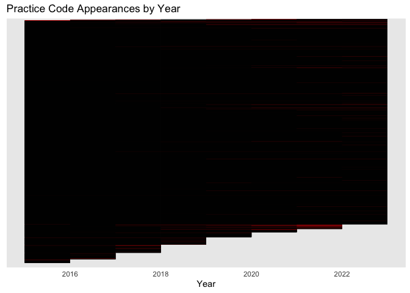

# Practice Closures Trigger Analysis

In this analysis, we attempt to quantify and categorise the number of
GPs practices that have closed in England each year from 2015 to 2023.

``` r
library(magrittr)

for (file in list.files("../../data/payments/raw/")) {
  n_prac <- read.csv(paste0("../../data/payments/raw/", file))$Practice.Code %>%
    unique() %>%
    length()

  # assign year
  year <- file %>%
    substr(1, nchar(.) - 4) %>%
    substr(4, nchar(.)) %>%
    paste0("20", .) %>%
    as.numeric()

  if (file == "14-15.csv") {
    n_prac_15_payments <- n_prac
  } else if (file == "22-23.csv") {
    n_prac_23_payments <- n_prac
  }

  print(paste0(year, ": ", n_prac))
}
```

    ## [1] "2015: 7959"
    ## [1] "2016: 7841"
    ## [1] "2017: 7763"
    ## [1] "2018: 7543"
    ## [1] "2019: 7279"
    ## [1] "2020: 7001"
    ## [1] "2021: 6808"
    ## [1] "2022: 6758"
    ## [1] "2023: 6669"

Over the past decade, there has been a dramatic reduction in the number
of practices from 7959 in 2015 to 6669 in 2023, according to the number
of unique practice codes in the annual [NHS Payments
data](https://github.com/camappel/HEEC/tree/main/data/payments).

The reasons for and consequences of practice closures are multifaceted.
Practices may merge with other practices for purely organisational
reasons or because one practice is failing. Mergers may be purely
administrative with limited impact on patients, or they may involve
closure of premises or redesign of services.

Practices may also close altogether, leaving thousands of patients
without access to primary care until they find another surgery. Practice
closures are costly in that they incur interruptions in services for
patients. One reason for closure is when the partnership model fails
within a practice; this partnership model is increasingly under strain
because younger doctors are less keen to become a partner due to the
financial and workload commitment.

We begin by categorising types of closures:

- Merged: Horizontal integration of 2 or more practices. The practice
  code changes to a pre-existing practice code.
  - Administrative: premises are unchanged, limited impact on workforce
    and patients
  - Estate restructure: premises close, staff are let go and patient
    satisfaction falls
- Closed: The practice code no longer exists
  - Practice no longer receives payments, has no registered payments,
    the premises close, and staff are let go.
- Open: The practice has had the same practice code since it opened and
  still exists in the most recent records

# Identify open practices

We start by identifying open practices, which are practices that have
had the same practice code since they opened and still exist in the most
recent records.

To get a sense of the data, we plot the number of appearances of each
practice code by year. If the number of registered patients or total
payments are 0, the line is coloured red.

``` r
library(magrittr)
library(dplyr)
library(ggplot2)

payments <- read.csv("../../data/payments/payments.csv")

t <- payments[, c("Practice.Code", "Year", "Number.of.Registered.Patients..Last.Known.Figure.", "Total.NHS.Payments.to.General.Practice")]

# Create a unique ordering by combining last_year and Practice.Code
t <- t %>%
  group_by(Practice.Code) %>%
  mutate(last_year = max(Year)) %>%
  ungroup() %>%
  arrange(last_year, Practice.Code)

# Convert Practice.Code to a factor ordered by last_year, then by Practice.Code
t$Practice.Code <- factor(t$Practice.Code, levels = unique(t$Practice.Code))

# Create the color column based on conditions
t$color <- with(t, ifelse(Number.of.Registered.Patients..Last.Known.Figure. <= 0 |
  Total.NHS.Payments.to.General.Practice <= 0,
"red",
"black"
))

# Create the plot
ggplot(t, aes(x = Year, y = Practice.Code, group = Practice.Code, color = color)) +
  geom_line(alpha = 0.5, linewidth = 0.25) + # Adjust alpha for transparency if needed
  labs(
    x = "Year", y = NULL,
    title = "Practice Code Appearances by Year"
  ) +
  theme_minimal() +
  theme(
    axis.text.y = element_blank(),
    axis.ticks.y = element_blank()
  ) +
  scale_color_identity()
```

<!-- -->

``` r
# how many practices are present from 2015 to 2023
practice_years <- payments[, c("Practice.Code", "Year", "Number.of.Registered.Patients..Last.Known.Figure.", "Total.NHS.Payments.to.General.Practice")] %>%
  group_by(Practice.Code) %>%
  summarise(unique_years = n_distinct(Year))

practices_present_all_years <- practice_years[practice_years$unique_years == 9, ]$Practice.Code
```

6503 practices of the 7959 that were present in the NHS Payments data in
2015 were still present in 2023.

``` r
t_drop <- payments[, c("Practice.Code", "Year", "Number.of.Registered.Patients..Last.Known.Figure.", "Total.NHS.Payments.to.General.Practice")][t$Number.of.Registered.Patients..Last.Known.Figure. != 0 & t$Total.NHS.Payments.to.General.Practice != 0, ]

practice_years <- t_drop %>%
  group_by(Practice.Code) %>%
  summarise(unique_years = n_distinct(Year))

practices_present_all_years <- practice_years[practice_years$unique_years == 9, ]$Practice.Code
```

However, many of these practices had 0 patients or patients, despite
being included in the NHS Payments data. 5922 practices had non-zero
patients and payments in all years from 2015 to 2023.

``` r
# Create a unique ordering by combining last_year and Practice.Code
t <- t %>%
  group_by(Practice.Code) %>%
  mutate(last_year = max(Year)) %>%
  ungroup() %>%
  arrange(last_year, Practice.Code)

# Convert Practice.Code to a factor ordered by last_year, then by Practice.Code
t$Practice.Code <- factor(t$Practice.Code, levels = unique(t$Practice.Code))

# Create the color column based on conditions
t$color <- with(t, ifelse(Number.of.Registered.Patients..Last.Known.Figure. <= 0 |
  Total.NHS.Payments.to.General.Practice <= 0,
"red",
"black"
))

# Create the plot
ggplot(t, aes(x = Year, y = Practice.Code, group = Practice.Code, color = color)) +
  geom_line(alpha = 0.5, linewidth = 0.25) + # Adjust alpha for transparency if needed
  labs(
    x = "Year", y = NULL,
    title = "Practice Code Appearances by Year"
  ) +
  theme_minimal() +
  theme(
    axis.text.y = element_blank(),
    axis.ticks.y = element_blank()
  ) +
  scale_color_identity()
```

<!-- -->

# Identify closed practices

### NHS Payments data

We start by identifying discontinued practice codes in the NHS Payments
data.

``` r
library(dplyr)

# Initialize an empty list to store Practice.Codes from the previous iteration
prev_practice_codes <- NULL

# Initialize an empty dataframe to store the missing practice codes and years
missing_practices_df <- data.frame(Year = integer(), Practice.Code = character(), stringsAsFactors = FALSE)

for (file in list.files("../../data/payments/raw/")) {
  df <- read.csv(paste0("../../data/payments/raw/", file))[c("Practice.Code", "Practice.Close.Date")]

  # Assign file year
  year <- substr(file, 1, nchar(file) - 4)
  year <- substr(year, 4, nchar(year))
  year <- as.numeric(paste0("20", year))

  # Extract the Practice.Code column as a list
  current_practice_codes <- df$Practice.Code

  # Check if there is a previous list to compare with
  if (!is.null(prev_practice_codes)) {
    # Find Practice.Codes that were in the previous list but are not in the current list
    missing_practice_codes <- setdiff(prev_practice_codes, current_practice_codes)
    missing_practice_codes_length <- length(missing_practice_codes)

    # Append the missing practice codes and year to the dataframe
    if (missing_practice_codes_length > 0) {
      missing_practices_df <- rbind(
        missing_practices_df,
        data.frame(Year = rep(year, missing_practice_codes_length), Practice.Code = missing_practice_codes)
      )
    }
  }

  # Update the previous Practice.Codes list for the next iteration
  prev_practice_codes <- current_practice_codes
}

# number of discontinued practice codes per year
missing_practices_df %>%
  group_by(Year) %>%
  summarise(n = n())
```

    ## # A tibble: 8 × 2
    ##    Year     n
    ##   <dbl> <int>
    ## 1  2016   155
    ## 2  2017   123
    ## 3  2018   230
    ## 4  2019   274
    ## 5  2020   288
    ## 6  2021   202
    ## 7  2022   125
    ## 8  2023   155

The table above shows the number of discontinued practice codes per
year; these are practice codes that were present in the previous year’s
data but are missing in the current year’s data. This could indicate
that the practice has closed or merged with another practice.

``` r
t <- missing_practices_df %>%
  group_by(Practice.Code) %>%
  summarise(n = n())

t <- t[t$n > 1, ] %>% nrow()
```

49 practice codes were discontinued in multiple years, meaning that they
reported payments in one year, were missing in the following year’s
data, and then reappeared in a subsequent year’s data before
disappearing again.

The NHS Payments data also contains information on practice closures,
under the column `Practice.Close.Date`.

``` r
library(tidyverse)
library(lubridate)

closure <- data.frame()

for (file in list.files("../../data/payments/raw/")) {
  df <- read.csv(paste0("../../data/payments/raw/", file))[c("Practice.Code", "Practice.Close.Date")]

  # assign file year
  year <- substr(file, 1, nchar(file) - 4)
  year <- substr(year, 4, nchar(year))
  year <- paste0("20", year)
  df$reportedYear <- year

  # replace empty values with NA
  df$Practice.Close.Date[df$Practice.Close.Date %in% c("-", "", " ")] <- NA

  # Convert Practice.Close.Date to Date format
  df <- df %>%
    mutate(Practice.Close.Date = dmy(Practice.Close.Date))

  # Extract year and update Year column
  df <- df %>%
    mutate(closureYear = year(Practice.Close.Date))

  # if Practice.Close.Date is not NA, add row to closure dataframe
  closure <- df %>%
    filter(!is.na(Practice.Close.Date)) %>%
    bind_rows(closure)
}

# remove duplicates, keeping lowest value of year
closure <- closure %>%
  group_by(Practice.Code) %>%
  filter(closureYear == min(closureYear))

# sort by closure year
closure %>%
  arrange(closureYear) %>%
  print()
```

    ## # A tibble: 1,347 × 4
    ## # Groups:   Practice.Code [1,227]
    ##    Practice.Code Practice.Close.Date reportedYear closureYear
    ##    <chr>         <date>              <chr>              <dbl>
    ##  1 Y02424        2013-07-31          2023                2013
    ##  2 J82651        2013-10-31          2022                2013
    ##  3 Y02424        2013-07-31          2022                2013
    ##  4 J82620        2014-08-31          2022                2014
    ##  5 L83132        2014-11-30          2022                2014
    ##  6 F85680        2014-10-16          2016                2014
    ##  7 N85056        2014-06-30          2015                2014
    ##  8 Y02664        2014-06-30          2015                2014
    ##  9 Y02673        2014-08-31          2015                2014
    ## 10 Y02880        2014-12-14          2015                2014
    ## # ℹ 1,337 more rows

``` r
# print number of closed practices per year
closure %>%
  group_by(closureYear) %>%
  summarise(n = n()) %>%
  print()
```

    ## # A tibble: 11 × 2
    ##    closureYear     n
    ##          <dbl> <int>
    ##  1        2013     3
    ##  2        2014    98
    ##  3        2015   152
    ##  4        2016   158
    ##  5        2017   225
    ##  6        2018   230
    ##  7        2019   135
    ##  8        2020   166
    ##  9        2021    89
    ## 10        2022    86
    ## 11        2023     5

``` r
# return rows in missing_practice_codes_df where Practice.Code is in closure$Practice.Code
missing_practices_df[missing_practices_df$Practice.Code %in% closure$Practice.Code, ] %>% nrow()
```

    ## [1] 1187

``` r
missing_practices_df[!missing_practices_df$Practice.Code %in% closure$Practice.Code, ] %>% nrow()
```

    ## [1] 365

From this, we can get a rough idea of the number of practices that have
closed each year. However, this data does not provide information about
the type of closure (merged, closed, open), and consequently the impact
on patients.

Furthermore, the Practice.Close.Date is often not consistent between
years; where duplicated, we will use the earliest reported date of
closure for each practice. `reportedYear` refers to the year in which
the closure was reported in the annual NHS Payments data, while
`closureYear` refers to the year in which the practice closed.

As such, practices that are reported to have closed in year ‘t’ still
receive payments and report patients in year ‘t+1’.

### Pulse

We can also use data from
[Pulse](https://www.pulsetoday.co.uk/news/practice-closures/) to
identify practices that have closed. This data is stored in `pulse.csv`.

``` r
pulse <- read.csv("pulse.csv")

# filter out rows where Practice.Code is blank
pulse <- pulse %>%
  filter(Practice.Code != "")

# return rows in pulse where Practice.Code is in closure$Practice.Code
pulse[pulse$Practice.Code %in% closure$Practice.Code, ] %>% nrow()
```

    ## [1] 228

### [Sidhu et al. (2023)](https://www.journalslibrary.nihr.ac.uk/hsdr/PRWQ4012/#/bn1)

A study on the impact of vertical integration whereby acute hospitals
run primary care medical practices found that “at 31 March 2021, 26 NHS
trusts were in vertically integrated organisations, running 85 general
practices across 116 practice sites”. We obtained this dataset directly
from the authors, stored in `sidhu.csv`.

``` r
sidhu <- read.csv("sidhu.csv")

# return rows where code_April_2020 does not match previous_practice_codes. This indicates that previous_practice_codes merged with code_April_2020
t <- sidhu %>%
  filter(code_April_2020 != previous_practice_codes) %>%
  arrange(code_April_2020)

merged_practices <- t$previous_practice_codes

merged_practices[merged_practices %in% closure$Practice.Code] %>% length()
```

    ## [1] 817

## Descriptive statistics

### What is the distribution of deprivation of practices that have closed?

We can use the [Index of Multiple Deprivation
(IMD)](https://github.com/HealthEquityEvidenceCentre/HEEC/tree/main/data/IMD)
to determine the distribution of deprivation of practices that have
closed.

``` r
IMD <- read.csv("../../data/IMD/IMD_interpolated.csv")

# assign to quintiles by year
for (year in unique(IMD$Year)) {
  IMD[IMD$Year == year, "quintile"] <- cut(IMD[IMD$Year == year, "IMD"], breaks = quantile(IMD[IMD$Year == year, "IMD"], probs = seq(0, 1, 0.2)), labels = FALSE)
}

# all practices
IMD %>%
  group_by(Year) %>%
  summarise(
    mean_IMD = mean(IMD, na.rm = TRUE),
    sd_IMD = sd(IMD, na.rm = TRUE),
    min_IMD = min(IMD, na.rm = TRUE),
    max_IMD = max(IMD, na.rm = TRUE),
    n = n()
  )
```

    ## # A tibble: 15 × 6
    ##     Year mean_IMD sd_IMD min_IMD max_IMD     n
    ##    <int>    <dbl>  <dbl>   <dbl>   <dbl> <int>
    ##  1  2010     24.2   12.8    2.60    68.9  8222
    ##  2  2011     24.2   12.6    2.77    68.4  8222
    ##  3  2012     24.1   12.4    2.95    67.9  8222
    ##  4  2013     24.1   12.2    3.13    67.4  8222
    ##  5  2014     24.1   12.1    3.31    67.0  8222
    ##  6  2015     24.1   12.0    3.21    66.5  8438
    ##  7  2016     24.1   11.9    3.21    66.5  8438
    ##  8  2017     24.1   11.9    3.21    67.1  8438
    ##  9  2018     24.1   11.9    3.21    67.9  8438
    ## 10  2019     24.1   11.9    3.21    68.7  8461
    ## 11  2020     24.1   11.9    3.21    68.7  8461
    ## 12  2021     24.1   11.9    3.21    68.7  8461
    ## 13  2022     24.1   11.9    3.21    68.7  8461
    ## 14  2023     24.1   11.9    3.21    68.7  8461
    ## 15  2024     24.1   11.9    3.21    68.7  8461

``` r
# how many practices in closure are not in IMD
closure$Practice.Code[!closure$Practice.Code %in% IMD$Practice.Code] %>% length()
```

    ## [1] 10

``` r
# merge closure with IMD by Practice.Code and reportedYear = Year
closure_IMD <- merge(closure, IMD, by.x = c("Practice.Code", "reportedYear"), by.y = c("Practice.Code", "Year"))

closure_IMD %>%
  group_by(closureYear) %>%
  summarise(
    mean_IMD = mean(IMD, na.rm = TRUE),
    sd_IMD = sd(IMD, na.rm = TRUE),
    min_IMD = min(IMD, na.rm = TRUE),
    max_IMD = max(IMD, na.rm = TRUE),
    n = n()
  )
```

    ## # A tibble: 11 × 6
    ##    closureYear mean_IMD sd_IMD min_IMD max_IMD     n
    ##          <dbl>    <dbl>  <dbl>   <dbl>   <dbl> <int>
    ##  1        2013     25.0   2.46   22.2     26.4     3
    ##  2        2014     27.3  13.1     3.31    56.6    96
    ##  3        2015     24.6  12.1     5.14    54.6   149
    ##  4        2016     27.0  11.6     5.43    55.6   157
    ##  5        2017     28.2  12.1     3.21    65.2   224
    ##  6        2018     26.0  12.8     3.49    66.5   229
    ##  7        2019     24.9  11.9     5.10    56.2   135
    ##  8        2020     23.7  12.6     5.60    53.9   166
    ##  9        2021     28.2  10.9     7.02    55.5    89
    ## 10        2022     22.4  10.1     5.89    45.6    84
    ## 11        2023     24.6   9.06   12.0     36.7     5

``` r
closure_IMD %>%
  group_by(quintile) %>%
  summarise(n = n())
```

    ## # A tibble: 6 × 2
    ##   quintile     n
    ##      <int> <int>
    ## 1        1   225
    ## 2        2   218
    ## 3        3   247
    ## 4        4   296
    ## 5        5   350
    ## 6       NA     1

``` r
# bar chart of quintiles
ggplot(closure_IMD, aes(x = quintile)) +
  geom_bar()
```

<!-- --> We see
that that closed practices tend to be in the higher quintiles of
deprivation, with a mean IMD of 25.9317859.

We then perform a Welch Two Sample t-test to determine if the mean IMD
of closed practices is significantly different from the mean IMD of all
practices.

``` r
t.test(closure_IMD$IMD, IMD$IMD, alternative = "two.sided")
```

    ## 
    ##  Welch Two Sample t-test
    ## 
    ## data:  closure_IMD$IMD and IMD$IMD
    ## t = 5.4235, df = 1364.1, p-value = 6.905e-08
    ## alternative hypothesis: true difference in means is not equal to 0
    ## 95 percent confidence interval:
    ##  1.157342 2.469004
    ## sample estimates:
    ## mean of x mean of y 
    ##  25.93179  24.11861

Based on the results of the t-test, we can conclude that there *is* a
statistically significant difference between the IMD values of closed
practices and all practices. Specifically, the closed practices sample
tend to have higher IMD values.

### Notes

We could also try counting practice codes in each year that are not
present in the following years.

``` r
library(dplyr)

# read in data
df <- read.csv("../../data/payments/raw/14-15.csv")[c("Practice.Code", "Practice.Open.Date", "Practice.Close.Date")]
df$Year <- "2015"
```

<https://www.gponline.com/map-gp-practice-mergers-closures-nhs-england/article/1439293>
<https://www.gponline.com/exclusive-one-twenty-gp-contracts-terminated-three-years-closures-accelerate/article/1404813>
Subregional figures, obtained using the Freedom of Information Act,
reveal for the first time the full and escalating extent of disruptive
practice closures, mergers and takeovers.

Commissioners provided details of 140 practice contracts that had been
terminated because of a practice closure between 1 April 2013 and 21
March 2016. The number of closures more than doubled from 26 in 2013/14
to 59 the following year, with a further 55 before the end of last year.

A further 264 contracts were identified as having been merged over the
three-year period. More detailed information from some areas indicated
that around half of those practices involved in mergers may have been
closed.

The data on contract terminations revealed a further 26 practices that
had been reprocured under a new contract. Of these 11 GMS and five PMS
practices were handed to an APMS provider.

The total number of contract terminations - in which practices closed or
merged - increased from 54 in 2013/14 to 158 the next year and up to 192
before the end of 2015/16.

Common reasons for closures provided by commissioners included GP
retirements and contract resignations.
