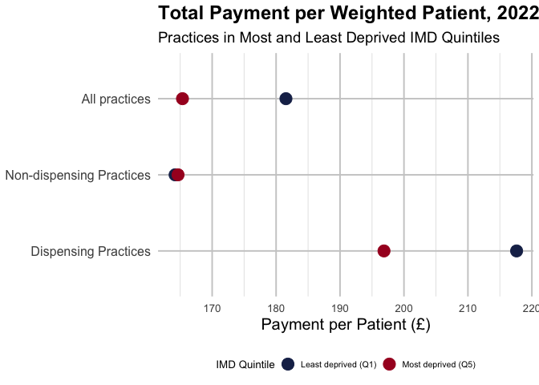
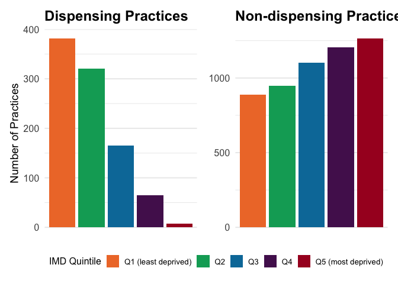
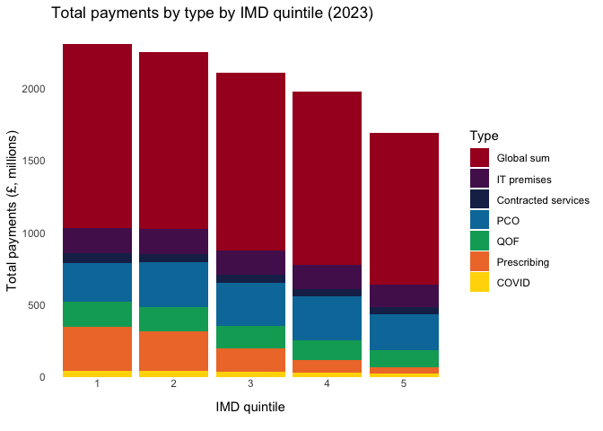

# Exploring the impact of dispensing practicing on equity in NHS payments to general practices

General practices serving the most deprived populations receive less
funding per weighted patient than those serving the least deprived. Here
we show that this inequality is driven by a higher concentration of
dispensing practices in more affluent areas.

### What are Dispensing Practices?

Dispensing practices are practices where “at the patient’s request
dispensing doctors are allowed to dispense the medicines they prescribe
for these patients” (DDA); they are not the same as practices with an
on-site pharmacy.

[NHS
Digital](https://digital.nhs.uk/data-and-information/publications/statistical/nhs-payments-to-general-practice)
provides public CSVs on NHS payments to individual providers of general
practice services in England from 2014-15 to 2022-23. We look at the
most recent data from 2022-23.

``` r
# Load necessary libraries
library(magrittr)
library(dplyr)

# Download the NHS payments data for 2022/23
df <- read.csv("https://files.digital.nhs.uk/05/E6ADA0/nhspaymentsgp-22-23-prac-csv.csv")

# Filter dispensing and non-dispensing practices
dispensing <- df %>% filter(Dispensing.Practice == "Yes")
non_dispensing <- df %>% filter(Dispensing.Practice == "No")

# Number of dispensing practices
num_dispensing <- dispensing %>%
  distinct(Practice.Code) %>%
  nrow()

# Number of non-dispensing practices
num_non_dispensing <- non_dispensing %>%
  distinct(Practice.Code) %>%
  nrow()

num_unknown_dispensing <- df[df$Dispensing.Practice == "Unknown", ] %>%
  distinct(Practice.Code) %>%
  nrow()

# Sum of patients in dispensing practices
total_dispensing_patients <- sum(dispensing$Average.Number.of.Registered.Patient, na.rm = TRUE)

# Sum of patients in non-dispensing practices
total_non_dispensing_patients <- sum(non_dispensing$Average.Number.of.Registered.Patient, na.rm = TRUE)
```

In 2023, there were 944 dispensing practices covering 9.5058785^{6}
patients and 5537 non-dispensing practices covering 5.2628766^{7}
patients in England (dispensing status unknown for 188 practices).

[OHID](https://fingertips.phe.org.uk/search/deprivation%20index#page/4/gid/1/pat/159/par/K02000001/ati/15/are/E92000001/iid/93553/age/1/sex/4/cat/-1/ctp/-1/yrr/1/cid/4/tbm/1)
provides the [Fingertips API](https://fingertips.phe.org.uk/api), which
includes practice-level IMD values.

``` r
# Load necessary libraries
library(httr)
library(readr)

# Define the URL and query parameters
base_url <- "https://fingertipsws.phe.org.uk/api/all_data/csv/by_indicator_id"
query_params <- list(
  v = "/0-c459298b/",
  parent_area_code = "E92000001",
  parent_area_type_id = 167,
  child_area_type_id = 7,
  indicator_ids = 93553
)

# Make the API request
response <- GET(base_url, query = query_params)

# Check if the response is successful
if (http_status(response)$category == "Success") {
  # Write the content to a temporary file
  temp_file <- tempfile(fileext = ".csv")
  writeBin(content(response, "raw"), temp_file)

  # Read the CSV data
  IMD <- read_csv(temp_file)

  # Display the first few rows of the data
  print(head(IMD))
} else {
  cat("Failed to retrieve data. Status code:", status_code(response), "\n")
  cat("Response content:", content(response, "text"), "\n")
}
```

    ## # A tibble: 6 × 27
    ##   `Indicator ID` `Indicator Name`        `Parent Code` `Parent Name` `Area Code`
    ##            <dbl> <chr>                   <chr>         <chr>         <chr>      
    ## 1          93553 Deprivation score (IMD… <NA>          <NA>          E92000001  
    ## 2          93553 Deprivation score (IMD… E92000001     England       E38000217  
    ## 3          93553 Deprivation score (IMD… E38000247     NHS Tees Val… A81001     
    ## 4          93553 Deprivation score (IMD… E38000247     NHS Tees Val… A81002     
    ## 5          93553 Deprivation score (IMD… E38000247     NHS Tees Val… A81004     
    ## 6          93553 Deprivation score (IMD… E38000247     NHS Tees Val… A81005     
    ## # ℹ 22 more variables: `Area Name` <chr>, `Area Type` <chr>, Sex <chr>,
    ## #   Age <chr>, `Category Type` <lgl>, Category <lgl>, `Time period` <dbl>,
    ## #   Value <dbl>, `Lower CI 95.0 limit` <lgl>, `Upper CI 95.0 limit` <lgl>,
    ## #   `Lower CI 99.8 limit` <lgl>, `Upper CI 99.8 limit` <lgl>, Count <lgl>,
    ## #   Denominator <lgl>, `Value note` <lgl>, `Recent Trend` <chr>,
    ## #   `Compared to England value or percentiles` <chr>,
    ## #   `Compared to CCGs (from Apr 2021) value or percentiles` <chr>, …

``` r
# select Area Code, Time period, Value columns and rename them to Practice.Code, Year, IMD
IMD <- IMD %>%
  select("Area Code", "Time period", "Value") %>%
  rename(Practice.Code = "Area Code", Year = "Time period", IMD = "Value")
```

As well as the the fingertipsR package, which provides an R interface to
the Fingertips API.

To explore the relationship between dispensing practices and
deprivation, we can merge the NHS payments data with the IMD data (from
the API, not the package).

``` r
# Merge the NHS payments data with the IMD data, starting with 2019 data
df_merged <- merge(df, IMD[IMD$Year == max(IMD$Year), ], by = "Practice.Code")

# Assign each practice to a deprivation quintile based on the IMD score
df_merged %<>%
  mutate(IMD_quintile = cut(IMD, breaks = quantile(IMD, probs = seq(0, 1, 0.2), na.rm = TRUE), include.lowest = TRUE, labels = c("1", "2", "3", "4", "5")))

# How many practices in df are missing from df_merged?
num_missing <- df[!df$Practice.Code %in% df_merged$Practice.Code, ]$Practice.Code %>%
  unique() %>%
  length()

# How many dispensing practices are in each quintile?
num_disp_5 <- table(df_merged$IMD_quintile, df_merged$Dispensing.Practice)[5, 2]

# What is the dispensing status of the practices missing from df_merged?
dispensing_status_missing <- df[!df$Practice.Code %in% df_merged$Practice.Code, ] %>%
  group_by(Dispensing.Practice) %>%
  summarise(
    n = n()
  )
```

IMD values were not available for 322 practices, including all of the
practices with unknown dispensing status, leaving 6347 practices with
known IMD values and dispensing status out of the original 6669
practices.

``` r
# calculate the average payment per patient for the highest and lowest deprivation quintiles for dispensing and non-dispensing practices
agg_dispensing <- df_merged %>%
  filter(
    (IMD_quintile == 1 | IMD_quintile == 5) &
      (Dispensing.Practice == "No" | Dispensing.Practice == "Yes") &
      !is.na(IMD_quintile)
  ) %>%
  group_by(IMD_quintile, Dispensing.Practice) %>%
  summarise(
    total_payments = sum(Total.NHS.Payments.to.General.Practice.including.Covid.and.PCN.payments, na.rm = TRUE),
    weighted_patients = sum(Average.Number.of.Weighted.Patients, na.rm = TRUE),
    .groups = "drop" # to ungroup after summarise
  ) %>%
  mutate(
    payment_per_patient = total_payments / weighted_patients
  )

# calculate the average payment per patient for all practices
additional_rows <- bind_rows(
  data.frame(
    IMD_quintile = "1",
    Dispensing.Practice = "All",
    total_payments = sum(df_merged[df_merged$IMD_quintile == 1, ]$Total.NHS.Payments.to.General.Practice.including.Covid.and.PCN.payments, na.rm = TRUE),
    weighted_patients = sum(df_merged[df_merged$IMD_quintile == 1, ]$Average.Number.of.Weighted.Patients, na.rm = TRUE)
  ) %>%
    mutate(
      payment_per_patient = total_payments / weighted_patients
    ),
  data.frame(
    IMD_quintile = "5",
    Dispensing.Practice = "All",
    total_payments = sum(df_merged[df_merged$IMD_quintile == 5, ]$Total.NHS.Payments.to.General.Practice.including.Covid.and.PCN.payments, na.rm = TRUE),
    weighted_patients = sum(df_merged[df_merged$IMD_quintile == 5, ]$Average.Number.of.Weighted.Patients, na.rm = TRUE)
  ) %>%
    mutate(
      payment_per_patient = total_payments / weighted_patients
    )
)

agg_dispensing <- bind_rows(agg_dispensing, additional_rows)

# Replace the "All" Dispensing.Practice with "All Practices"
agg_dispensing$Dispensing.Practice[agg_dispensing$Dispensing.Practice == "All"] <- "All practices"
agg_dispensing$Dispensing.Practice[agg_dispensing$Dispensing.Practice == "Yes"] <- "Dispensing Practices"
agg_dispensing$Dispensing.Practice[agg_dispensing$Dispensing.Practice == "No"] <- "Non-dispensing Practices"

# Update the factor levels for Dispensing.Practice
agg_dispensing$Dispensing.Practice <- factor(agg_dispensing$Dispensing.Practice,
  levels = c("Dispensing Practices", "Non-dispensing Practices", "All practices")
)

pwp_1 <- agg_dispensing[5, 5]
pwp_5 <- agg_dispensing[6, 5]
pwp_diff <- pwp_1 - pwp_5

pwp_disp_diff <- agg_dispensing[1, 5] - agg_dispensing[3, 5]
pwp_disp_diff2 <- agg_dispensing[2, 5] - agg_dispensing[4, 5]
```

Across all practices, those in the least deprived 20% received
£181.540148 per weighted patient in 2023, compared to £165.3584231 for
those in the most deprived 20% – a gap of £16.1817249. When we exclude
all dispensing practices from this analysis, the gap is only
£-0.4599605. The gap in payments to dispensing practices is much larger
(£20.7390235), but this is partly because there are only 7 dispensing
practices covering the most deprived 20%.

``` r
library(ggplot2)

# Plot
ggplot(agg_dispensing, aes(x = payment_per_patient, y = Dispensing.Practice, color = as.factor(IMD_quintile))) +
  geom_point(size = 5) +
  scale_color_manual(values = c("5" = "#A80026", "1" = "#1B2C57"), labels = c("Least deprived (Q1)", "Most deprived (Q5)")) +
  labs(
    title = "Total Payment per Weighted Patient, 2022/23",
    subtitle = "Practices in Most and Least Deprived IMD Quintiles",
    x = "Payment per Patient (£)",
    y = "Dispensing Practice",
    color = "IMD Quintile"
  ) +
  theme_minimal(base_size = 15) +
  theme(
    plot.title = element_text(size = 18, face = "bold"),
    plot.subtitle = element_text(size = 14),
    axis.title.y = element_blank(),
    axis.text.x = element_text(size = 10),
    legend.position = "bottom",
    legend.title = element_text(size = 10),
    legend.text = element_text(size = 8),
    legend.key.size = unit(0.5, "cm"),
    panel.grid.major = element_line(color = "grey80"),
    panel.grid.minor = element_line(color = "grey90"),
    plot.margin = margin(5, 5, 5, 5) # Adjust margin to make space for the legend
  )
```



``` r
table(dispensing$Practice.Rurality)
```

    ## 
    ## Rural Urban 
    ##   692   252

``` r
perc_rural <- table(dispensing$Practice.Rurality) / nrow(dispensing) * 100

table(df_merged[df_merged$Practice.Rurality == "Rural", ]$IMD_quintile)
```

    ## 
    ##   1   2   3   4   5 
    ## 445 352 184  65  18

``` r
perc_dep <- table(df_merged[df_merged$Practice.Rurality == "Rural", ]$IMD_quintile) / nrow(df_merged[df_merged$Practice.Rurality == "Rural", ]) * 100
```

73.3050847% of all dispensing practices are in rural areas. One
explanation for this unequal geographical distribution is that in order
for a dispensing practice to dispense medicine, “the patient must live
more than 1.6km from a retail pharmacy or the area must be designated as
a ‘reserved location’” (DDE). Therefore, dispensing practices are only
likely to dispense enough medicine to be sufficiently profitable in
rural areas.

Consequently, dispensing practices tend to be in more affluent areas:
41.8233083% of dispensing practices serve patients in the least deprived
quintile and 33.0827068% serve those in the second least deprived
quintile, whereas 1.6917293% cover the most deprived quintile.

``` r
# Define the colors vector as provided
colors <- c("#EF7A34", "#00A865", "#007AA8", "#531A5C", "#A80026")

# Custom labels for the legend
custom_labels <- c(
  "1" = "Q1 (least deprived)",
  "2" = "Q2",
  "3" = "Q3",
  "4" = "Q4",
  "5" = "Q5 (most deprived)"
)

dispensing_plot <- ggplot(df_merged[df_merged$Dispensing.Practice == "Yes", ], aes(x = as.factor(IMD_quintile), fill = as.factor(IMD_quintile))) +
  geom_bar() +
  scale_fill_manual(values = colors, labels = custom_labels) +
  labs(
    title = "Dispensing Practices",
    # x = "IMD Quintile",
    y = "Number of Practices",
    fill = "IMD Quintile"
  ) +
  theme_minimal(base_size = 15) +
  theme(
    plot.title = element_text(size = 18, face = "bold"),
    axis.title.x = element_blank(),
    axis.title.y = element_text(size = 14),
    axis.text.x = element_blank(), # Adjust margin to reduce space
    axis.text.y = element_text(size = 12),
    legend.position = "right",
    legend.title = element_text(size = 12),
    legend.text = element_text(size = 10),
    panel.grid.major.x = element_blank(), # Remove major vertical grid lines
    panel.grid.minor.x = element_blank(), # Remove minor vertical grid lines
    # panel.grid.major = element_line(color = "grey80"),
    # panel.grid.minor = element_line(color = "grey90")
  )

non_dispensing_plot <- ggplot(df_merged[df_merged$Dispensing.Practice == "No", ], aes(x = as.factor(IMD_quintile), fill = as.factor(IMD_quintile))) +
  geom_bar() +
  scale_fill_manual(values = colors, labels = custom_labels) +
  labs(
    title = "Non-dispensing Practices",
    y = "Number of practices",
    fill = "IMD Quintile"
  ) +
  theme_minimal(base_size = 15) +
  theme(
    plot.title = element_text(size = 18, face = "bold"),
    axis.title.x = element_blank(),
    axis.title.y = element_blank(),
    axis.text.x = element_blank(), # Adjust margin to reduce space
    axis.text.y = element_text(size = 12),
    legend.position = "right",
    legend.title = element_text(size = 12),
    legend.text = element_text(size = 10),
    panel.grid.major.x = element_blank(), # Remove major vertical grid lines
    panel.grid.minor.x = element_blank(), # Remove minor vertical grid lines
    # panel.grid.major = element_line(color = "grey80"),
    # panel.grid.minor = element_line(color = "grey90"),
  )

# Combine the two plots using patchwork
library(patchwork)

combined_plot <- dispensing_plot + non_dispensing_plot +
  plot_layout(guides = "collect") & theme(legend.position = "bottom")

print(combined_plot)
```



## How do payments differ between dispensing and non-dispensing practices?

Dispensing and non-dispensing practices receive reimbursement for the
drugs they use.

We calculate the proportion of payments that are for prescribing for
dispensing and non-dispensing practices.

``` r
Prescribing <- c("Prescribing.Fee.Payments", "Dispensing.Fee.Payments", "Reimbursement.of.Drugs")

df_merged$Total.Prescribing <- rowSums(df_merged[, Prescribing], na.rm = TRUE)

agg <- df_merged %>%
  group_by(Dispensing.Practice) %>%
  summarise(
    total_prescribing = sum(Total.Prescribing, na.rm = TRUE),
    total_payments = sum(Total.NHS.Payments.to.General.Practice.including.Covid.and.PCN.payments, na.rm = TRUE),
    .groups = "drop"
  ) %>%
  mutate(
    prescribing_proportion = (total_prescribing / total_payments) * 100
  )

agg
```

    ## # A tibble: 2 × 4
    ##   Dispensing.Practice total_prescribing total_payments prescribing_proportion
    ##   <chr>                           <dbl>          <dbl>                  <dbl>
    ## 1 No                         244166199.    8589930080.                   2.84
    ## 2 Yes                        624136108.    2268785305.                  27.5

For dispensing practices, prescribing payments constitute 27.5097034% of
total payments for dispensing practices, but only 2.8424702 for
non-dispensing practices.

``` r
agg <- df_merged %>%
  group_by(IMD_quintile) %>%
  summarise(
    total_prescribing = sum(Total.Prescribing, na.rm = TRUE),
    total_payments = sum(Total.NHS.Payments.to.General.Practice.including.Covid.and.PCN.payments, na.rm = TRUE),
    .groups = "drop"
  ) %>%
  mutate(
    prescribing_proportion = (total_prescribing / total_payments) * 100
  )

diff_all <- agg[1, 3] - agg[5, 3]
ratio_all <- agg[1, 3] / agg[5, 3]

diff_wo_pres <- (agg[1, 3] - agg[1, 2]) - (agg[5, 3] - agg[5, 2])
ratio_wo_pres <- (agg[1, 3] - agg[1, 2]) / (agg[5, 3] - agg[5, 2])

agg
```

    ## # A tibble: 5 × 4
    ##   IMD_quintile total_prescribing total_payments prescribing_proportion
    ##   <fct>                    <dbl>          <dbl>                  <dbl>
    ## 1 1                   306249881.    2413786042.                  12.7 
    ## 2 2                   274913517.    2366647050.                  11.6 
    ## 3 3                   161167701.    2217972011.                   7.27
    ## 4 4                    84705141.    2082075332.                   4.07
    ## 5 5                    41266067.    1778234951.                   2.32

As result, prescribing fees constituted a larger percentage of total
payments for more affluent practices (12.6875322%) than less affluent
ones (2.3206195%) in 2023.

Excluding prescribing payments from the total reduces the difference in
total payments between practices serving the most and least deprived
populations from 6.3555109^{8} to 3.7056728^{8} (or from a ratio of
1.3574056 to 1.2133413)

# Do prescribing contribute more to funding inequality than other payment types?

First, we categorise all payments into 7 types: Global Sum, IT &
Premises, PCO, QOF, Contracted services, Prescribing, and COVID. We then
calculate the proportion of each payment type for IMD quintile, and the
correlation of these proportions with the IMD.

``` r
df_merged %>% colnames()
```

    ##  [1] "Practice.Code"                                                                                             
    ##  [2] "NHS.England..Region..code"                                                                                 
    ##  [3] "NHS.England..Region..Name"                                                                                 
    ##  [4] "Sub.ICB.Code"                                                                                              
    ##  [5] "Sub.ICB.NAME"                                                                                              
    ##  [6] "PCN.Code"                                                                                                  
    ##  [7] "PCN.Name"                                                                                                  
    ##  [8] "Practice.Name"                                                                                             
    ##  [9] "Practice.Address"                                                                                          
    ## [10] "Practice.Postcode"                                                                                         
    ## [11] "Practice.Open.Date"                                                                                        
    ## [12] "Practice.Close.Date"                                                                                       
    ## [13] "Contract.Type"                                                                                             
    ## [14] "Dispensing.Practice"                                                                                       
    ## [15] "Practice.type"                                                                                             
    ## [16] "Practice.Rurality"                                                                                         
    ## [17] "Atypical.characteristics"                                                                                  
    ## [18] "Average.Number.of.Registered.Patients"                                                                     
    ## [19] "Average.Number.of.Weighted.Patients"                                                                       
    ## [20] "Average.payments.per.registered.patient"                                                                   
    ## [21] "Average.payments.per.weighted.patient"                                                                     
    ## [22] "Global.Sum"                                                                                                
    ## [23] "MPIG.Correction.factor"                                                                                    
    ## [24] "Balance.of.PMS.Expenditure"                                                                                
    ## [25] "Total.QOF.Payments"                                                                                        
    ## [26] "Childhood.Vaccination.and.Immunisation.Scheme"                                                             
    ## [27] "GP.Extended.Hours.Access"                                                                                  
    ## [28] "Influenza.and.Pneumococcal.Immunisations"                                                                  
    ## [29] "Learning.Disabilities"                                                                                     
    ## [30] "Meningitis"                                                                                                
    ## [31] "Minor.Surgery"                                                                                             
    ## [32] "Out.Of.Area.in.Hours.Urgent.Care"                                                                          
    ## [33] "Pertussis"                                                                                                 
    ## [34] "Rotavirus.and.Shingles.Immunisation"                                                                       
    ## [35] "Services.for.Violent.Patients"                                                                             
    ## [36] "Medical.Assessment.Reviews"                                                                                
    ## [37] "Weight.Management.Service"                                                                                 
    ## [38] "Local.Incentive.Schemes"                                                                                   
    ## [39] "Premises.Payments"                                                                                         
    ## [40] "Seniority"                                                                                                 
    ## [41] "Doctors.Retainer.Scheme.Payments"                                                                          
    ## [42] "Total.Locum.Allowances"                                                                                    
    ## [43] "Appraisal...Appraiser.Costs.in.Respect.of.Locums"                                                          
    ## [44] "Prolonged.Study.Leave"                                                                                     
    ## [45] "PCO.Admin.Other"                                                                                           
    ## [46] "Information.Management.and.Technology"                                                                     
    ## [47] "Non.DES.Item.Pneumococcal.Vaccine..Childhood.Immunisation.Main.Programme"                                  
    ## [48] "General.Practice.Transformation"                                                                           
    ## [49] "PCN.Participation"                                                                                         
    ## [50] "Prescribing.Fee.Payments"                                                                                  
    ## [51] "Dispensing.Fee.Payments"                                                                                   
    ## [52] "Reimbursement.of.Drugs"                                                                                    
    ## [53] "winter.Access.Fund"                                                                                        
    ## [54] "Other.Payments"                                                                                            
    ## [55] "Total.NHS.Payments.to.General.Practice"                                                                    
    ## [56] "Deductions.for.Pensions..Levies.and.Prescription.Charge.Income"                                            
    ## [57] "Total.NHS.Payments.to.General.Practice.Minus.Deductions"                                                   
    ## [58] "Total.NHS.Payments.to.General.Practice.including.covid.vaccination..covid.support.and.long.covid.payments" 
    ## [59] "Total.NHS.Payments.including.PCN.Workforce..Leadership.and.Support"                                        
    ## [60] "Total.NHS.Payments.to.General.Practice.including.Covid.and.PCN.payments"                                   
    ## [61] "Total.NHS.Payments.to.General.Practice.including.Covid.and.PCN.payments.minus.deductions"                  
    ## [62] "PCN.Leadership"                                                                                            
    ## [63] "PCN.Support"                                                                                               
    ## [64] "PCN.Extended.Hours.Access"                                                                                 
    ## [65] "PCN.Workforce"                                                                                             
    ## [66] "PCN.Investment.and.impact.Fund"                                                                            
    ## [67] "PCN.Care.Home.Premium"                                                                                     
    ## [68] "PCN.Enhanced.Access"                                                                                       
    ## [69] "Covid.Immunisation"                                                                                        
    ## [70] "Covid.Support.and.Expansion"                                                                               
    ## [71] "Long.Covid"                                                                                                
    ## [72] "Average.payments.per.registered.patient.including.PCN.Workforce..Leadership.and.Support"                   
    ## [73] "Average.payments.per.weighted.patient.including.PCN.Workforce..Leadership.and.Support"                     
    ## [74] "Average.payments.per.registered.patient.including.covid.vaccination..covid.support.and.long.covid.payments"
    ## [75] "Average.payments.per.weighted.patient.including.covid.vaccination..covid.support.and.long.covid.payments"  
    ## [76] "Year"                                                                                                      
    ## [77] "IMD"                                                                                                       
    ## [78] "IMD_quintile"                                                                                              
    ## [79] "Total.Prescribing"

``` r
globalSum <- c(
  "Global.Sum", "MPIG.Correction.factor", "Balance.of.PMS.Expenditure"
)

QOF <- c("Total.QOF.Payments")

contractedServices <- c(
  "Childhood.Vaccination.and.Immunisation.Scheme",
  "GP.Extended.Hours.Access",
  "Influenza.and.Pneumococcal.Immunisations",
  "Learning.Disabilities",
  "Meningitis",
  "Minor.Surgery",
  "Out.Of.Area.in.Hours.Urgent.Care",
  "Pertussis",
  "Rotavirus.and.Shingles.Immunisation",
  "Services.for.Violent.Patients",
  "Medical.Assessment.Reviews",
  "Medical.Assessment.Reviews",
  "Weight.Management.Service",
  "Non.DES.Item.Pneumococcal.Vaccine..Childhood.Immunisation.Main.Programme"
)

ITPremises <- c(
  "Premises.Payments", "Information.Management.and.Technology"
)

PCO <- c(
  "Seniority",
  "Doctors.Retainer.Scheme.Payments",
  "Total.Locum.Allowances",
  "Appraisal...Appraiser.Costs.in.Respect.of.Locums",
  "Prolonged.Study.Leave",
  "PCO.Admin.Other",
  "General.Practice.Transformation",
  "PCN.Participation",
  "winter.Access.Fund",
  "Other.Payments",
  "PCN.Leadership",
  "PCN.Support",
  "PCN.Extended.Hours.Access",
  "PCN.Workforce",
  "PCN.Investment.and.impact.Fund",
  "PCN.Care.Home.Premium",
  "PCN.Enhanced.Access"
)

COVID <- c(
  "Covid.Immunisation", "Covid.Support.and.Expansion",
  "Long.Covid"
)

# setdiff(names(df_merged), c(globalSum, ITPremises, PCO, QOF, contractedServices, Prescribing, COVID))

df_merged$Total.globalSum <- rowSums(df_merged[, globalSum], na.rm = TRUE)
df_merged$Total.ITPremises <- rowSums(df_merged[, ITPremises], na.rm = TRUE)
df_merged$Total.PCO <- rowSums(df_merged[, PCO], na.rm = TRUE)
df_merged$Total.contractedServices <- rowSums(df_merged[, contractedServices], na.rm = TRUE)
df_merged$Total.COVID <- rowSums(df_merged[, COVID], na.rm = TRUE)

agg <- df_merged %>%
  group_by(IMD_quintile) %>%
  summarise(
    total_prescribing = sum(Total.Prescribing, na.rm = TRUE),
    total_globalSum = sum(Total.globalSum, na.rm = TRUE),
    total_ITPremises = sum(Total.ITPremises, na.rm = TRUE),
    total_PCO = sum(Total.PCO, na.rm = TRUE),
    total_QOF = sum(Total.QOF.Payments, na.rm = TRUE),
    total_contractedServices = sum(Total.contractedServices, na.rm = TRUE),
    total_COVID = sum(Total.COVID, na.rm = TRUE),
    total_payments = sum(Total.NHS.Payments.to.General.Practice.including.Covid.and.PCN.payments, na.rm = TRUE),
    .groups = "drop"
  ) %>%
  mutate(
    prescribing_proportion = (total_prescribing / total_payments) * 100,
    globalSum_proportion = (total_globalSum / total_payments) * 100,
    ITPremises_proportion = (total_ITPremises / total_payments) * 100,
    PCO_proportion = (total_PCO / total_payments) * 100,
    QOF_proportion = (total_QOF / total_payments) * 100,
    contractedServices_proportion = (total_contractedServices / total_payments) * 100,
    COVID_proportion = (total_COVID / total_payments) * 100
  )
agg[, c(1, 10:16)]
```

    ## # A tibble: 5 × 8
    ##   IMD_quintile prescribing_proportion globalSum_proportion ITPremises_proportion
    ##   <fct>                         <dbl>                <dbl>                 <dbl>
    ## 1 1                             12.7                  52.9                  7.22
    ## 2 2                             11.6                  51.9                  7.25
    ## 3 3                              7.27                 55.5                  7.61
    ## 4 4                              4.07                 57.7                  8.02
    ## 5 5                              2.32                 58.9                  9.08
    ## # ℹ 4 more variables: PCO_proportion <dbl>, QOF_proportion <dbl>,
    ## #   contractedServices_proportion <dbl>, COVID_proportion <dbl>

``` r
# calculate the difference between the total payments for the most and least deprived quintiles for each payment type
diffs_abs <- sapply(agg[, c(2:9)], function(x) x[1] - x[5]) %>% sort()
diffs_abs
```

    ##         total_ITPremises              total_COVID                total_PCO 
    ##                 12976135                 16655019                 17216740 
    ## total_contractedServices                total_QOF          total_globalSum 
    ##                 20760076                 55079869                228397617 
    ##        total_prescribing           total_payments 
    ##                264983815                635551091

``` r
# calculate the difference between the proportion of payments for the most and least deprived quintiles for each payment type
diffs_prop <- sapply(agg[, c(10:16)], function(x) x[1] - x[5]) %>% sort()
diffs_prop
```

    ##          globalSum_proportion                PCO_proportion 
    ##                    -6.0478114                    -3.0094170 
    ##         ITPremises_proportion contractedServices_proportion 
    ##                    -1.8523884                     0.2074023 
    ##              COVID_proportion                QOF_proportion 
    ##                     0.3491382                     0.5013439 
    ##        prescribing_proportion 
    ##                    10.3669127

``` r
# calculate the association between IMD_quintile and the proportion of payments for each payment type
correlations <- sapply(df_merged[, c(25, 79:84)], function(x) cor(as.numeric(df_merged$IMD), x)) %>% sort()
correlations
```

    ##        Total.Prescribing       Total.QOF.Payments Total.contractedServices 
    ##              -0.27334183              -0.19121531              -0.16536047 
    ##          Total.globalSum              Total.COVID         Total.ITPremises 
    ##              -0.10784797              -0.05975018              -0.02878752 
    ##                Total.PCO 
    ##              -0.01349681

The largest difference in payment proportions between the most and least
deprived quintiles is for prescribing payments. Furthermore, while all
payment types are negatively correlated with IMD, prescribing payments
have the highest absolute correlation score with IMD. This suggests that
prescribing payments contribute most to the observed inequality in
payments between practices serving the most and least deprived
populations.

``` r
library(reshape2)

agg_melted <- agg[, "IMD_quintile"]
agg_melted[, 2] <- agg["total_globalSum"]
agg_melted[, 3] <- agg["total_ITPremises"]
agg_melted[, 4] <- agg["total_contractedServices"]
agg_melted[, 5] <- agg["total_PCO"]
agg_melted[, 6] <- agg["total_QOF"]
agg_melted[, 7] <- agg["total_prescribing"]
agg_melted[, 8] <- agg["total_COVID"]

# divide all values by 1,000,000
agg_melted[, 2:8] <- agg_melted[, 2:8] / 1000000

agg_melted <- agg_melted %>%
  melt(id.vars = "IMD_quintile")
```

``` r
colors <- c("#A80026", "#531A5C", "#1B2C57", "#007AA8", "#00A865", "#EF7A34", "#FFD700")

ggplot(agg_melted[!is.na(agg_melted$IMD_quintile), ], aes(x = IMD_quintile, y = value, fill = variable)) +
  geom_bar(stat = "identity") +
  labs(
    title = paste0("Total payments by type by IMD quintile (2023)"),
    x = "Column",
    y = "Total payments (£, millions)"
  ) +
  scale_fill_manual(values = colors, labels = c("Global sum", "IT premises", "Contracted services", "PCO", "QOF", "Prescribing", "COVID")) +
  theme_minimal() +
  theme(
    panel.grid.major.x = element_blank(), # Remove minor vertical grid lines
    panel.grid.major.y = element_blank(), # Remove minor horizontal grid lines
    panel.grid.minor.x = element_blank(), # Remove minor vertical grid lines
    panel.grid.minor.y = element_blank(), # Remove minor horizontal grid lines
    axis.text.x = element_text(vjust = 10) # Rotate x-axis labels and adjust horizontal justification
  ) +
  xlab("IMD quintile") +
  guides(
    fill = guide_legend(title = "Type")
  ) +
  theme(
    axis.title.x = element_text(vjust = 5) # Move x-axis label upwards
  )
```



## References

NHS Digital: NHS Payments to General Practice Fingertips API
Documentation
