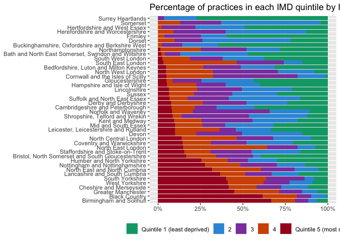

# Which ICBs have the greatest need for primary care?

Different populations have different needs for primary care. The NHS
measures health care need by accounting for the populations’ demographic
characteristics and overall health status to produce a ‘weighted’
population count.

``` r
library(magrittr)
library(dplyr)
```

    ## 
    ## Attaching package: 'dplyr'

    ## The following objects are masked from 'package:stats':
    ## 
    ##     filter, lag

    ## The following objects are masked from 'package:base':
    ## 
    ##     intersect, setdiff, setequal, union

``` r
library(ggplot2)
library(tidyr)
```

    ## 
    ## Attaching package: 'tidyr'

    ## The following object is masked from 'package:magrittr':
    ## 
    ##     extract

``` r
payments <- read.csv("../../data/payments/payments.csv")

agg <- payments[payments$Year == 2023, ] %>%
  group_by(ICB.NAME) %>%
  summarise(
    Registered = sum(Number.of.Registered.Patients..Last.Known.Figure., na.rm = TRUE),
    Weighted = sum(Number.of.Weighted.Patients..Last.Known.Figure., na.rm = TRUE)
  )

agg$Difference <- agg$Weighted - agg$Registered
# calculate percentsge change in weighted patients
agg$Percent.change <- agg$Difference / agg$Registered

# sort by ascending difference
agg <- agg[order(agg$Percent.change), ]

# create barchart of registered patients per ICB
# Create the barchart
my_colors <- colorRampPalette(c("#1B2C57", "#00A865"))(42)

agg %>%
  mutate(ICB.NAME = factor(ICB.NAME, levels = unique(ICB.NAME))) %>%
  ggplot(aes(x = reorder(ICB.NAME, Percent.change), y = Percent.change, fill = ICB.NAME)) +
  geom_bar(stat = "identity") +
  labs(x = "", y = "Percent difference", title = "Percentage Difference between Registered and Weighted Patients") +
  theme_minimal() +
  theme(legend.position = "none", axis.text.x = element_text(angle = 90, hjust = 1)) +
  scale_y_continuous(labels = scales::percent) + # Change y-axis labels to percentages
  scale_fill_manual(values = rep(my_colors, length.out = 42))
```


This chart demonstrates that the ICBs with the greatest healthcare need
relative to population size are North East and North Cumbria,
Lincolnshire, and Cheshire and Merseyside.

This pattern reflects a combination of demographics, such as the number
of older people, socioeconomic disadvantage (such as the level of
poverty) and the health of the population.

``` r
region_mapping <- data.frame(
  ICB.NAME = c(
    "Hertfordshire and West Essex", "Bedfordshire, Luton and Milton Keynes", "Norfolk and Waveney", "Mid and South Essex",
    "Cambridgeshire and Peterborough", "Suffolk and North East Essex",
    "North Central London", "North East London", "North West London", "South East London", "South West London",
    "Birmingham and Solihull", "Black Country", "Coventry and Warwickshire", "Derby and Derbyshire", "Herefordshire and Worcestershire",
    "Leicester, Leicestershire and Rutland", "Lincolnshire", "Northamptonshire", "Nottingham and Nottinghamshire",
    "Shropshire, Telford and Wrekin", "Staffordshire and Stoke-on-Trent",
    "Humber and North Yorkshire", "North East and North Cumbria", "South Yorkshire", "West Yorkshire",
    "Cheshire and Merseyside", "Greater Manchester", "Lancashire and South Cumbria",
    "Buckinghamshire, Oxfordshire and Berkshire West", "Frimley", "Hampshire and Isle of Wight", "Kent and Medway",
    "Surrey Heartlands", "Sussex",
    "Bath and North East Somerset, Swindon and Wiltshire", "Bristol, North Somerset and South Gloucestershire",
    "Cornwall and the Isles of Scilly", "Devon", "Dorset", "Gloucestershire", "Somerset"
  ),
  Region = c(
    rep("East of England", 6),
    rep("London", 5),
    rep("Midlands", 11),
    rep("North East & Yorkshire", 4),
    rep("North West", 3),
    rep("South East", 6),
    rep("South West", 7)
  )
)

payments <- read.csv("../../data/payments/payments.csv")

england <- payments %>%
  filter(Year == 2019) %>%
  group_by(Year) %>%
  summarise(total = n(), .groups = "drop")

# Calculate total count by Year, ICB.NAME
total_counts <- payments %>%
  filter(Year == 2019) %>%
  group_by(Year, ICB.NAME) %>%
  summarise(total = n(), .groups = "drop")

# Calculate count and percentage by IMD_quintile for all ICBs
result <- payments %>%
  filter(Year == 2019) %>%
  group_by(Year, IMD_quintile, ICB.NAME) %>%
  summarise(n = n(), .groups = "drop") %>%
  left_join(total_counts, by = c("Year", "ICB.NAME")) %>%
  mutate(perc = (n / total) * 100) %>%
  select(Year, ICB.NAME, IMD_quintile, n, perc)
```

``` r
# Find the region for params$ICB
selected_region <- region_mapping %>%
  # filter(ICB.NAME == params$ICB_NAME) %>%
  pull(Region)

# Ensure quintile 5 exists for each ICB by adding rows with perc = 0 if missing
t <- result %>%
  filter(!is.na(IMD_quintile)) %>%
  # inner_join(region_mapping, by = "ICB.NAME") %>%
  # filter(Region == selected_region) %>%
  complete(ICB.NAME, IMD_quintile = 5, fill = list(perc = 0)) # Add missing rows for quintile 5

# Calculate the maximum `perc` for IMD_quintile 5 and order the ICBs
ordered_ICB <- t %>%
  filter(IMD_quintile == 5) %>%
  group_by(ICB.NAME) %>%
  summarize(max_perc = max(perc, na.rm = TRUE)) %>%
  arrange(desc(max_perc)) %>%
  pull(ICB.NAME)

# Reorder `ICB.NAME` factor in `t` based on `ordered_ICB`
t <- t %>%
  mutate(ICB.NAME = factor(ICB.NAME, levels = ordered_ICB))

# Plot
t %>%
  ggplot(aes(x = ICB.NAME, y = perc, fill = factor(IMD_quintile))) +
  geom_bar(stat = "identity", position = "fill") +
  scale_y_continuous(labels = scales::percent) +
  scale_fill_manual(
    values = c("5" = "#A80026", "4" = "#D35400", "3" = "#8E44AD", "2" = "#3498DB", "1" = "#00A676"),
    name = "",
    labels = c("Quintile 1 (least deprived)", "2", "3", "4", "Quintile 5 (most deprived)")
  ) +
  labs(
    x = NULL,
    y = NULL,
    title = paste("Percentage of practices in each IMD quintile by ICB (", selected_region, ")", sep = "")
  ) +
  theme(
    legend.position = "bottom"
  ) +
  coord_flip()
```


