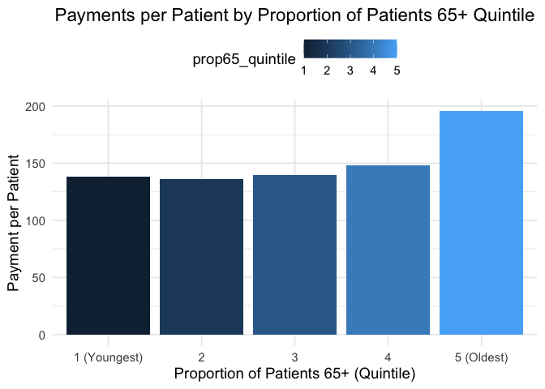

# Proportion of GP Registered Populations by Age Group

### API

This data can be accessed through the
[API](https://fingertips.phe.org.uk/api) provided by the Fingertips
platform.

``` r
# Load necessary libraries
library(httr)
library(readr)
library(magrittr)
library(dplyr)
```

    ## 
    ## Attaching package: 'dplyr'

    ## The following objects are masked from 'package:stats':
    ## 
    ##     filter, lag

    ## The following objects are masked from 'package:base':
    ## 
    ##     intersect, setdiff, setequal, union

``` r
# Define the URL and query parameters
base_url <- "https://fingertipsws.phe.org.uk/api/all_data/csv/by_indicator_id"
query_params <- list(
  v = "/0-c459298b/",
  # parent_area_code = "E92000001",
  # parent_area_type_id = 167,
  # child_area_type_id = 7,
  indicator_ids = 93468
)

# Make the API request
response <- GET(base_url, query = query_params)

# Check if the response is successful
if (http_status(response)$category == "Success") {
  # Write the content to a temporary file
  temp_file <- tempfile(fileext = ".csv")
  writeBin(content(response, "raw"), temp_file)

  # Read the CSV data
  age <- read_csv(temp_file)

  # Display the first few rows of the data
  print(head(age))
} else {
  cat("Failed to retrieve data. Status code:", status_code(response), "\n")
  cat("Response content:", content(response, "text"), "\n")
}
```

    ## Warning: One or more parsing issues, call `problems()` on your data frame for details,
    ## e.g.:
    ##   dat <- vroom(...)
    ##   problems(dat)

    ## Rows: 847633 Columns: 27

    ## ── Column specification ────────────────────────────────────────────────────────
    ## Delimiter: ","
    ## chr (13): Indicator Name, Parent Code, Parent Name, Area Code, Area Name, Ar...
    ## dbl  (6): Indicator ID, Time period, Value, Count, Denominator, Time period ...
    ## lgl  (8): Category Type, Category, Lower CI 95.0 limit, Upper CI 95.0 limit,...
    ## 
    ## ℹ Use `spec()` to retrieve the full column specification for this data.
    ## ℹ Specify the column types or set `show_col_types = FALSE` to quiet this message.

    ## # A tibble: 6 × 27
    ##   `Indicator ID` `Indicator Name`        `Parent Code` `Parent Name` `Area Code`
    ##            <dbl> <chr>                   <chr>         <chr>         <chr>      
    ## 1          93468 Proportion of GP regis… <NA>          <NA>          E92000001  
    ## 2          93468 Proportion of GP regis… <NA>          <NA>          E92000001  
    ## 3          93468 Proportion of GP regis… <NA>          <NA>          E92000001  
    ## 4          93468 Proportion of GP regis… <NA>          <NA>          E92000001  
    ## 5          93468 Proportion of GP regis… <NA>          <NA>          E92000001  
    ## 6          93468 Proportion of GP regis… <NA>          <NA>          E92000001  
    ## # ℹ 22 more variables: `Area Name` <chr>, `Area Type` <chr>, Sex <chr>,
    ## #   Age <chr>, `Category Type` <lgl>, Category <lgl>, `Time period` <dbl>,
    ## #   Value <dbl>, `Lower CI 95.0 limit` <lgl>, `Upper CI 95.0 limit` <lgl>,
    ## #   `Lower CI 99.8 limit` <lgl>, `Upper CI 99.8 limit` <lgl>, Count <dbl>,
    ## #   Denominator <dbl>, `Value note` <chr>, `Recent Trend` <chr>,
    ## #   `Compared to England value or percentiles` <chr>, `Column not used` <chr>,
    ## #   `Time period Sortable` <dbl>, `New data` <lgl>, `Compared to goal` <lgl>, …

``` r
age %<>%
  rename(Practice.Code = `Area Code`) %>%
  rename(Year = `Time period`) %>%
  filter(Practice.Code != "E92000001") %>%
  filter(Age == "65+ yrs") %>%
  mutate(prop65_quintile = ntile(Value, 5)) %>%
  select("Practice.Code", "Year", "Value", "prop65_quintile") %>%
  rename(prop65 = Value)

write.csv(age, "age.csv", row.names = FALSE)
```

``` r
age %<>%
  filter(Year == 2023)

payments23 <- read.csv("../payments/raw/22-23.csv")

payments23 %<>%
  filter(Contract.Type == "GMS")

print(paste0(
  "Total expenditure, 22/23: £",
  format(payments23 %>%
    summarise(Total.expenditure = sum(Total.NHS.Payments.to.General.Practice.Minus.Deductions, na.rm = TRUE)) %>%
    pull(Total.expenditure), digits = 1, big.mark = ",", scientific = FALSE)
))
```

    ## [1] "Total expenditure, 22/23: £6,638,285,617"

``` r
print(paste0(
  "Total GMS practices, 22,23: ",
  payments23$Practice.Code %>% unique() %>% length()
))
```

    ## [1] "Total GMS practices, 22,23: 4664"

``` r
df <- merge(age, payments23, by = "Practice.Code")

print(paste0(
  "Total GMS practices after merge, 22/23: ",
  df$Practice.Code %>% unique() %>% length()
))
```

    ## [1] "Total GMS practices after merge, 22/23: 4587"

``` r
library(ggplot2)

df %<>%
  mutate(
    Average.payment.per.weight.patient = Total.NHS.Payments.to.General.Practice.Minus.Deductions / Number.of.Registered.Patients..Last.Known.Figure.
  )

plot <- df %>%
  group_by(prop65_quintile) %>%
  summarise(
    Total.average = sum(Average.payment.per.weight.patient),
    count = n()
  ) %>%
  mutate(per.patient = Total.average / count) %>%
  select(-"Total.average") %>%
  print()
```

    ## # A tibble: 5 × 3
    ##   prop65_quintile count per.patient
    ##             <int> <int>       <dbl>
    ## 1               1   706        139.
    ## 2               2   820        136.
    ## 3               3   728        139.
    ## 4               4   923        148.
    ## 5               5  1410        196.

``` r
plot %>%
  ggplot(., aes(x = factor(prop65_quintile), y = per.patient, fill = prop65_quintile)) +
  geom_bar(stat = "identity", position = "dodge") +
  labs(
    title = "Payments per Patient by Proportion of Patients 65+ Quintile",
    x = "Proportion of Patients 65+ (Quintile)",
    y = "Payment per Patient"
  ) +
  scale_x_discrete(labels = c("1 (Youngest)", "2", "3", "4", "5 (Oldest)")) +
  theme_minimal(base_size = 14) +
  theme(
    plot.title = element_text(hjust = 0.5),
    legend.position = "top"
  )
```



``` r
IMD <- read.csv("../IMD/IMD_interpolated.csv")

IMD %<>% filter(Year == 2023) %>% select(-Year)

df <- merge(df, IMD, by = "Practice.Code") %>%
  mutate(IMD_quintile = ntile(IMD, 5))

mean_prop65 <- df %>%
  filter(IMD_quintile == 1 | IMD_quintile == 5) %>% # Keep only the most and least deprived quintiles
  group_by(IMD_quintile) %>%
  summarize(
    Mean_Prop65 = mean(prop65, na.rm = TRUE),
    .groups = "drop"
  ) %>%
  mutate(
    IMD_Description = ifelse(IMD_quintile == 1, "Most Affluent", "Most Deprived")
  ) %>%
  print()
```

    ## # A tibble: 2 × 3
    ##   IMD_quintile Mean_Prop65 IMD_Description
    ##          <int>       <dbl> <chr>          
    ## 1            1        21.7 Most Affluent  
    ## 2            5        14.1 Most Deprived

``` r
df %>%
  filter(prop65_quintile == 1 | prop65_quintile == 5) %>% # Keep only the most and least deprived quintiles
  group_by(prop65_quintile) %>%
  summarize(
    Mean_IMD = mean(IMD, na.rm = TRUE),
    .groups = "drop"
  ) %>%
  mutate(
    `Proportion 65+` = ifelse(prop65_quintile == 1, "Youngest quintile", "Oldest quintile")
  ) %>%
  print()
```

    ## # A tibble: 2 × 3
    ##   prop65_quintile Mean_IMD `Proportion 65+` 
    ##             <int>    <dbl> <chr>            
    ## 1               1     31.1 Youngest quintile
    ## 2               5     16.1 Oldest quintile

``` r
plot <- df %>%
  select("Practice.Code", "prop65", "IMD", "Practice.Rurality") %>%
  arrange(Practice.Rurality == "Rural")

ggplot(plot, aes(x = prop65, y = IMD, color = Practice.Rurality)) +
  geom_point(alpha = 0.6, size = 2) + # Adjust transparency and size
  labs(
    title = "Scatter Plot of IMD vs Proportion of Patients 65+",
    x = "Proportion of Patients 65+ (%)",
    y = "Index of Multiple Deprivation (IMD)",
    color = "Practice Rurality"
  ) +
  scale_x_continuous(
    limits = c(0, 50), # Set limits for prop65
    breaks = seq(0, 50, by = 10) # Custom tick marks
  ) +
  scale_y_continuous(
    limits = c(0, 60), # Set limits for IMD
    breaks = seq(0, 60, by = 10) # Custom tick marks
  ) +
  theme_minimal(base_size = 14) + # Larger base font size
  theme(
    plot.title = element_text(hjust = 0.5), # Center-align the title
    legend.position = "top" # Move legend to the top
  )
```

    ## Warning: Removed 18 rows containing missing values (`geom_point()`).


``` r
library(tidyr)
```

    ## 
    ## Attaching package: 'tidyr'

    ## The following object is masked from 'package:magrittr':
    ## 
    ##     extract

``` r
appt <- read.csv("../appointments/appointments.csv")

n_w_patients <- read.csv("../payments/payments.csv")[, c("Practice.Code", "Year", "Number.of.Weighted.Patients..Last.Known.Figure.")] %>%
  mutate(Year = ifelse(Year == 2023, 2024, Year))

appt <- merge(appt, n_w_patients, by = c("Year", "Practice.Code"))

appt_mar <- appt %>% filter(Month == 3)

appt <- appt_mar %>%
  mutate(APPT_MODE = case_when(
    APPT_STATUS == "DNA" ~ "DNA",
    TRUE ~ as.character(APPT_MODE)
  )) %>%
  group_by(Practice.Code, APPT_MODE) %>%
  summarise(
    count = sum(COUNT_OF_APPOINTMENTS),
    patients = unique(Number.of.Weighted.Patients..Last.Known.Figure.)
  ) %>%
  mutate(
    per_10000patient = (count / patients) * 10000
  ) %>%
  select(Practice.Code, APPT_MODE, per_10000patient) %>% # Keep relevant columns
  pivot_wider(
    names_from = APPT_MODE,
    values_from = per_10000patient,
    names_prefix = "per_10000patient"
  )
```

    ## `summarise()` has grouped output by 'Practice.Code'. You can override using the
    ## `.groups` argument.

``` r
df <- merge(df, appt, by = "Practice.Code")

df %>%
  group_by(prop65_quintile) %>%
  summarise(
    per_10000patientDNA = mean(per_10000patientDNA, na.rm = TRUE),
    # `per_10000patientFace-to-Face` = mean(`per_10000patientFace-to-Face`, na.rm = TRUE),
    # per_10000patientTelephone = mean(per_10000patientTelephone, na.rm = TRUE),
    `per_10000patientHome Visit` = mean(`per_10000patientHome Visit`, na.rm = TRUE),
    # count = n()
  ) %>%
  print()
```

    ## # A tibble: 5 × 3
    ##   prop65_quintile per_10000patientDNA `per_10000patientHome Visit`
    ##             <int>               <dbl>                        <dbl>
    ## 1               1                93.2                         21.1
    ## 2               2                74.1                         35.5
    ## 3               3                66.7                         39.8
    ## 4               4                56.7                         44.0
    ## 5               5                44.2                         43.5

``` r
library(ggplot2)
plot <- df %>%
  group_by(prop65_quintile) %>%
  summarise(
    per_10000patientDNA = mean(per_10000patientDNA, na.rm = TRUE),
    # `per_10000patientFace-to-Face` = mean(`per_10000patientFace-to-Face`, na.rm = TRUE),
    # per_10000patientTelephone = mean(per_10000patientTelephone, na.rm = TRUE),
    `per_10000patientHome Visit` = mean(`per_10000patientHome Visit`, na.rm = TRUE),
    # count = n()
  )

# Reshape the data into a long format for easier plotting
data_long <- plot %>%
  tidyr::pivot_longer(
    cols = c(per_10000patientDNA, `per_10000patientHome Visit`),
    names_to = "Metric",
    values_to = "Rate"
  )

# Create the bar chart
ggplot(data_long, aes(x = factor(prop65_quintile), y = Rate, fill = Metric)) +
  geom_bar(stat = "identity", position = "dodge") +
  labs(
    title = "Rates of DNA and Home Visits per 10,000 Patients by Proportion of Patients 65+ Quintile",
    x = "Proportion of Patients 65+ (Quintile)",
    y = "Rate per 10,000 Patients",
    fill = "Metric"
  ) +
  scale_x_discrete(labels = c("1 (Youngest)", "2", "3", "4", "5 (Oldest)")) +
  theme_minimal(base_size = 14) +
  theme(
    plot.title = element_text(hjust = 0.5),
    legend.position = "top"
  )
```


``` r
prevalence <- read.csv("../prevalence/ltc_prevalence.csv") %>%
  filter(Year == 2023) %>%
  select(-c("IMD", "IMD_quintile", "Year")) %>%
  select(-ICB_NAME, -area_name) %>%
  pivot_wider(
    names_from = Indicator,
    values_from = Value
  )

df %<>%
  merge(prevalence, by = "Practice.Code")
```

``` r
plot <- df %>% select(c(
  "Practice.Code", "Year", "prop65_quintile",
  "Asthma: QOF prevalence (6+ yrs)",
  "CKD: QOF prevalence (18+ yrs)",
  "Depression: QOF prevalence (18+ yrs)",
  "Epilepsy: QOF prevalence (18+ yrs)",
  "Stroke: QOF prevalence (all ages)",
  "Diabetes: QOF prevalence (17+ yrs)",
  "Atrial fibrillation: QOF prevalence (all ages)",
  "COPD: QOF prevalence (all ages)",
  "CHD: QOF prevalence (all ages)",
  "Dementia: QOF prevalence (all ages)",
  "Mental Health: QOF prevalence (all ages)",
  "Heart failure with LVSD: QOF prevalence (all ages)",
  "Learning disability: QOF prevalence (all ages)",
))

plot_long <- plot %>%
  pivot_longer(
    cols = starts_with("Asthma"):starts_with("Learning"), # Adjust the range as needed
    names_to = "Indicator",
    values_to = "Value"
  ) %>%
  group_by(Indicator, prop65_quintile) %>%
  summarise(Value = mean(Value, na.rm = TRUE), .groups = "drop") %>%
  filter(prop65_quintile %in% c(1, 5)) %>% # Keep only quintiles 1 and 5
  mutate(Quintile = ifelse(prop65_quintile == 1, "Least represented", "Most represented"))

# Plot the data
ggplot(plot_long, aes(x = Value, y = Indicator, color = Quintile)) +
  geom_point(size = 4) +
  scale_color_manual(values = c("Least represented" = "#28B788", "Most represented" = "#007AA8")) +
  labs(
    x = "Average Prevalence (%)",
    y = NULL,
    color = "Quintile",
    title = "Average Disease Prevalence by Propensity Quintile",
    subtitle = "Comparison of least and most represented prop65 quintiles",
    caption = "Source: Office for Health Improvements and Disparities National GP Profiles"
  ) +
  theme_minimal(base_size = 14) +
  theme(
    axis.text.y = element_text(size = 10, face = "bold"),
    plot.title = element_text(size = 16, face = "bold"),
    plot.subtitle = element_text(size = 12)
  )
```

    ## Warning: Removed 2 rows containing missing values (`geom_point()`).


``` r
satisfaction <- read.csv("../satisfaction/satisfaction.csv") %>%
  filter(Year == 2023) %>%
  select(-ICB.NAME, -Year, -IMD, -IMD_quintile, -Practice.Name, -ICB.NAME)

df <- merge(df, satisfaction, by = "Practice.Code")
```

``` r
plot <- df %>%
  group_by(prop65_quintile) %>%
  summarise(
    overall_pct = mean(overall_pct, na.rm = TRUE),
    continuity_pct = mean(continuity_pct, na.rm = TRUE),
    access_pct = mean(access_pct, na.rm = TRUE),
    trust_pct = mean(trust_pct, na.rm = TRUE)
  )

print(plot)
```

    ## # A tibble: 5 × 5
    ##   prop65_quintile overall_pct continuity_pct access_pct trust_pct
    ##             <int>       <dbl>          <dbl>      <dbl>     <dbl>
    ## 1               1       0.675          0.354      0.534     0.898
    ## 2               2       0.693          0.347      0.514     0.912
    ## 3               3       0.721          0.350      0.527     0.929
    ## 4               4       0.737          0.346      0.525     0.937
    ## 5               5       0.783          0.400      0.614     0.952

``` r
plot_long <- plot %>%
  pivot_longer(
    cols = 2:5, # Adjust the range as needed
    names_to = "Indicator",
    values_to = "Value"
  ) %>%
  group_by(Indicator, prop65_quintile) %>%
  summarise(Value = mean(Value, na.rm = TRUE), .groups = "drop") %>%
  filter(prop65_quintile %in% c(1, 5)) %>% # Keep only quintiles 1 and 5
  mutate(Quintile = ifelse(prop65_quintile == 1, "Least represented", "Most represented"))

# Plot the data
ggplot(plot_long, aes(x = Value, y = Indicator, color = Quintile)) +
  geom_point(size = 4) +
  scale_color_manual(values = c("Least represented" = "#28B788", "Most represented" = "#007AA8")) +
  labs(
    x = "Average Prevalence (%)",
    y = NULL,
    color = "Quintile",
    title = "Average GPSS Response by Propensity Quintile",
    subtitle = "Comparison of least and most represented prop65 quintiles",
    caption = "Source: Office for Health Improvements and Disparities National GP Profiles"
  ) +
  theme_minimal(base_size = 14) +
  theme(
    axis.text.y = element_text(size = 10, face = "bold"),
    plot.title = element_text(size = 16, face = "bold"),
    plot.subtitle = element_text(size = 12)
  )
```


