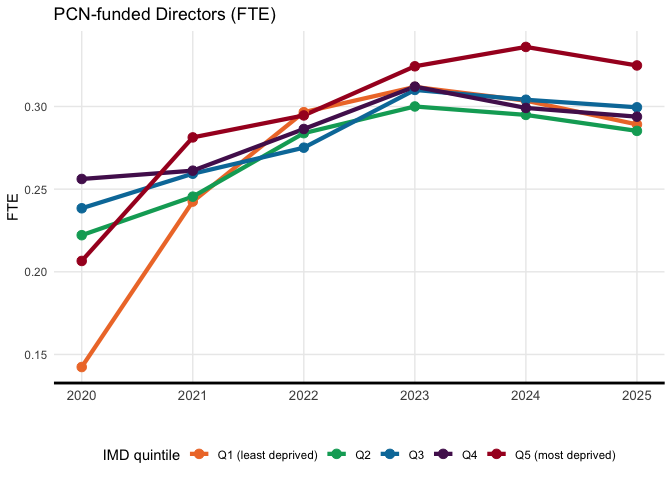
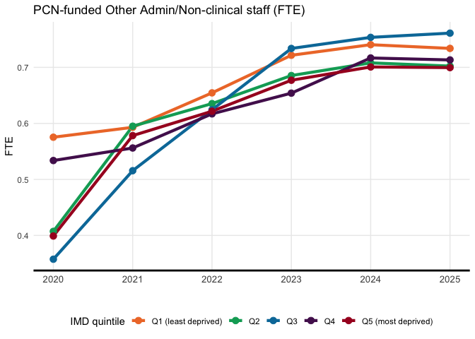
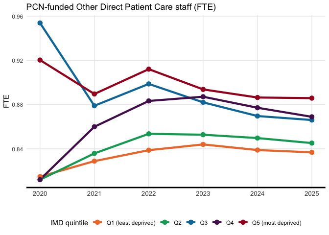
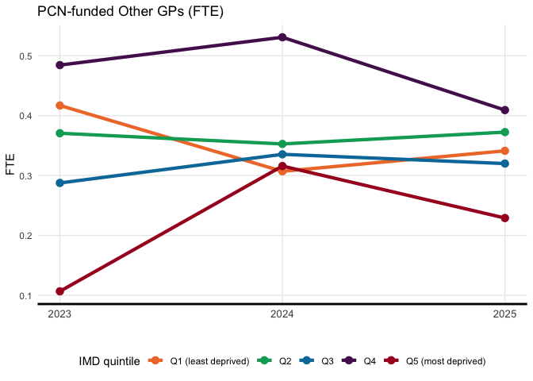
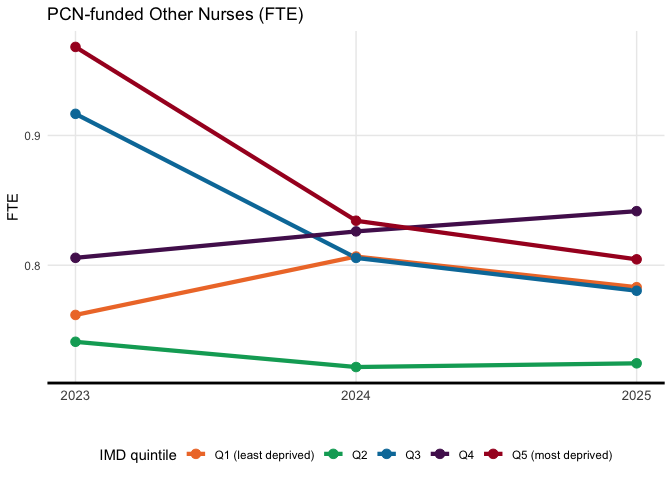

# Primary Care Network
Cameron Appel
2024-10-20

# Primary Care Network

Primary Care Networks were created in July 2019 to provide accessible
and integrated primary, mental health, and community care for patients.
The bulk of the PCN workforce consists of Direct Patient Care staff,
funded by the Additional Roles Reimbursement Scheme (ARRS), and each PCN
has the flexibility and autonomy to determine which roles are required
to meet the specific needs of their local populations. Initially,
recruitment focused on clinical pharmacists and social prescribing link
workers, with more roles being included over subsequent years.

[NHS
Digital](https://digital.nhs.uk/data-and-information/publications/statistical/primary-care-network-workforce)
provides public CSVs on the PCN workforce at the PCN-level.

We take the average IMD of each practice in the PCN to assign the PCN to
a deprivation quintile.

``` r
# List all relevant files from the raw directory
files <- list.files("raw", pattern = "Primary Care Networks.*Individual Level.csv", full.names = TRUE)

# Load and combine all files
pcn <- lapply(files, function(file) {
  df <- read.csv(file)

  df <- df %>% 
    select(CENSUS_YEAR, CENSUS_MONTH,
           PCN_CODE, PCN_NAME, 
           ICB_CODE, ICB_NAME, STAFF_GROUP, 
           FTE)

  month <- df$CENSUS_MONTH %>% unique()
  year <- df$CENSUS_YEAR %>% unique()

  if (month >= 4) {
    df$fiscal_year <- year + 1
  }  else {
    df$fiscal_year <- year
  }
  
  return(df)
}) %>% 
  bind_rows()

# pcn %<>% group_by(fiscal_year, PCN_CODE, PCN_NAME, ICB_NAME, STAFF_GROUP) %>% summarise(FTE = sum(FTE, na.rm = TRUE)) %>% rename(Year = CENSUS_YEAR)

pcn %<>% group_by(fiscal_year, PCN_CODE, PCN_NAME, ICB_NAME, STAFF_GROUP) %>% summarise(FTE = mean(FTE, na.rm = TRUE)) %>% rename(Year = fiscal_year) %>% group_by(Year, PCN_CODE, PCN_NAME, ICB_NAME, STAFF_GROUP) %>% summarise(FTE = sum(FTE, na.rm=TRUE))
```

    `summarise()` has grouped output by 'fiscal_year', 'PCN_CODE', 'PCN_NAME',
    'ICB_NAME'. You can override using the `.groups` argument.
    `summarise()` has grouped output by 'Year', 'PCN_CODE', 'PCN_NAME', 'ICB_NAME'.
    You can override using the `.groups` argument.

``` r
pcn$ICB_NAME <- gsub("NHS ", "", pcn$ICB_NAME)
pcn$ICB_NAME <- gsub(" Integrated Care Board", "", pcn$ICB_NAME)
pcn$ICB_NAME <- gsub(" ICB", "", pcn$ICB_NAME)
pcn$ICB_NAME <- gsub("Cornwall and The Isles Of Scilly", "Cornwall and the Isles of Scilly", pcn$ICB_NAME)
pcn$ICB_NAME <- gsub("Hampshire and Isle Of Wight", "Hampshire and Isle of Wight", pcn$ICB_NAME)

pcn %>% head()
```

    # A tibble: 6 × 6
    # Groups:   Year, PCN_CODE, PCN_NAME, ICB_NAME [4]
       Year PCN_CODE PCN_NAME                             ICB_NAME STAFF_GROUP   FTE
      <dbl> <chr>    <chr>                                <chr>    <chr>       <dbl>
    1  2020 U01092   CISSBURY INTEGRATED CARE PCN         Sussex   Directors   0.16 
    2  2020 U01092   CISSBURY INTEGRATED CARE PCN         Sussex   Other Admi… 0.08 
    3  2020 U01092   CISSBURY INTEGRATED CARE PCN         Sussex   Other Dire… 1    
    4  2020 U01096   LOUGHTON BUCKHURST HILL and CHIGWEL… Hertfor… Other Dire… 1    
    5  2020 U01989   DURHAM WEST PCN                      North E… Directors   0.248
    6  2020 U02671   GREATER MIDDLESBROUGH PCN            North E… Directors   0.125

# Get IMD from fingertipsR

``` r
# Load necessary library
library(fingertipsR)

# Get the profile ID for the Public Health Outcomes Framework
profiles_data <- profiles()
phof_profile <- profiles_data[profiles_data$ProfileName == "Public Health Outcomes Framework", ]
profile_id <- phof_profile$ProfileID[1]

# Get indicators for the Public Health Outcomes Framework profile
indicators_data <- indicators(ProfileID = profile_id)

# Find the IndicatorID for "Deprivation score (IMD 2019)"
indicator_id <- indicators_data$IndicatorID[indicators_data$IndicatorName == "Deprivation score (IMD 2019)"]

# Get the data for the "Deprivation score (IMD 2019)" indicator
IMD <- fingertips_data(IndicatorID = indicator_id, AreaTypeID = 7) %>%
  select(c("ParentCode","Value")) %>% group_by(ParentCode) %>% summarise(IMD = mean(Value))

IMD %<>% rename(PCN_CODE = ParentCode)
# Display the first few rows of the data
head(IMD)
```

    # A tibble: 6 × 2
      PCN_CODE   IMD
      <chr>    <dbl>
    1 U00000   22.0 
    2 U00070    8.41
    3 U00147   27.6 
    4 U00203   33.2 
    5 U00254   26.2 
    6 U00351   18.2 

``` r
pcn <- merge(pcn, IMD, by = "PCN_CODE") %>%
  group_by(Year) %>%
  mutate(IMD_quintile = ntile(IMD, 5))

# View the updated data frame
head(pcn)
```

    # A tibble: 6 × 8
    # Groups:   Year [5]
      PCN_CODE  Year PCN_NAME         ICB_NAME  STAFF_GROUP   FTE   IMD IMD_quintile
      <chr>    <dbl> <chr>            <chr>     <chr>       <dbl> <dbl>        <int>
    1 U00000    2025 WEST NORWICH PCN Norfolk … Other Dire… 0.900 22.0             3
    2 U00070    2023 WEST MERTON PCN  South We… Other Admi… 0.917  8.41            1
    3 U00070    2024 WEST MERTON PCN  South We… Other Dire… 0.915  8.41            1
    4 U00070    2021 WEST MERTON PCN  South We… Other Dire… 1      8.41            1
    5 U00070    2025 WEST MERTON PCN  South We… Other Dire… 0.912  8.41            1
    6 U00070    2022 WEST MERTON PCN  South We… Other Admi… 1      8.41            1

``` r
write.csv(pcn, "pcn_workforce.csv", row.names = FALSE)
```

# Disparity

``` r
agg <- pcn %>%
  group_by(Year, IMD_quintile, STAFF_GROUP) %>%
  summarise(
    Value = mean(FTE, na.rm=TRUE)
  )
```

    `summarise()` has grouped output by 'Year', 'IMD_quintile'. You can override
    using the `.groups` argument.

``` r
pcn$STAFF_GROUP %>% unique()
```

    [1] "Other Direct Patient Care staff" "Other Admin/Non-clinical staff" 
    [3] "Other Nurses"                    "Directors"                      
    [5] "Other GPs"                      

``` r
# Define colors and labels for IMD quintile
colors <- c("#EF7A34", "#00A865", "#007AA8", "#531A5C", "#A80026")
imd_labels <- c("Q1 (least deprived)", "Q2", "Q3", "Q4", "Q5 (most deprived)")

# Loop over each unique STAFF_GROUP
for (group in unique(agg$STAFF_GROUP)) {
  
  # Filter data for the current STAFF_GROUP
  data_group <- agg[agg$STAFF_GROUP == group, ]
  data_group$IMD_quintile <- as.factor(data_group$IMD_quintile)
  
  # Plot
  p <- data_group %>%
    ggplot(aes(x = Year, y = Value, group = IMD_quintile, colour = IMD_quintile)) +
    geom_line(size = 1.5) +
    geom_point(size = 3) +
    labs(
      x = "", 
      y = "FTE", 
      title = paste("PCN-funded", group, "(FTE)")
    ) +
    theme_minimal() +
    theme(
      legend.position = "bottom",
      legend.justification = "center",
      axis.text.x = element_text(size = 10),
      axis.title.x = element_text(size = 12),
      axis.line.x = element_line(size = 1),
      panel.grid.minor.x = element_blank(),
      panel.grid.minor.y = element_blank()
    ) +
    scale_color_manual(values = colors, labels = imd_labels) +
    labs(color = "IMD quintile") +
    scale_x_continuous(breaks = unique(agg$Year)) # Show every year on the x-axis

  # Print the plot (or save it, if you prefer to save each plot as a file)
  print(p)
}
```










