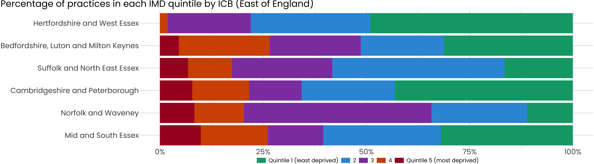
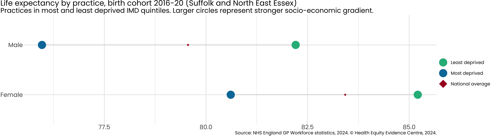

# Primary Care Equity Datapack
Health Equity Evidence Centre

- [Introduction](#introduction)
- [ICB Overview](#icb-overview)
- [Inequality in Life Expectancy](#inequality-in-life-expectancy)

<details>
<summary>Code</summary>

``` r
# Load necessary libraries
library(ggplot2)
library(showtext)
```

</details>

    Loading required package: sysfonts

    Loading required package: showtextdb

<details>
<summary>Code</summary>

``` r
library(patchwork)
library(ggtext)
library(fingertipsR)
library(tidyverse)
```

</details>

    ── Attaching core tidyverse packages ──────────────────────── tidyverse 2.0.0 ──
    ✔ dplyr     1.1.2     ✔ readr     2.1.4
    ✔ forcats   1.0.0     ✔ stringr   1.5.1
    ✔ lubridate 1.9.2     ✔ tibble    3.2.1
    ✔ purrr     1.0.1     ✔ tidyr     1.3.0

    ── Conflicts ────────────────────────────────────────── tidyverse_conflicts() ──
    ✖ dplyr::filter() masks stats::filter()
    ✖ dplyr::lag()    masks stats::lag()
    ℹ Use the conflicted package (<http://conflicted.r-lib.org/>) to force all conflicts to become errors

<details>
<summary>Code</summary>

``` r
library(purrr)
library(tibble)
library(spatstat)
```

</details>

    Warning: package 'spatstat' was built under R version 4.3.3

    Loading required package: spatstat.data

    Warning: package 'spatstat.data' was built under R version 4.3.3

    Loading required package: spatstat.univar

    Warning: package 'spatstat.univar' was built under R version 4.3.3

    spatstat.univar 3.0-1
    Loading required package: spatstat.geom

    Warning: package 'spatstat.geom' was built under R version 4.3.3

    spatstat.geom 3.3-2

    Attaching package: 'spatstat.geom'

    The following object is masked from 'package:patchwork':

        area

    Loading required package: spatstat.random

    Warning: package 'spatstat.random' was built under R version 4.3.3

    spatstat.random 3.3-1
    Loading required package: spatstat.explore

    Warning: package 'spatstat.explore' was built under R version 4.3.3

    Loading required package: nlme

    Attaching package: 'nlme'

    The following object is masked from 'package:dplyr':

        collapse

    spatstat.explore 3.3-2
    Loading required package: spatstat.model

    Warning: package 'spatstat.model' was built under R version 4.3.3

    Loading required package: rpart
    spatstat.model 3.3-1
    Loading required package: spatstat.linnet

    Warning: package 'spatstat.linnet' was built under R version 4.3.3

    spatstat.linnet 3.2-1

    spatstat 3.1-1 
    For an introduction to spatstat, type 'beginner' 

<details>
<summary>Code</summary>

``` r
library(lubridate)
library(readODS)
```

</details>

    Warning: package 'readODS' was built under R version 4.3.3

<details>
<summary>Code</summary>

``` r
library(janitor)
```

</details>


    Attaching package: 'janitor'

    The following objects are masked from 'package:stats':

        chisq.test, fisher.test

<details>
<summary>Code</summary>

``` r
library(gdata)
```

</details>


    Attaching package: 'gdata'

    The following objects are masked from 'package:dplyr':

        combine, first, last, starts_with

    The following object is masked from 'package:purrr':

        keep

    The following object is masked from 'package:tidyr':

        starts_with

    The following object is masked from 'package:stats':

        nobs

    The following object is masked from 'package:utils':

        object.size

    The following object is masked from 'package:base':

        startsWith

<details>
<summary>Code</summary>

``` r
# Set up Google font and automatic display for text rendering
font_add_google("Poppins", family = "Poppins")
showtext_auto()

# Set up the ggplot theme
theme_set(
  theme_minimal() +
    theme(
      axis.title = element_text(size = 80, family = "Poppins"),
      axis.text = element_text(size = 80, family = "Poppins"),
      plot.caption = element_text(size = 60, family = "Poppins"),
      plot.title = element_text(size = 100, family = "Poppins"),
      plot.subtitle = element_text(size = 90, family = "Poppins"),
      panel.grid = element_line(size = 5),
      legend.title = element_text(size = 60, family = "Poppins"),
      legend.text = element_text(size = 60, family = "Poppins"),
      legend.key.width = unit(3.5, "cm"),
      plot.title.position = "plot"
    )
)
```

</details>

    Warning: The `size` argument of `element_line()` is deprecated as of ggplot2 3.4.0.
    ℹ Please use the `linewidth` argument instead.

<details>
<summary>Code</summary>

``` r
# Update default settings for geom_point size
update_geom_defaults("point", list(size = 50))

# Import data
df <- read.csv("final_data.csv")

# Define helper functions or custom operators if needed
"%ni%" <- Negate("%in%")

# Optional: suppress warnings and set figure dimensions globally for knitr
knitr::opts_chunk$set(
  echo = FALSE,
  warning = FALSE,
  fig.width = 90,
  fig.height = 25,
  fig.fullwidth = TRUE
)
```

</details>

## Introduction

Primary care, in contrast to specialty care, is associated with a more
equitable distribution of health across populations. One of the key
roles of commissioners is to ensure that resources are distributed
equitably across the healthcare system.

This report presents the latest NHS primary care data, using the Index
of Multiple Deprivation (IMD) to examine inequalities in patient health
determinants and outcomes. We analyze the data according to the
following categories:

- **Resources (supply)**: Payments, Workforce
- **Population (demand)**: Disease prevalence, Health-related behaviors
- **Service quality**: Quality and Outcomes Framework (QOF) achievement
- **Access**: Patient experience, Appointments
- **Impact on secondary care**: Emergency admissions, A&E attendances

For further information or to discuss the results, please contact
[Dr. John Ford](mailto:j.a.ford@qmul.ac.uk).

## ICB Overview



Each practice in England is assigned an Index of Multiple Deprivation
(IMD) based on the population it serves, divided into deprivation
quintiles.

For Hertfordshire and West Essex, approximately **NA%** of practices
serve the most deprived quintile of patients in England.

## Inequality in Life Expectancy



Average life expectancy for men is in the least deprived 20%.
