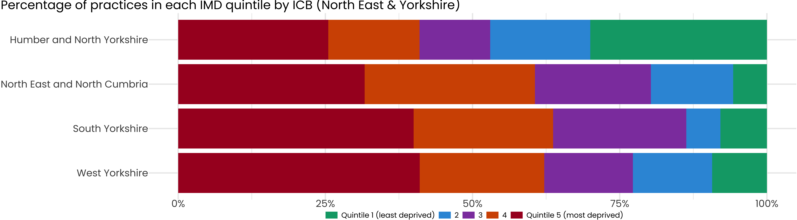
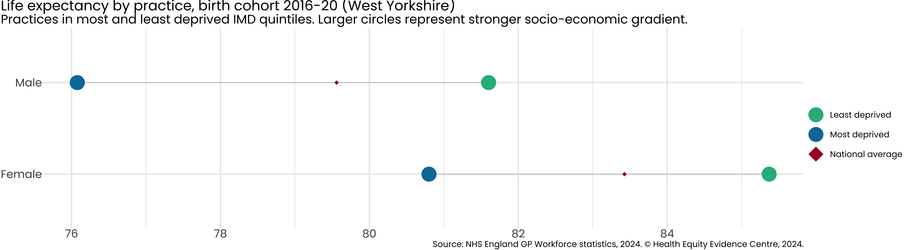
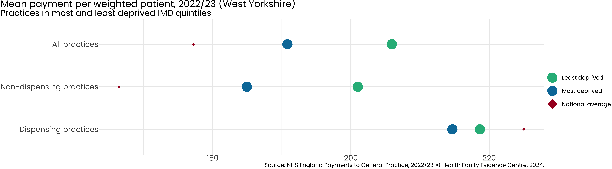
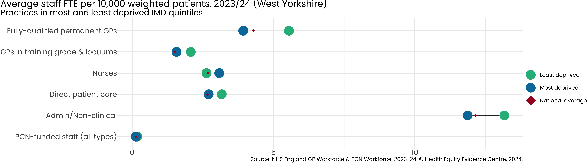
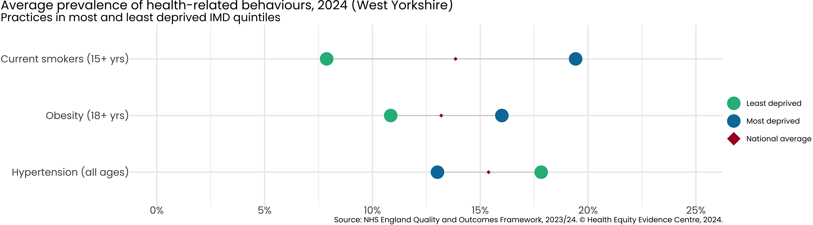
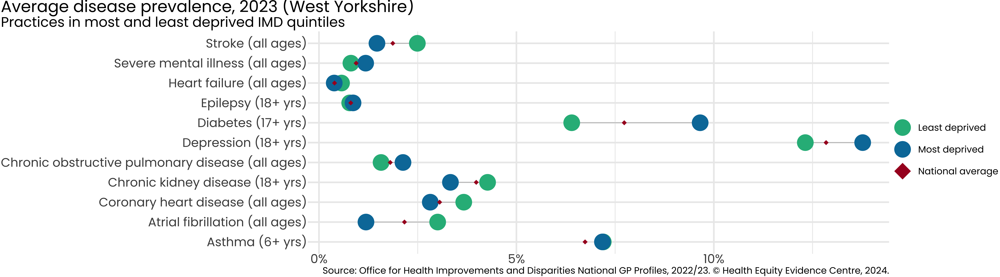
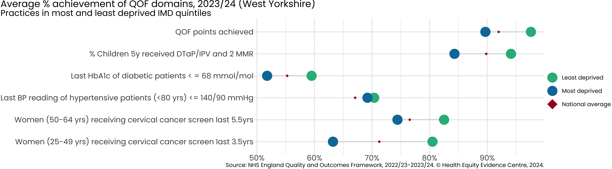
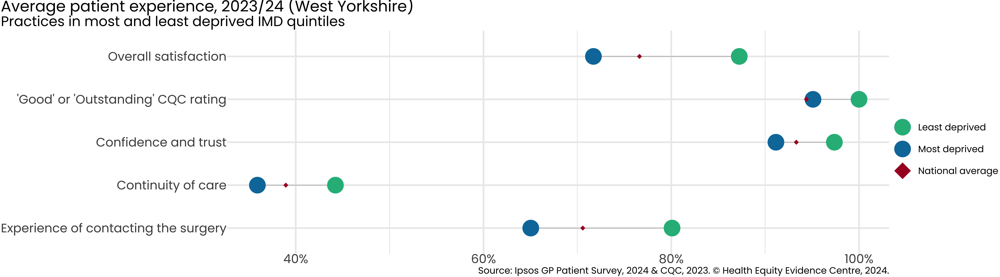
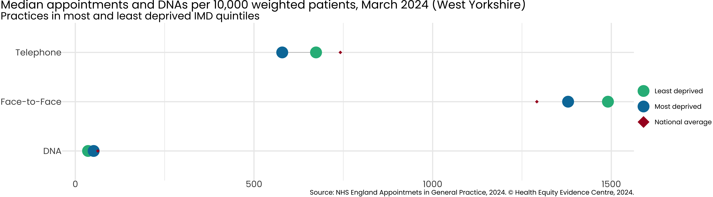
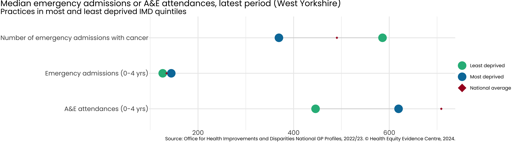

---
author:
- Health Equity Evidence Centre
params:
subtitle: Data from latest period for West Yorkshire
title: Primary Care Equity Datapack
toc-title: Table of contents
---

## Introduction

-   Strong primary care is associated with more equitable health
    outcomes.

-   A key role of commissioners is to ensure the equitable distribution
    of resources across the system.

-   We present the latest NHS primary care data, using Index of Multiple
    Deprivation (IMD) to examine inequalities existing in primary care
    access, experience and outcomes, across the following categories:

    -   **Resources (supply)**: Payments, Workforce
    -   **Population (demand)**: Disease prevalence, Health-related
        behaviours
    -   **Service quality**: QOF achievement
    -   **Access**: Patient experience, Appointments
    -   **Impact on secondary care**: Emergency admissions, A&E
        attendances

-   For further information or to discuss the results, please contact
    [Dr John Ford](j.a.ford@qmul.ac.uk)

## ICB Overview

::: cell
::: cell-output-display

:::
:::

Each practice in England is assigned an Index of Multiple Deprivation
based on the population served, which we divide into deprivation
quintiles. **41**% of practices in West Yorkshire, serve the most
deprived quintile of patients in England.

If data for the most deprived quintile is missing, we use the second
most deprived. If both are missing, we omit the data point from the
figure.

## Inequality in Life Expectancy

::: cell
::: cell-output-display

:::
:::

Average life expectancy for men is **76.1** in the least deprived 20%
and **76.1** in the most deprived 20%.

Average life expectancy for women is **80.8** in the least deprived 20%
and **80.8** in the most deprived 20%.

## Inequality in NHS Payments

::: cell
::: cell-output-display

:::
:::

Average payment per weighted patient is £**190.81** in the most deprived
20% of practices, versus £**205.91** in the least deprived 20%.

If there are no dispensing practices in the most deprived quintile, we
use the second most deprived. If both are missing, we omit the data
point from the figure.

## Inequality in Workforce

::: cell
::: cell-output-display

:::
:::

Average fully-qualified GPs FTE per 10,000 weighted patients is **3.9**
per weighted patient in the most deprived 20% of practices in West
Yorkshire versus **5.5** in the least deprived 20%.

## Inequality in Health-related Behaviours

::: cell
::: cell-output-display

:::
:::

Average prevalence of current smokers (15+ years) is **19.4**% in the
most deprived 20% of practices in West Yorkshire versus \*\*7.9% in the
least deprived 20%.

## Inequality in Disease Prevalence

::: cell
::: cell-output-display

:::
:::

Average prevalence of diabetes (17+ years) is **9.7% in the most
deprived 20% of practices in West Yorkshire, versus **6.4% in the least
deprived 20%.

Average prevalence of depression (18+ years) is **13.8**% in the most
deprived 20% of practices in West Yorkshire, versus **12.3** % in the
least deprived 20%.

## Inequality in Quality of Service

::: cell
::: cell-output-display

:::
:::

Average QOF points achieved is **89.7**% in the most deprived 20% of
practices in West Yorkshire, versus **97.6**% in the least deprived 20%.

## Inequality in Patient Experience

::: cell
::: cell-output-display

:::
:::

Average % of practices receiving \'Good\' or \'Outstanding\' CQC ratings
is **95.1**% in the most deprived 20% of practices in West Yorkshire,
versus **100%** in the least deprived 20%.

Average % of patients describing their experience as \'Good\' is
**71.7%** in the most deprived 20% of practices in West Yorkshire,
versus **87.2%** in the least deprived 20%.

## Inequality in Appointments

::: cell
::: cell-output-display

:::
:::

Average number of Face-to-Face appointments per 10,000 weighted patients
is **1379.1** in the most deprived 20% of practices in West Yorkshire,
versus **1490.6** in the least deprived 20%.

## Inequality in Impact on Secondary Care

::: cell
::: cell-output-display

:::
:::

Average number of emergency admissions (0-4 years) is **144.1** in the
most deprived 20% of practices in West Yorkshire, versus **126.2** in
the least deprived 20%.

## Acknowledgements

-   The work of the Health Equity Evidence Centre is made possible
    through seed funding from NHS East of England team.

-   The views expressed in this publication are those of the Health
    Equity Evidence Centre and not necessarily those of NHS England.
