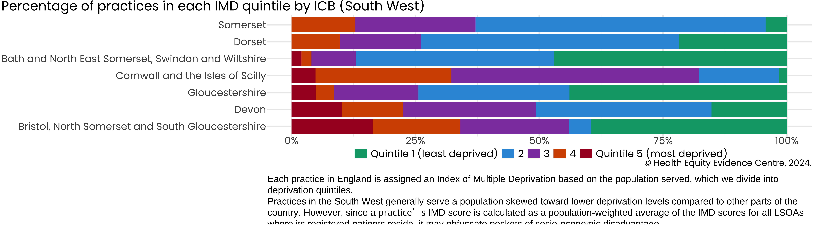
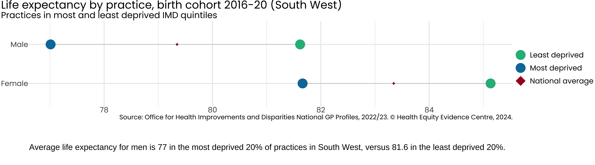
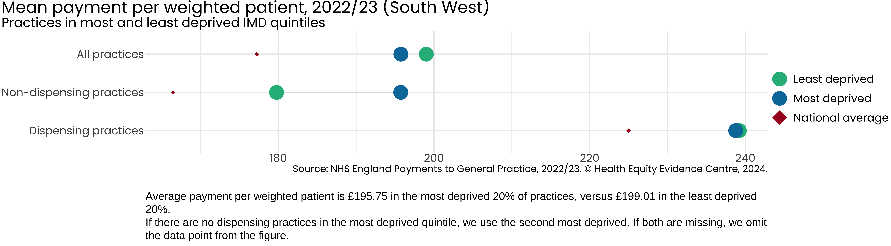
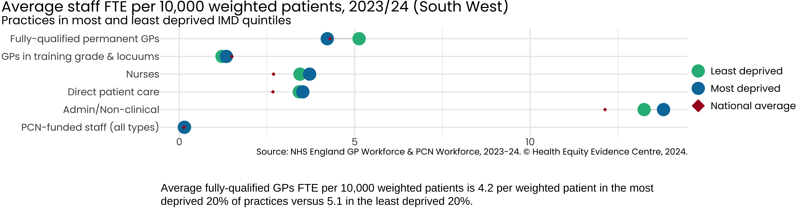
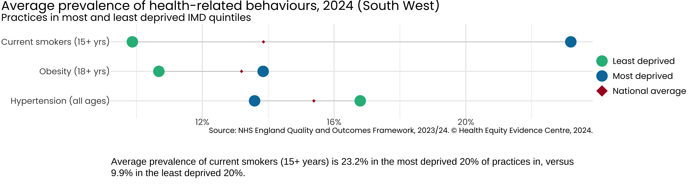
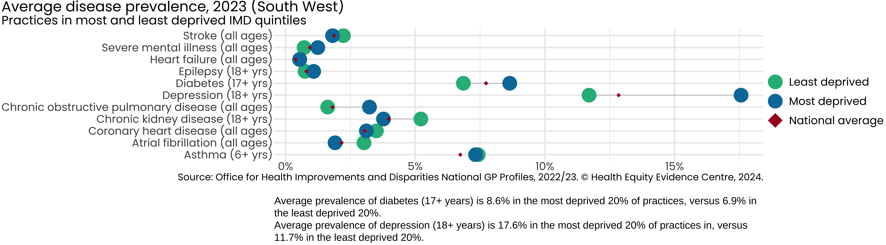
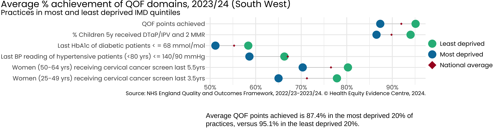
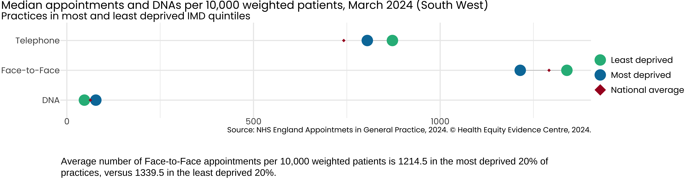
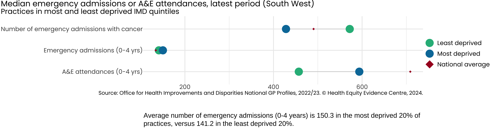

## Introduction
- Strong primary care is associated with more equitable health outcomes.

- A key role of commissioners is to ensure the equitable distribution of resources across the system.

- We present the latest NHS primary care data, using Index of Multiple Deprivation (IMD) to examine inequalities existing in primary care access, experience and outcomes, across the following categories:
  - **Resources (supply)**:	Payments, Workforce
  - **Population (demand)**: Disease prevalence, Health-related behaviours
  - **Service quality**: QOF achievement
  - **Access**: Patient experience, Appointments
  - **Impact on secondary care**: Emergency admissions, A&E attendances

- For further information or to discuss the results, please contact [Dr John Ford](j.a.ford@qmul.ac.uk)

## Region Overview
<!-- -->

## Inequality in Life Expectancy
<!-- -->

## Inequality in NHS Payments
<!-- -->

## Inequality in Workforce
<!-- -->

## Inequality in Health-related Behaviours
<!-- -->

## Inequality in Disease Prevalence
<!-- -->

## Inequality in Quality of Service
<!-- -->

## Inequality in Patient Experience
<!-- -->

## Inequality in Appointments
<!-- -->

## Inequality in Impact on Secondary Care
<!-- -->

## Acknowledgements
- The work of the Health Equity Evidence Centre is made possible through seed funding from NHS South West team.

- The views expressed in this publication are those of the Health Equity Evidence Centre and not necessarily those of NHS England.
