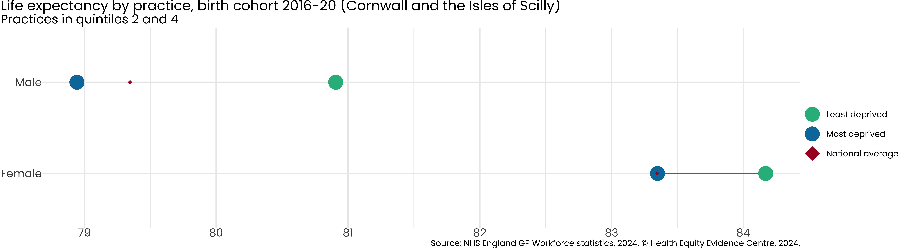
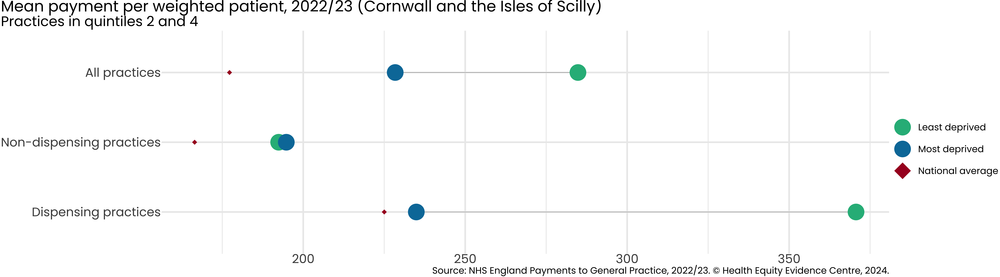
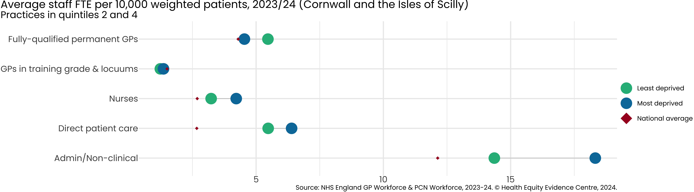
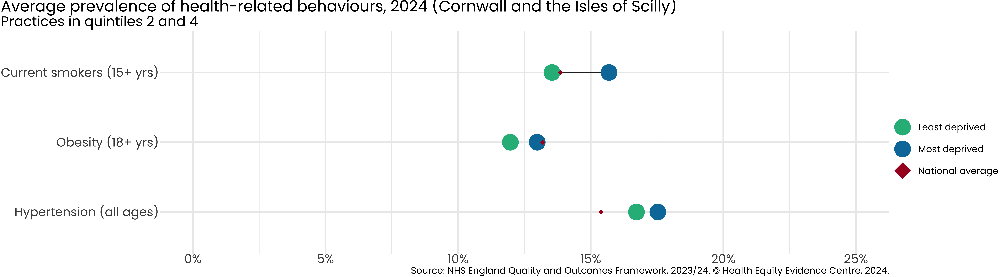
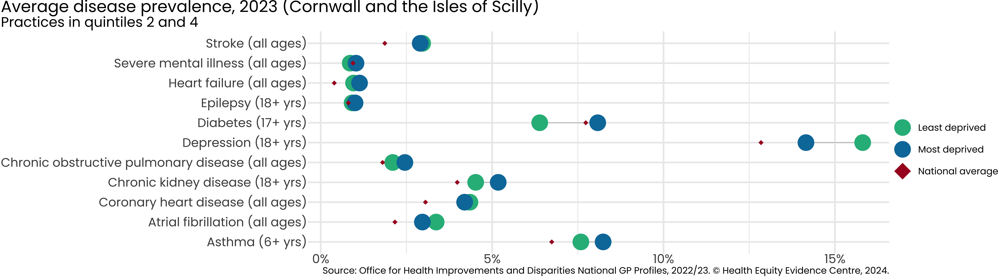
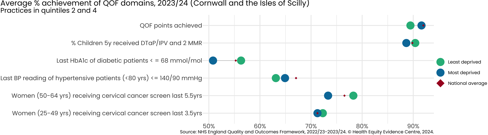
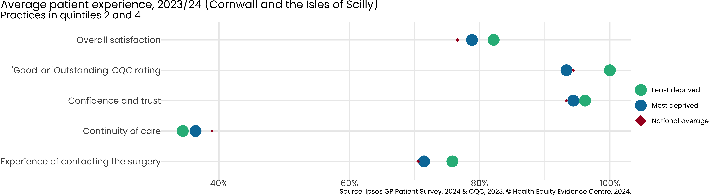
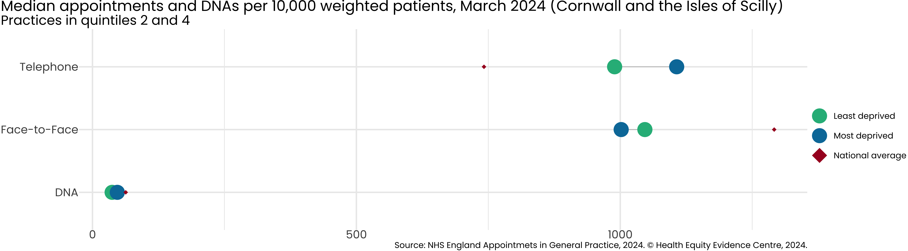
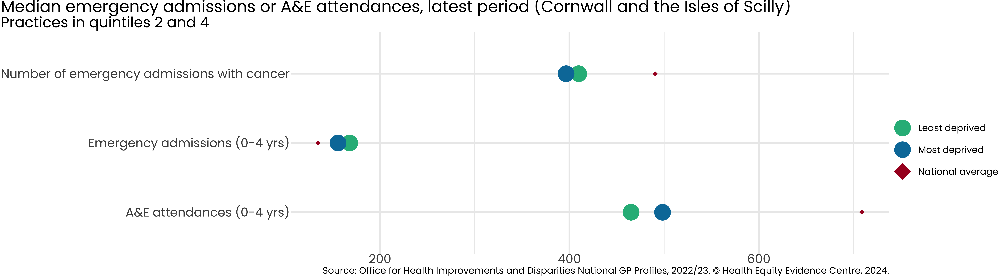

# Primary Care Equity Datapack
Health Equity Evidence Centre

- [Introduction](#introduction)
- [ICB Overview](#icb-overview)
- [Inequality in Life Expectancy](#inequality-in-life-expectancy)
- [Inequality in NHS Payments](#inequality-in-nhs-payments)
- [Inequality in Workforce](#inequality-in-workforce)
- [Inequality in Health-related
  Behaviours](#inequality-in-health-related-behaviours)
- [Inequality in Disease Prevalence](#inequality-in-disease-prevalence)
- [Inequality in Quality of Service](#inequality-in-quality-of-service)
- [Inequality in Patient Experience](#inequality-in-patient-experience)
- [Inequality in Appointments](#inequality-in-appointments)
- [Inequality in Impact on Secondary
  Care](#inequality-in-impact-on-secondary-care)
- [Acknowledgements](#acknowledgements)

## Introduction

- Strong primary care is associated with more equitable health outcomes.

- A key role of commissioners is to ensure the equitable distribution of
  resources across the system.

- We present the latest NHS primary care data, using Index of Multiple
  Deprivation (IMD) to examine inequalities existing in primary care
  access, experience and outcomes, across the following categories:

  - **Resources (supply)**: Payments, Workforce
  - **Population (demand)**: Disease prevalence, Health-related
    behaviours
  - **Service quality**: QOF achievement
  - **Access**: Patient experience, Appointments
  - **Impact on secondary care**: Emergency admissions, A&E attendances

- For further information or to discuss the results, please contact [Dr
  John Ford](j.a.ford@qmul.ac.uk)

## ICB Overview

Each practice in England is assigned an Index of Multiple Deprivation
based on the population served, which we divide into deprivation
quintiles. **5**% of practices in Cornwall and the Isles of Scilly,
serve the most deprived quintile of patients in England, so quintiles 1
and 2 are combined to represent the most deprived, and quintiles 4 and 5
are combined as the least deprived.

## Inequality in Life Expectancy

Average life expectancy for men is **80.9** in the least deprived and
**78.9** in the most deprived.

Average life expectancy for women is **84.2** in the least deprived and
**83.3** in the most deprived.

## Inequality in NHS Payments

Average payment per weighted patient is £**228.39** in the most deprived
of practices, versus £**284.81** in the least deprived.

If there are no dispensing practices in the most deprived quintiles, we
omit the data point from the figure.

## Inequality in Workforce

Average fully-qualified GPs FTE per 10,000 weighted patients is **4.5**
per weighted patient in the most deprived of practices in Cornwall and
the Isles of Scilly versus **5.5** in the least deprived.

## Inequality in Health-related Behaviours

Average prevalence of current smokers (15+ years) is **15.7**% in the
most deprived of practices in Cornwall and the Isles of Scilly versus
**13.5**% in the least deprived.

## Inequality in Disease Prevalence

Average prevalence of diabetes (17+ years) is **8.1**% in the most
deprived of practices in Cornwall and the Isles of Scilly, versus
**6.4**% in the least deprived.

Average prevalence of depression (18+ years) is **14.2**% in the most
deprived (quintile 4) of practices in Cornwall and the Isles of Scilly,
versus **15.8** % in the least deprived (quintile 2).

## Inequality in Quality of Service

Average QOF points achieved is **91.6**% in the most deprived (quintile
4) of practices in Cornwall and the Isles of Scilly, versus **89.4**% in
the least deprived (quintile 2).

## Inequality in Patient Experience

Average % of practices receiving 'Good' or 'Outstanding' CQC ratings is
**93.3**% in the most deprived (quintile 4) of practices in Cornwall and
the Isles of Scilly, versus **100%** in the least deprived (quintile 2).

Average % of patients describing their experience as 'Good' is **78.8%**
in the most deprived (quintile 4) of practices in Cornwall and the Isles
of Scilly, versus **82.2%** in the least deprived (quintile 2).

## Inequality in Appointments

Average number of Face-to-Face appointments per 10,000 weighted patients
is **1001.7** in the most deprived (quintile 4) of practices in Cornwall
and the Isles of Scilly, versus **1046.6** in the least deprived
(quintile 2).

## Inequality in Impact on Secondary Care

Average number of emergency admissions (0-4 years) is **155.7** in the
most deprived (quintile 4) of practices in Cornwall and the Isles of
Scilly, versus **168** in the least deprived (quintile 2).

## Acknowledgements

- The work of the Health Equity Evidence Centre is made possible through
  seed funding from NHS East of England team.

- The views expressed in this publication are those of the Health Equity
  Evidence Centre and not necessarily those of NHS England.
