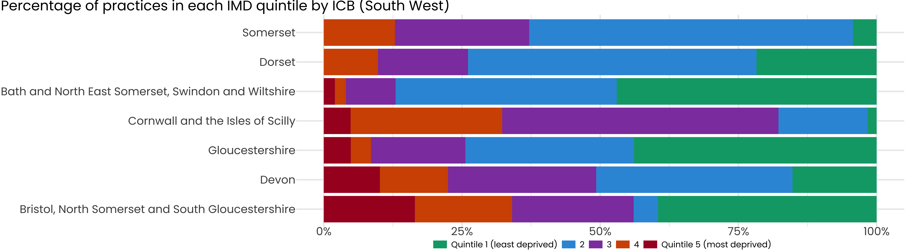
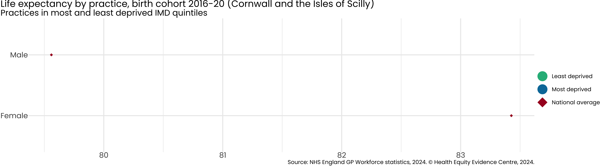
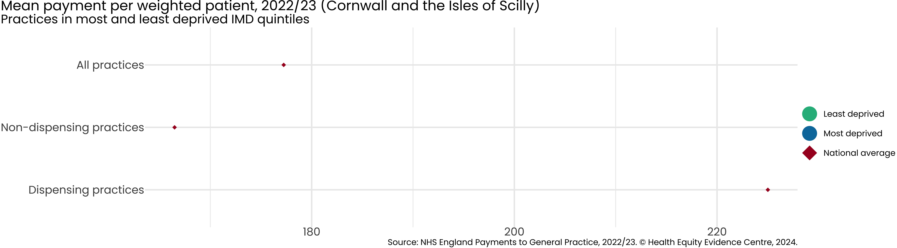
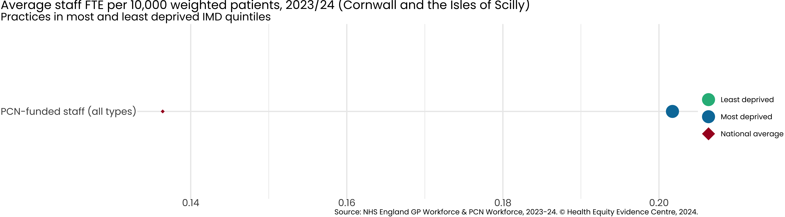
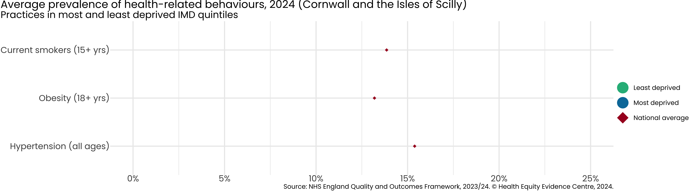
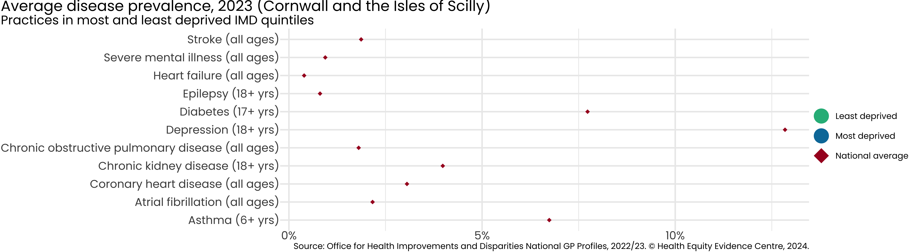
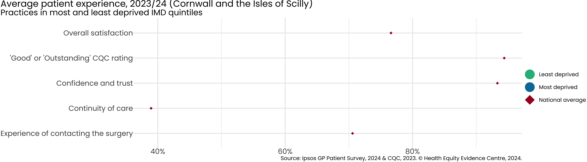
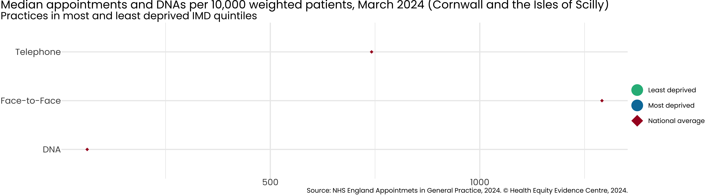
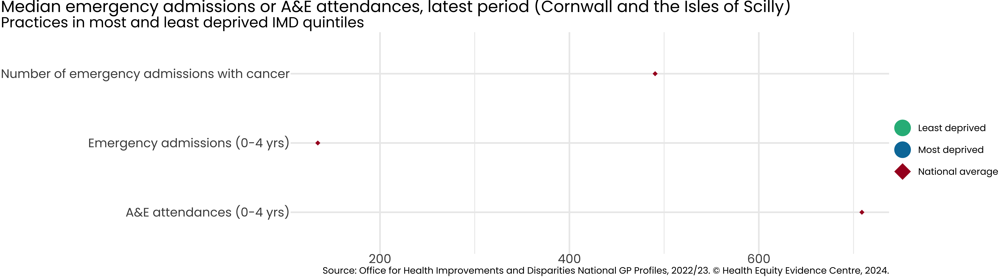

# Primary Care Equity Datapack
Health Equity Evidence Centre

- [Introduction](#introduction)
- [ICB Overview](#icb-overview)
- [Inequality in Life Expectancy](#inequality-in-life-expectancy)
- [Inequality in NHS Payments](#inequality-in-nhs-payments)
- [Inequality in Workforce](#inequality-in-workforce)
- [Inequality in Health-related
  Behaviours](#inequality-in-health-related-behaviours)
- [Inequality in Disease Prevalence](#inequality-in-disease-prevalence)
- [Inequality in Quality of Service](#inequality-in-quality-of-service)
- [Inequality in Patient Experience](#inequality-in-patient-experience)
- [Inequality in Appointments](#inequality-in-appointments)
- [Inequality in Impact on Secondary
  Care](#inequality-in-impact-on-secondary-care)
- [Acknowledgements](#acknowledgements)

## Introduction

- Strong primary care is associated with more equitable health outcomes.

- A key role of commissioners is to ensure the equitable distribution of
  resources across the system.

- We present the latest NHS primary care data, using Index of Multiple
  Deprivation (IMD) to examine inequalities existing in primary care
  access, experience and outcomes, across the following categories:

  - **Resources (supply)**: Payments, Workforce
  - **Population (demand)**: Disease prevalence, Health-related
    behaviours
  - **Service quality**: QOF achievement
  - **Access**: Patient experience, Appointments
  - **Impact on secondary care**: Emergency admissions, A&E attendances

- For further information or to discuss the results, please contact [Dr
  John Ford](j.a.ford@qmul.ac.uk)

## ICB Overview

Each practice in England is assigned an Index of Multiple Deprivation
based on the population served, which we divide into deprivation
quintiles. **5**% of practices in Cornwall and the Isles of Scilly,
serve the most deprived quintile of patients in England.

If data for the most deprived quintile is missing, we use the second
most deprived. If both are missing, we omit the data point from the
figure.

## Inequality in Life Expectancy

Average life expectancy for men is **77.6** in the least deprived 20%
and **77.6** in the most deprived 20%.

Average life expectancy for women is **80.7** in the least deprived 20%
and **80.7** in the most deprived 20%.

## Inequality in NHS Payments

Average payment per weighted patient is £**167.31** in the most deprived
20% of practices, versus £**524.96** in the least deprived 20%.

If there are no dispensing practices in the most deprived quintile, we
use the second most deprived. If both are missing, we omit the data
point from the figure.

## Inequality in Workforce

Average fully-qualified GPs FTE per 10,000 weighted patients is **6.7**
per weighted patient in the most deprived 20% of practices in Cornwall
and the Isles of Scilly versus **28.1** in the least deprived 20%.

## Inequality in Health-related Behaviours

Average prevalence of current smokers (15+ years) is **19.9**% in the
most deprived 20% of practices in Cornwall and the Isles of Scilly
versus \*\*16.4% in the least deprived 20%.

## Inequality in Disease Prevalence

Average prevalence of diabetes (17+ years) is **9.8% in the most
deprived 20% of practices in Cornwall and the Isles of Scilly, versus
**5.1% in the least deprived 20%.

Average prevalence of depression (18+ years) is **18.7**% in the most
deprived 20% of practices in Cornwall and the Isles of Scilly, versus
**4.2** % in the least deprived 20%.

## Inequality in Quality of Service

Average QOF points achieved is **84.5**% in the most deprived 20% of
practices in Cornwall and the Isles of Scilly, versus **97**% in the
least deprived 20%.

## Inequality in Patient Experience

Average % of practices receiving 'Good' or 'Outstanding' CQC ratings is
**0**% in the most deprived 20% of practices in Cornwall and the Isles
of Scilly, versus **100%** in the least deprived 20%.

Average % of patients describing their experience as 'Good' is **61.4%**
in the most deprived 20% of practices in Cornwall and the Isles of
Scilly, versus **83.3%** in the least deprived 20%.

## Inequality in Appointments

Average number of Face-to-Face appointments per 10,000 weighted patients
is **692.3** in the most deprived 20% of practices in Cornwall and the
Isles of Scilly, versus **3113.4** in the least deprived 20%.

## Inequality in Impact on Secondary Care

Average number of emergency admissions (0-4 years) is **243.9** in the
most deprived 20% of practices in Cornwall and the Isles of Scilly,
versus **34.2** in the least deprived 20%.

## Acknowledgements

- The work of the Health Equity Evidence Centre is made possible through
  seed funding from NHS East of England team.

- The views expressed in this publication are those of the Health Equity
  Evidence Centre and not necessarily those of NHS England.
